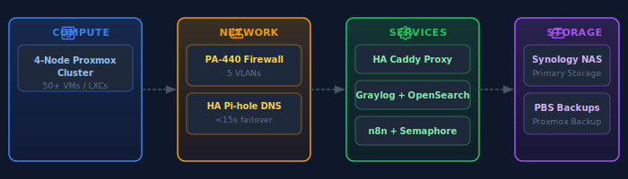

## Welcome

Enterprise SASE security by day, homelab tinkerer by night. I'm Mario, a Network Security Engineer at Palo Alto Networks managing one of PANW's largest global deployments (100K+ users, 34 regions). This journal documents what happens when you bring that mindset home — a 4-node Proxmox cluster running 50+ services with proper security, observability, and AI-assisted automation.

**Built with AI** — This site is created with the help of [Claude Code](https://claude.ai/code). The diagrams, banners, and even some of the writing are AI-assisted. It's an experiment in human-AI collaboration for technical documentation. [Resume →](https://mareox.github.io/resume)

---

## What's Running

---

## Featured Content

### [Wazuh XDR Implementation]()
Deploying open-source extended detection and response across the homelab — from manager setup to Graylog integration. Enterprise-grade threat detection on a homelab budget.

### [4-Layer Agentic Architecture]()
How I organize AI-assisted automation into composable layers: Justfile → Commands → Skills → Agents. Each layer has a single responsibility.

### [PAN-OS Certificate Automation]()
Automated certificate lifecycle management across firewall and reverse proxy — where security engineering meets infrastructure automation.

---

## Explore by Interest

**[I want to understand how something works →]()**
Reference documentation organized by topic — Security, Networking, Infrastructure, Automation, Observability, and AI Tooling.

**[I want to follow a step-by-step guide →]()**
Detailed tutorials with prerequisites, verification steps, and troubleshooting tips.

**[I want to read lessons learned →]()**
Deep dives, post-mortems, and discoveries from building and breaking things.
