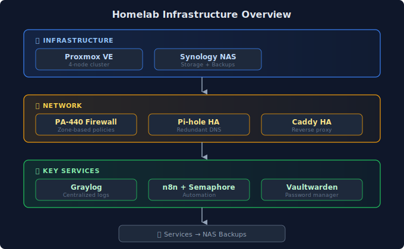

## The Beginning

Every homelab starts somewhere. Mine started with a Raspberry Pi running Pi-hole because I was tired of ads on my smart TV. That was three years ago.

Today, I'm running a 4-node Proxmox cluster with 50+ containers, enterprise-grade networking, centralized logging, and more automation than I probably need. Somewhere along the way, I realized I should write this down.

## Why Document This?

Two reasons:

**For you**: I've learned more from random blog posts than from official documentation. Someone's troubleshooting session at 2 AM, written up the next morning, has saved me countless hours. This is my contribution to that tradition.

**For me**: I've lost count of how many times I've re-learned something because I didn't write it down. This journal is insurance against future amnesia.

## What's Running

## What to Expect

This journal has four sections:

| Section | Content |
|---------|---------|
| **[Wiki]()** | Reference documentation — the "what" and "how" |
| **[Tutorials]()** | Step-by-step guides you can follow |
| **[Journal]()** | Quick changelog — what I changed and when |
| **[Posts]()** | Deep dives — lessons learned, post-mortems |

## Security Note

All examples use sanitized placeholders. You won't find my actual IP addresses, domains, or credentials here. Substitute your own values when following along.

## Let's Go

Thanks for stopping by. I hope something here saves you a few hours or sparks an idea for your own lab.

---

*First post done. Now to write the interesting stuff.*
