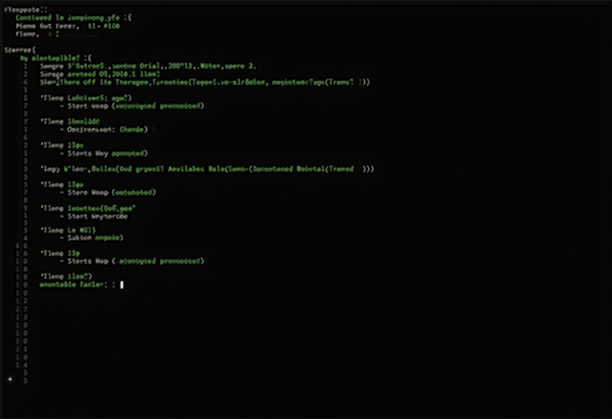

## The Problem

After months of building Claude Code extensions -- agents, skills, commands, hooks, MCP servers -- I had a growing collection of powerful tools with no coherent entry point. Want to pull all repos? Run a shell script. Want to check infrastructure health? Ask Claude and hope it knows which command to use. Want to automate a browser task? Figure out whether to use the MCP plugin or write a script.

Every new capability added more cognitive load. The tools were good individually, but the *system* was incoherent.

## The Inspiration

IndyDevDan's [Bowser framework](https://github.com/ATheorel/bowser) introduced a clean mental model: **composable layers where each has a single responsibility and can be entered independently.** His stack was designed for browser automation, but the pattern is universal.

The insight: you don't need one tool that does everything. You need layers that compose.

## The Architecture

Four layers, each with a clear boundary:





flowchart TB
    subgraph L1["Layer 1: Justfile"]
        J["just pull / just health / just browse"]
    end
    subgraph L2["Layer 2: Commands"]
        C1["/mx-homelab-health"]
        C2["/mx-bowser"]
    end
    subgraph L3["Layer 3: Skills"]
        S1["mx:health-check"]
        S2["mx:playwright-bowser"]
    end
    subgraph L4["Layer 4: Agents"]
        A1["Task subagents"]
        A2["MCP tools"]
    end

    L1 -->|"humans type here"| L2
    L2 -->|"agents invoke here"| L3
    L3 -->|"context loaded here"| L4

    classDef layer1 fill:#4A90D9,stroke:#333,color:#fff
    classDef layer2 fill:#50C878,stroke:#333,color:#fff
    classDef layer3 fill:#FFB347,stroke:#333,color:#000
    classDef layer4 fill:#FF6B6B,stroke:#333,color:#fff

    class J layer1
    class C1,C2 layer2
    class S1,S2 layer3
    class A1,A2 layer4


### Layer 1: Justfile (Human CLI)

[Just](https://github.com/casey/just) is a command runner -- think `make` without the build system baggage. A single `justfile` at the workspace root wraps all existing shell scripts and adds new utilities:

```bash
just pull        # Start of session - pull all repos
just end         # End of session - audit + commit + push
just status      # Show repos with uncommitted changes
just health      # List infrastructure health check stories
just browse      # List browser automation stories
```

**Key decision:** The justfile *wraps* existing scripts -- it doesn't replace them. `just pull` calls `./start-pull-all-repos.sh` under the hood. Zero migration cost, instant unified interface.

### Layer 2: Commands (Agent Interface)

Commands are markdown files with YAML frontmatter that define structured prompts for Claude. They're the bridge between human intent and agent execution:

- `/mx-homelab-health pihole-ha` -- Parse a YAML health check story, SSH into servers, run checks, report pass/fail
- `/mx-bowser homelab-services` -- Parse a browser story YAML, write Playwright scripts, execute, report results

Commands are *imperative* -- they tell the agent exactly what to do and how to report results.

### Layer 3: Skills (Passive Context)

Skills are knowledge that Claude loads automatically when it detects relevance. They don't execute anything -- they inform:

- `mx:health-check` triggers on "homelab health", "service status" -- tells Claude about the YAML story system
- `mx:playwright-bowser` triggers on "browse website", "take screenshot" -- tells Claude to prefer CLI over MCP

Skills are *declarative* -- they teach the agent what's available and how it works.

### Layer 4: Agents (Autonomous Execution)

The actual execution layer -- Claude's Task tool spawning specialized subagents, MCP server tools, or direct Bash commands. This layer already existed; the architecture just makes the entry points clearer.

## YAML-Driven Stories

Both health checks and browser automation use the same pattern: **declarative YAML files that describe what to check, not how to check it.**

### Infrastructure Health Checks

```yaml
name: pihole-ha
description: Pi-hole HA cluster health
severity: critical

targets:
  - host: <DNS-PRIMARY-IP>
    role: dns1
  - host: <DNS-SECONDARY-IP>
    role: dns2

checks:
  - name: FTL service running
    type: ssh_command
    command: "systemctl is-active pihole-FTL"
    expect: "active"
```

Four stories cover the critical infrastructure: Pi-hole HA, Caddy HA, Proxmox cluster, and Docker service stacks. Each story defines targets (hosts) and checks (commands with expected output).

### Browser Automation Stories

```yaml
name: homelab-services
description: Verify homelab web UIs are accessible

stories:
  - name: "n8n web UI loads"
    steps:
      - action: navigate
        url: "http://<DOCKER-HOST>:5678"
      - action: assert_title
        text: "n8n"
      - action: screenshot
        path: /tmp/pw-n8n.png
```

Same idea, different domain. The orchestrator command reads the YAML, generates a Playwright script, executes it, and reports results.

## CLI-First Browser Automation

This was the most interesting design decision. The Bowser framework's insight: **MCP tool calls carry schema overhead that burns tokens.** Every `browser_navigate`, `browser_click`, `browser_snapshot` call includes the full tool schema in the conversation context.

The alternative: write a Playwright script to `/tmp/pw-task.mjs` and run it with `node`. One Bash call instead of 5-10 MCP calls. Same Playwright engine, dramatically fewer tokens.

```javascript
import { createRequire } from 'module';
const require = createRequire('<PLAYWRIGHT-INSTALL-PATH>');
const { chromium } = require('playwright');

const browser = await chromium.launch({ headless: true });
const page = await browser.newPage();
try {
  await page.goto('https://example.com');
  console.log(await page.title());
  await page.screenshot({ path: '/tmp/pw-result.png' });
} finally {
  await browser.close();
}
```

The `createRequire` pattern is worth noting -- it solves a WSL2-specific problem where `npm install -g` needs root permissions. Instead, Playwright lives in a local project directory, and scripts resolve it via Node's module system.

MCP mode is kept as a fallback for when you need interactive DOM inspection or step-by-step debugging. Two modes, one engine, pick the right one for the task.

## What I Learned

### Layers compose better than monoliths

The temptation with AI tools is to build one mega-skill that handles everything. The 4-layer approach works better because each layer can evolve independently. Adding a new health check? Just drop a YAML file. New browser test? Same pattern. No skill code changes needed.

### Declarative beats imperative for story-driven automation

YAML stories are the real unlock. They're version-controlled, diffable, reviewable, and composable. The same pattern works for infrastructure health, browser testing, and potentially deployment validation, security scanning, or backup verification.

### Token efficiency matters in agentic workflows

Every MCP tool call in the conversation context costs tokens. For repetitive operations (navigate, click, fill, assert), writing a script and executing it once is dramatically cheaper than individual tool calls. The CLI-first pattern isn't just faster -- it's cheaper.

### Wrap, don't replace

The justfile wraps existing shell scripts instead of rewriting them. This is the right approach for introducing a new layer -- zero migration risk, immediate value, and the old tools still work exactly as before.

## What's Next

The YAML story pattern could extend to:
- **Deployment validation stories** -- verify a service is healthy after deploy
- **Security audit stories** -- check SSL certs, open ports, firewall rules
- **Backup verification stories** -- confirm backup freshness and restorability

Each would follow the same pattern: YAML definition, command orchestrator, skill for context, justfile recipe for humans.
