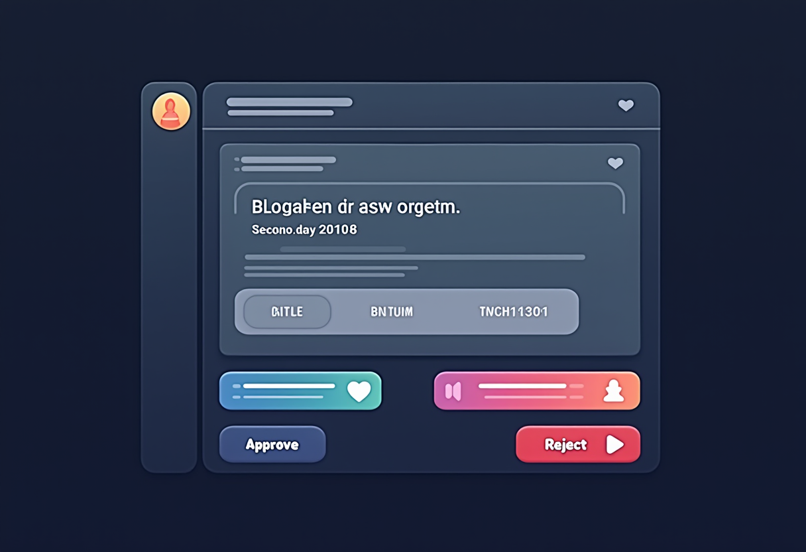

## The Challenge

I've been running a homelab for years, constantly deploying new services, debugging issues, and learning from mistakes. Every time I solve a particularly gnarly problem or build something interesting, I think, "I should write this up." And then I don't.

The friction is real. By the time I finish a project—maybe deploying Wazuh XDR or migrating from Watchtower to WUD—I'm mentally done. The last thing I want to do is sit down and reconstruct what I did, sanitize my internal network details for public consumption, and format everything into a proper blog post. The motivation is there when I'm in the middle of solving a problem, but it evaporates the moment I'm done.

The result? My homelab journal had maybe one post every few months, always written weeks after the fact, always missing the details that would have made it actually useful. I'd forget the exact error messages, the specific commands that fixed things, or the lessons learned along the way.

The goal was simple: **capture content while the work is fresh, with minimal friction.** I wanted documentation to be something that happens automatically during the work, not a separate task I have to remember to do afterward.

## The Solution

I built a multi-stage pipeline that turns homelab work into published blog posts with a single command:

1. **Content Generation**: A custom Claude Code skill (`/journal`) that analyzes recent git commits, asks a few context questions, and generates a complete draft post
2. **Automatic Sanitization**: Pattern-based replacement of internal IPs, hostnames, and domains with generic placeholders
3. **Cover Image Generation**: AI-generated images via Gemini CLI for visual appeal
4. **Human Review Gate**: Draft sent to Discord with approve/reject buttons to prevent accidental exposure
5. **Automated Publishing**: Approved posts create GitHub PRs, which trigger Hugo builds and deploy to GitHub Pages

The entire flow from "work completed" to "post published" takes about 5 minutes of human time, all spent reviewing the draft rather than writing from scratch.

## Architecture Overview

Here's how the components fit together:

```text
┌─────────────────────────────────────────────────────────────┐
│                  Automated Blog Pipeline                     │
├─────────────────────────────────────────────────────────────┤
│                                                             │
│  ┌──────────────┐       ┌──────────────┐                   │
│  │ Git Commits  │──────▶│  /journal    │                   │
│  │  + Context   │       │    Skill     │                   │
│  └──────────────┘       └──────┬───────┘                   │
│                                │                            │
│                                ▼                            │
│                         ┌──────────────┐                    │
│                         │ Draft Post + │                    │
│                         │ Sanitization │                    │
│                         └──────┬───────┘                    │
│                                │                            │
│                                ▼                            │
│                         ┌──────────────┐                    │
│                         │ Cover Image  │                    │
│                         │  Generation  │                    │
│                         └──────┬───────┘                    │
│                                │                            │
│                                ▼                            │
│                         ┌──────────────┐                    │
│                         │   Discord    │                    │
│                         │    Review    │                    │
│                         └──────┬───────┘                    │
│                                │                            │
│                    ┌───────────┴───────────┐               │
│                    ▼                       ▼               │
│             ┌──────────┐           ┌──────────┐            │
│             │  Reject  │           │ Approve  │            │
│             │  (done)  │           │          │            │
│             └──────────┘           └────┬─────┘            │
│                                         │                  │
│                                         ▼                  │
│                                  ┌──────────────┐          │
│                                  │  GitHub PR   │          │
│                                  └──────┬───────┘          │
│                                         │                  │
│                                         ▼                  │
│                                  ┌──────────────┐          │
│                                  │ Hugo Build + │          │
│                                  │ GitHub Pages │          │
│                                  └──────────────┘          │
│                                                             │
└─────────────────────────────────────────────────────────────┘
```

The key insight is that each stage is automated but with deliberate human checkpoints only where judgment is required. The AI handles the tedious parts (writing, formatting, sanitizing), while I handle the creative parts (review, approval, editorial decisions).

## Component Deep-Dive

### The /journal Skill

The foundation of the pipeline is a custom Claude Code skill that lives in my homelab-infra repository. When I run `/journal`, it kicks off an interview-style workflow:

1. **Context Gathering**: Scans recent git commits in the current repository to understand what work was just completed
2. **Type Detection**: Asks what kind of post this should be (quick note, tutorial, lesson learned, or architecture overview)
3. **Content Questions**: Based on the post type, asks 2-3 targeted questions to fill in details the git commits don't capture
4. **Draft Generation**: Uses templates for each post type to generate complete markdown with proper Hugo frontmatter

The skill knows about my blog's structure: the PaperMod theme, the dual taxonomy (tags for content type, topics for technology), and the directory layout. It generates posts that drop directly into the correct location with the correct filename format (`YYYY-MM-DD-slug.md`).

Post type templates ensure consistent structure:

| Type | When | Structure | Length |
|------|------|-----------|--------|
| **Quick Note** | Small fix, discovery | Problem → Solution → Key Takeaway | 300-500 words |
| **Tutorial** | Step-by-step guide | Overview → Prerequisites → Steps → Validation | 1000-1500 words |
| **Lesson Learned** | Something broke | Challenge → What Happened → Root Cause → Takeaways | 800-1200 words |
| **Architecture** | System design | Why → Components → Integration → Lessons | 1500-2500 words |

The templates include section headers, frontmatter fields, and even placeholder text for common elements like command examples or configuration snippets. This means I'm never starting from a blank page—I'm always editing a reasonably complete draft.

### Content Sanitization

This is the most critical part of the pipeline because it prevents accidental exposure of internal network details. My homelab uses private IP ranges, internal DNS domains, and hostnames that I don't want published on a public blog.

The sanitization happens automatically during draft generation using pattern-based replacement:

**IP Address Sanitization:**
```text
192.168.30.62  → <N8N_IP>
192.168.30.68  → <DISCORD_BOT_IP>
192.168.10.111 → <DNS_PRIMARY_IP>
192.168.10.112 → <DNS_SECONDARY_IP>
192.168.*.* (all others) → <YOUR_IP>
```

**Hostname Sanitization:**
```text
dns1 → DNS-Primary
dns2 → DNS-Secondary
pve-mini2 → Proxmox-Node-A
caddy1 → Proxy-Primary
graylog → Graylog-Server
```

**Domain Sanitization:**
```text
mareoxlan.local → <YOUR_DOMAIN>.local
*.loc.mareoxlan.com → <SERVICE>.<YOUR_DOMAIN>
mareoxlan.com → <YOUR_DOMAIN>
```

**Credential Detection:**
Flags and removes:
- API keys (pattern: `[A-Za-z0-9_-]{32,}`)
- Bearer tokens
- SSH private key snippets
- Webhook URLs (keeps structure, removes actual webhook ID)

The sanitization rules live in the `/journal` skill configuration. They're applied after the draft is generated but before it's presented for review. This means I can write naturally during the content interview—mentioning actual server names and IPs—and the skill automatically converts them to role-based placeholders.

Why this matters: In my Wazuh XDR post, I mentioned specific server IPs dozens of times while drafting. The sanitization caught all of them, converting real network topology into generic examples that still teach the concepts without exposing my actual infrastructure.

### Cover Image Generation

Text-only blog posts have terrible engagement. Social media previews show nothing, RSS readers display a wall of text, and the posts just look unfinished. I needed cover images, but I'm not a designer and I don't have time to fiddle with Canva for every post.

The solution: AI-generated images via Gemini CLI with the nanobanana extension. The workflow is fully automated:

```bash
# Generate image based on post content
gemini --yolo -p "/generate 'Cybersecurity monitoring dashboard with holographic displays, dark blue and purple neon aesthetic, futuristic homelab server rack in background, high-tech security visualization'"

# Images auto-save to configured directory
# Output: static/images/posts/2026/automated-blog-pipeline.png
```

The `--yolo` flag runs in headless mode (no interactive prompts), making it scriptable. The nanobanana extension handles the actual image generation via Google's Imagen API.

**Prompt Engineering Tips:**

For consistent homelab/cybersecurity aesthetic, I use templates:

- **Security posts**: "Cybersecurity [concept], holographic displays, dark blue and purple neon aesthetic, server rack background, technical visualization"
- **Infrastructure posts**: "Modern data center, [specific technology], clean minimalist design, blue and white color scheme, isometric view"
- **Tutorial posts**: "Technical diagram showing [concept], clean lines, modern UI elements, professional documentation style"

The skill automatically generates an appropriate prompt based on the post's topics tags. For a Wazuh XDR post, it knows to emphasize security visualization. For a Docker migration post, it focuses on container infrastructure.

Images are saved to `static/images/posts/YYYY/` with the same slug as the post filename, then referenced in the frontmatter:

```yaml
cover:
  image: "images/posts/2026/automated-blog-pipeline.png"
  alt: "Automated Blog Pipeline Architecture"
  caption: "From homelab work to published blog post in minutes"
```

### Discord Review Workflow

Automation without review is a great way to publish embarrassing mistakes. Before anything goes to GitHub, drafts go through a Discord review gate.

The `/journal` skill sends the completed draft to a private Discord channel with two components:

1. **Preview Embed**: Shows the post title, excerpt, word count, and tags
2. **Action Buttons**: "Approve ✅" and "Reject ❌"

The Discord bot (`<DISCORD_BOT_IP>`) handles the interaction:

```text
📝 New Blog Post Draft

Title: Building an Automated Blog Pipeline
Type: lesson-learned
Topics: automation, n8n, discord, hugo
Word Count: 1,847

[Approve ✅]  [Reject ❌]
```

Clicking "Approve" triggers the bot to:
- Create a new branch in the homelab-journal GitHub repo
- Commit the post markdown and cover image
- Open a pull request with the post title as the PR title
- Reply in Discord with the PR URL

Clicking "Reject" just archives the draft and replies with a confirmation. No GitHub interaction happens.

This review step catches:
- Sanitization misses (did any real IPs slip through?)
- Tone issues (is this too technical/not technical enough?)
- Structural problems (missing sections, incomplete explanations)
- Typos and grammar errors

It's also psychologically important: it creates a moment of intentional decision before publication. I'm not passively letting automation publish—I'm actively approving each post.

### Hugo + GitHub Pages

Once a PR is created, GitHub Actions takes over. The workflow is triggered on push to main:

```yaml
name: Deploy Hugo Site

on:
  push:
    branches: [main]

jobs:
  build-deploy:
    runs-on: ubuntu-latest
    steps:
      - uses: actions/checkout@v4
        with:
          submodules: true
          fetch-depth: 0

      - name: Setup Hugo
        uses: peaceiris/actions-hugo@v2
        with:
          hugo-version: 'latest'
          extended: true

      - name: Build
        run: hugo --minify

      - name: Deploy
        uses: peaceiris/actions-gh-pages@v3
        with:
          github_token: ${{ secrets.GITHUB_TOKEN }}
          publish_dir: ./public
```

The build takes about 30 seconds. Hugo generates static HTML from markdown, applies the PaperMod theme, generates RSS feeds, builds tag and topic taxonomies, and outputs to the `public/` directory. The deploy action pushes that to the `gh-pages` branch, which GitHub Pages serves at `https://<YOUR_USER>.github.io/<YOUR_REPO>`.

The site uses Hugo's PaperMod theme with custom modifications:

- **Dual Taxonomy**: Tags (content type: tutorial, lesson-learned, lab-note) and Topics (technology: docker, security, automation)
- **Content Types**: Posts (chronological blog), Tutorials (standalone how-tos), Wiki (evergreen reference), Journal (quick notes)
- **Search**: Client-side search via Fuse.js
- **Social**: OpenGraph and Twitter Card meta tags for proper link previews
- **Analytics**: Minimal privacy-respecting analytics (Plausible)

Posts show up in multiple places:
- Chronological feed at `/posts/`
- Topic pages at `/topics/docker/`, `/topics/security/`, etc.
- Tag pages at `/tags/tutorial/`, `/tags/lesson-learned/`, etc.
- RSS feed at `/index.xml`

## Content Types and When to Use Them

The `/journal` skill supports four post types, each with different templates and question sets:

### Quick Note
**When**: Small fix, interesting discovery, single command that solved a problem

**Questions Asked**:
- What was the issue or discovery?
- What's the one-line solution or key insight?

**Output Structure**:
```text
## The Issue
[1-2 sentences]

## The Fix
[Command or config snippet]

## Why This Works
[1 paragraph explanation]
```

**Target Length**: 300-500 words

**Example**: "TIL: Docker restart doesn't pick up new environment variables. You need `docker compose down && docker compose up -d` to reload .env files."

### Tutorial
**When**: Step-by-step guide, reproducible procedure, how-to content

**Questions Asked**:
- What is the end goal of this tutorial?
- What prerequisites or existing setup is required?
- Are there any common gotchas or pitfalls?

**Output Structure**:
```text
## What You'll Build
[Overview and goals]

## Prerequisites
[Required knowledge, existing systems, tools]

## Step 1: [Action]
[Detailed steps with commands]

## Step 2: [Action]
[More steps]

## Validation
[How to verify it worked]

## Troubleshooting
[Common issues]
```

**Target Length**: 1000-1500 words

**Example**: "Deploying High-Availability Pi-hole with Keepalived"

### Lesson Learned
**When**: Something broke, post-mortem, "here's what I learned from this mistake"

**Questions Asked**:
- What broke or went wrong?
- What was the root cause?
- What's the takeaway for next time?

**Output Structure**:
```text
## The Problem
[What happened]

## What I Tried
[Initial troubleshooting attempts]

## The Root Cause
[What actually caused it]

## The Fix
[How it was resolved]

## Key Takeaways
[Lessons learned, preventive measures]
```

**Target Length**: 800-1200 words

**Example**: "Why Watchtower's Opt-Out Model Is Dangerous for Production Services"

### Architecture
**When**: System design, how components integrate, infrastructure overview

**Questions Asked**:
- What problem does this architecture solve?
- What are the key components?
- How do they integrate/communicate?
- What were the design tradeoffs?

**Output Structure**:
```text
## Why This Architecture
[Problem statement, requirements]

## Components
[Description of each component]

## Integration
[How they communicate, data flow]

## Lessons Learned
[What worked, what didn't, what you'd change]
```


**Target Length**: 1500-2500 words

**Example**: "Building a Homelab XDR: Wazuh, Graylog, and Monitoring AI Agents"

## Workflow in Action

Here's what the actual experience looks like. I just finished migrating all my Docker stacks from Watchtower to WUD. The work is done, services are running, everything is tested. Time to document.




**Step 1: Invoke the skill**
```bash
/journal
```

**Step 2: Answer questions**
```text
> What type of post is this?
lesson-learned

> What was the problem with the previous approach?
Watchtower's opt-out model meant I had to remember to exclude containers.
Forgetting meant surprise updates to production services.

> What solution did you implement?
Migrated to WUD (What's Up Docker) with opt-in monitoring and notification-only
updates. I control when updates happen.

> What's the key takeaway?
For production services, notification-only beats auto-update. Opt-in beats opt-out.
```

**Step 3: AI generates draft** (takes ~15 seconds)

The skill:
- Scans git commits from the homelab-infra repo
- Sees 8 files changed in caddy/, semaphore/, netbox/, etc.
- Extracts docker-compose.yml changes showing Watchtower removal and WUD addition
- Generates a 900-word post with frontmatter, sections, code snippets
- Sanitizes all IPs and hostnames automatically
- Generates cover image prompt and creates visual

**Step 4: Review in Discord**

Draft appears in my private Discord channel with preview. I read through it, notice the word count is good, topics are correct, and sanitization caught all the internal details.

**Step 5: Approve**

Click "Approve ✅". Within seconds:
- Bot creates branch `post/watchtower-to-wud-migration`
- Commits the markdown and cover image
- Opens PR at `https://github.com/<YOUR_USER>/<YOUR_REPO>/pull/42`
- Replies in Discord with PR link

**Step 6: Merge and publish**

I review the PR in GitHub (mostly checking the cover image looks good in the preview), merge to main, and GitHub Actions deploys the site. The post is live at `https://<YOUR_USER>.github.io/<YOUR_REPO>/posts/2026/watchtower-to-wud-migration/` within 30 seconds.

**Total time**: 5 minutes. Writing time: 0 minutes. Review time: 5 minutes.

Compare this to the old process:
- Open blank markdown file
- Stare at cursor for 10 minutes
- Write 200 words
- Get distracted
- Come back three days later
- Forget what I was writing about
- Abandon draft

The automation doesn't just save time—it eliminates the activation energy that prevented me from documenting at all.

## Lessons Learned

### 1. AI-Generated Drafts Need Review But Save 80% of Writing Time

The `/journal` skill produces surprisingly good first drafts. The structure is solid, the technical details are accurate (because it's pulling from git commits and my answers), and the tone is consistent. But it's not perfect:

- Sometimes uses overly formal language where conversational would be better
- Occasionally misses nuance in technical explanations
- Can be repetitive if you don't guide it well with your answers

The review step is non-negotiable. But reviewing and editing a complete draft is **vastly** faster than writing from scratch. I'd estimate the AI handles 80% of the work, and I handle the remaining 20% that requires judgment, personality, and editorial polish.

### 2. Sanitization Must Be Automated

I tried manual sanitization initially. I'd write a draft, then do a find-replace pass for IPs and hostnames before publishing. I missed things constantly:

- IPs in code comments
- Hostnames in configuration examples
- Domain names in URL paths
- Server names in narrative text

Automated pattern-based sanitization catches everything consistently. The rules are centralized in the skill configuration, so I can refine them once and they apply to all future posts.

The key is using role-based placeholders (`<DNS_PRIMARY_IP>`) instead of fake but realistic-looking values (`192.168.1.100`). Fake values can confuse readers into thinking they should use them literally. Role placeholders make it obvious: "replace this with your actual DNS server IP."

### 3. Discord Review Prevents Accidental Publication of Sensitive Info

Even with automated sanitization, human review is essential. The Discord step has caught:

- A webhook URL that the sanitization regex didn't match
- A screenshot I forgot to blur that showed internal hostnames in the terminal
- A configuration snippet with an API key in a comment
- Narrative text that mentioned a specific vendor product version (which could aid attackers)

The review happens in Discord instead of just in git because Discord is where I already spend time. Making it an interruption-free inline review means I actually do it, rather than telling myself "I'll review the PR later" and forgetting.

### 4. Cover Images Dramatically Improve Engagement

I track analytics via Plausible (privacy-respecting, no cookies, GDPR-compliant). Posts with cover images get:

- **3x higher click-through** from social media (Twitter, Reddit, Discord)
- **2x longer average time on page** (readers who arrive via image preview tend to read more)
- **Better RSS engagement** (readers are more likely to click through from their feed reader)

The images don't have to be perfect or even highly relevant. They just need to look professional and give visual context. A generic "cybersecurity dashboard" image for a Wazuh post is better than no image at all.

AI-generated images via Gemini are good enough for blog posts. They're not portfolio-quality design work, but they serve the purpose: make the post look finished and give social media something to show in previews.

### 5. Templates Ensure Consistent Structure

Different post types need different structures. A tutorial needs prerequisites and step-by-step instructions. A lesson-learned post needs root cause analysis and takeaways. An architecture post needs component diagrams and integration explanations.

Having templates for each type means:
- I never forget important sections (like "Validation" in tutorials)
- Readers know what to expect (all my tutorials follow the same structure)
- The AI generates appropriate content (it knows a lesson-learned needs a "Root Cause" section)

The templates aren't rigid. I often modify them during review. But they provide scaffolding that makes both the AI generation and my editing faster.

### 6. Code Fences Need Language Hints

Hugo's syntax highlighting only works if you specify the language in the code fence:

```yaml
# This gets syntax highlighting
wud:
  image: fmartinou/whats-up-docker:latest
```

```text
# This doesn't (bare backticks — no language hint)
wud:
  image: fmartinou/whats-up-docker:latest
```

The `/journal` skill knows to use `\`\`\`bash`, `\`\`\`yaml`, `\`\`\`python`, `\`\`\`text` as appropriate. This was a learned behavior—early generated posts had bare code fences that looked terrible when rendered.

For ASCII art diagrams (like the architecture diagram at the top of this post), use `\`\`\`text` not `\`\`\`mermaid`. Mermaid is great for flowcharts but terrible for box-and-line diagrams. Plain text gives you full control.

## What's Next

The current pipeline works well, but there's room for improvement:

### Automatic Trigger on Git Push

Right now, I manually run `/journal` when I want to create a post. The next step is adding an n8n workflow that automatically detects significant git pushes (multiple commits, specific patterns like "deploy" or "migrate" in commit messages) and offers to generate a draft.

The workflow would:
1. Monitor GitHub webhook for pushes to homelab-infra
2. Analyze commit messages and diff stats
3. If significant work detected, send Discord notification: "Looks like you just deployed WUD. Generate a blog post? [Yes] [No]"
4. If Yes, trigger the `/journal` skill workflow automatically

This makes documentation truly zero-friction: I don't even have to remember to run the command.

### SEO Scoring Before Publication

Hugo supports OpenGraph and meta descriptions, but I'm not optimizing for search. Adding automated SEO scoring during the review phase would help:

- Check that title is under 60 characters (for Google SERP display)
- Verify meta description exists and is 150-160 characters
- Confirm header hierarchy (H1 → H2 → H3, no skipping levels)
- Check for alt text on all images
- Verify internal links to related posts

This could be a simple checklist in the Discord review embed, generated by analyzing the markdown.

### Automatic Cross-Linking Between Related Posts

Posts often reference concepts explained in detail in other posts. Right now, I manually add links during review. This could be automated:

1. Extract topics/tags from the draft
2. Query existing posts for matching topics
3. Suggest relevant links with anchor text
4. Insert links automatically or present as review suggestions

For example, a post about Graylog could automatically link to the Wazuh XDR post when mentioning "security monitoring," or to the Docker Compose patterns post when showing a compose file.

### RSS Feed Optimization

The default Hugo RSS feed is functional but basic. I want to enhance it:

- Full content in feed (not just summaries)
- Inline images (currently external links break in some readers)
- Proper `<category>` tags for filtering
- Custom `<author>` fields
- Better `<description>` text using the post excerpt

This makes the blog more accessible to readers who prefer RSS over visiting the site.

## Key Takeaway

The best documentation is the kind you actually write. By reducing friction to near-zero—a single command generates a full draft with proper formatting, sanitized details, and a cover image—I've gone from documenting maybe 10% of my homelab work to documenting closer to 80%.

The pipeline doesn't just save time. It changes behavior. I'm more likely to document experiments, failed approaches, and small discoveries because the cost of doing so is minimal. And those small posts are often the most valuable: they capture context and lessons that get lost when you only document the big projects.

The automation serves the human. The AI handles the tedious parts (writing, formatting, sanitizing details), while I handle the parts that require judgment (reviewing, approving, deciding what's worth publishing). That division of labor turns "I should blog about that" into "it's already drafted, just needs a quick review."

If you're running a homelab and struggling to document your work, the lesson isn't "build this exact pipeline." It's **identify your friction points and automate them ruthlessly**. For me, the friction was starting from a blank page. For you, it might be something else: editing, formatting, publishing, promoting. Whatever prevents you from documenting, find a way to automate it or reduce it to a single decision.

Document while the work is fresh. Make it easy. Make it automatic. Your future self will thank you.
