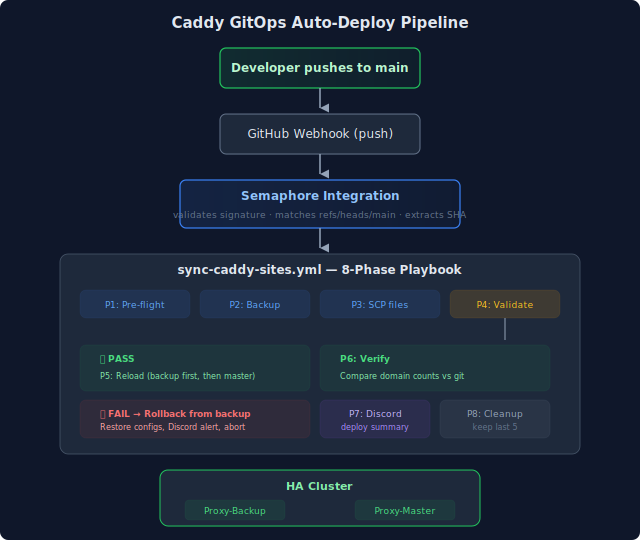
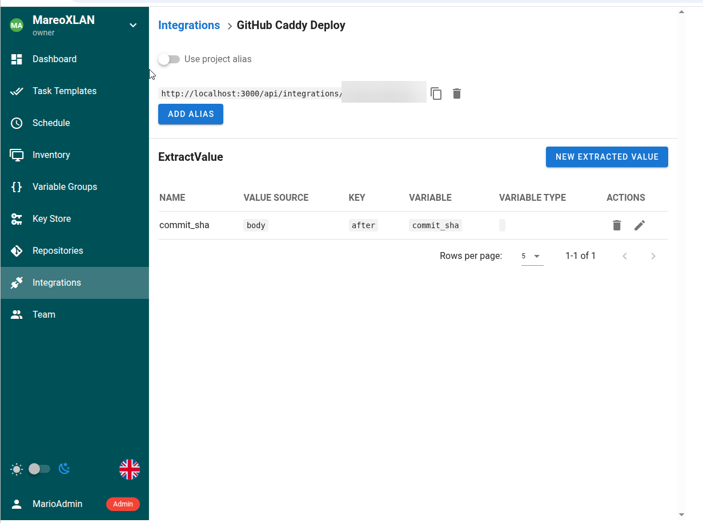

## The Problem

My Caddy reverse proxy runs as an HA pair -- two nodes behind a keepalived VIP. Every service in the homelab gets its traffic through this pair. The setup works great, except for one recurring failure mode: **config drift**.

The deployment process was manual: edit the Caddy site config in git, SCP it to both nodes, validate, reload. The "both nodes" part is where things break down. It's easy to deploy to caddy1, test it, see it working, and then forget caddy2 exists. Until keepalived fails over and suddenly half your sites return 502s because the backup node has last week's config.

This happened more than once. Each incident followed the same pattern -- urgent fix, deploy to the missed node, add a mental note to "always deploy to both." Mental notes don't scale.

## The Goal

Push Caddy config changes to GitHub, and have both nodes automatically updated. No manual SCP. No remembering which nodes need updating. Git becomes the single source of truth, and the deployed state is always a pure function of what's in the repo.

## The Architecture

The key design decision is **full-state sync** rather than incremental deployment. Every run deploys ALL config files to BOTH nodes, regardless of what changed. This eliminates drift by definition -- if the deployed state always matches git, there's nothing to drift from.

The tradeoff is slightly more network traffic per deploy (syncing ~50KB of Caddy configs instead of just the changed file), but that's negligible compared to the reliability gain. An incremental approach would need change detection logic, and that logic itself becomes a source of bugs.

## How Semaphore Integrations Work

Semaphore has a built-in webhook integration system that's simpler than setting up a separate CI/CD webhook handler. You create an Integration in a project that:

1. **Authenticates** the webhook -- for GitHub, it validates `X-Hub-Signature-256` using a shared secret
2. **Matches** conditions -- I filter on `refs/heads/main` so only pushes to the main branch trigger a deploy
3. **Extracts values** -- the `after` field from GitHub's push payload becomes the `commit_sha` variable in the playbook
4. **Triggers** a template -- the same template you'd run manually, but now automated

The webhook URL is something like `https://sema.<YOUR_DOMAIN>/api/webhooks/<alias>`, where the alias is auto-generated. Since Semaphore is already behind Caddy and accessible externally through a Cloudflare tunnel, the webhook endpoint is reachable from GitHub without any additional port forwarding.

## The Safety Net

Automated deployments to production infrastructure need guardrails. The playbook has several:

**Truncation guard**: Before deploying, it checks that every site file is at least 100 bytes. A zero-byte or near-empty file would wipe all domain configs -- this has happened before with accidental file truncation.

**Pre-deploy backup**: Every run creates a timestamped backup of the current configs on each node. If something goes wrong, there's always a rollback point.

**Validate-before-reload**: The playbook runs `caddy validate` on both nodes after deploying but before reloading. If validation fails on either node, it automatically restores the backup and sends a Discord alert. The nodes never serve an invalid config.

**Reload ordering**: The backup node reloads first. If the reload somehow fails on the backup, the master is still serving traffic with the previous config. Only after the backup succeeds does the master reload.

**Drift detection**: After deployment, the playbook counts domain entries on both nodes and compares against the git repo count. A mismatch means someone edited a node directly (bypassing git), which gets flagged in the output.

**Dry run mode**: Running with `dry_run=true` executes everything except the reload -- useful for validating the pipeline without affecting production traffic.

## What I'd Do Differently

If I were starting over, I'd consider using Ansible's native `synchronize` module (rsync wrapper) instead of individual SCP commands per file. The current approach works fine for 6 files, but wouldn't scale well if the config structure grew significantly.

I'd also consider adding a path filter to the webhook -- right now any push to main triggers the deploy, even if the changes are only to `proxmox/` or `pihole/`. Semaphore's matcher can check if the webhook body contains `caddy/` in the list of changed files, but the GitHub push payload doesn't include file paths in a simple way (you'd need to query the commits API). For now, the playbook is fast enough (~30 seconds) that running it on unrelated pushes is acceptable.

## The Result

Config drift between Caddy nodes is now structurally impossible. Every push to main synchronizes both nodes automatically. The Discord notifications give visibility into what was deployed and whether it succeeded. And the rollback mechanism means a bad config push is a 30-second recovery instead of a scramble.

The whole thing runs on infrastructure I already had -- Semaphore for orchestration, GitHub for webhooks, Discord for notifications. No new services to maintain. That's the homelab sweet spot: solving real operational pain with tools you're already running.
