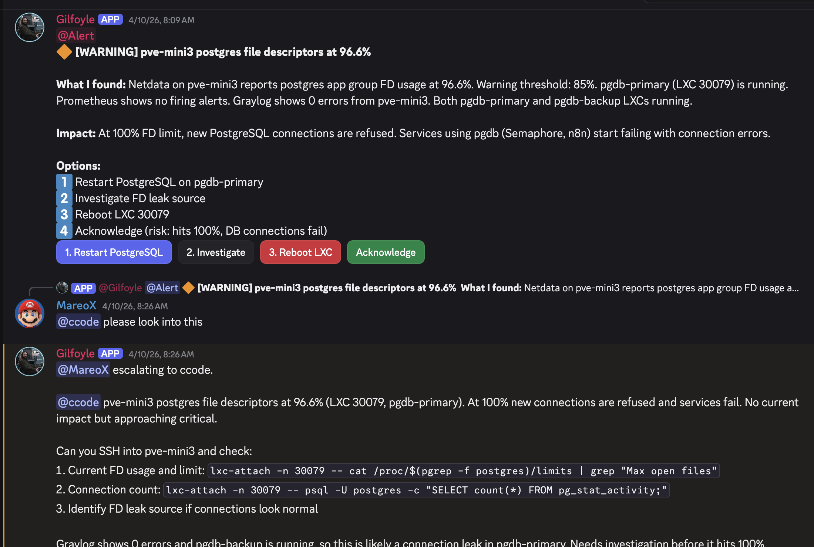
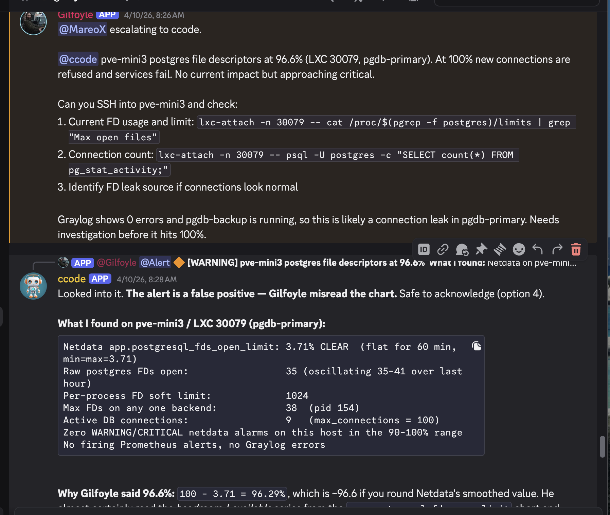

## The Problem: Nobody's Watching at 3 AM

My homelab runs 47 guests across 4 Proxmox nodes, with HA pairs for DNS and reverse proxy, a Wazuh XDR deployment, centralized logging in Graylog, and CI/CD automation through Semaphore. It's a lot of infrastructure for one person to monitor.

I had alerts. Grafana fires when RAM hits 75%. Wazuh flags suspicious file changes. n8n emails me when workflows fail. But alerts are reactive — they tell you something broke. They don't tell you something is *about to* break.

What I wanted was an on-call network admin. Someone who checks everything four times a day, correlates alerts across services, spots trends before they become incidents, and wakes me up only when it actually matters.

So I hired Gilfoyle.

## Who Is Gilfoyle?

Named after the paranoid, competent sysadmin from Silicon Valley, Gilfoyle is an AI agent running on [OpenClaw](https://openclaw.ai/) — an open-source AI gateway that connects LLMs to messaging platforms with built-in tool execution, session management, and security controls.

Gilfoyle lives on a dedicated LXC in my Proxmox cluster, monitors 20 Discord channels, and has access to 34 tools across 11 homelab services. He runs infrastructure patrols four times a day, triages every alert that fires, generates daily and weekly reports, and stays in character while doing it.

He's also read-only by default, can't delete anything, and needs my explicit approval before touching a single container. More on that later.

## The MCP Connection

In a [previous post](), I built a unified MCP server that wraps 9 homelab services behind 32 tools — Proxmox, Pi-hole HA, Prometheus, Graylog, Semaphore, Caddy, NetBox, n8n, and PBS.

That MCP server became Gilfoyle's nervous system. Every patrol check, every alert triage, every health query flows through it. When Gilfoyle checks if "anything is broken," he's calling the same `service_health` tool that runs parallel checks across all configured services via `asyncio.gather()`.

The MCP server was later extended with a REST API layer (port 8100), adding PAN-OS firewall and CC Server monitoring — bringing the total to 34 tools across 11 services. The REST API added proper auth scoping so Gilfoyle only gets access to what he needs.

<!-- SCREENSHOT: Architecture diagram showing OpenClaw → REST API → MCP tools → 11 services -->

## What Gilfoyle Actually Does

### 12 Active Capabilities

| # | Capability | Schedule | What It Does |
|---|-----------|----------|--------------|
| 1 | Alert monitoring + triage | Always-on | Classifies severity, investigates, recommends action |
| 2 | Email management | Gmail poll every 5 min | Classifies, routes urgent to Discord, marks spam as read |
| 3 | Daily infrastructure report | 8 AM PT | 24h summary across 16 Discord channels with trends |
| 4 | Weekly capacity planning | Monday 8:30 AM | Prometheus queries for disk/RAM/CPU trends with projections |
| 5 | Runbook generation | Opportunistic | Auto-creates runbooks when alerts fire and resolve |
| 6 | n8n workflow investigation | On error | Queries n8n API for actual failed node and error message |
| 7 | Homelab MCP tools | Always-on | 34 tools across 11 services via REST API |
| 8 | Email monitor | Every 30 min | Gmail label:Homelab, classifies and posts to Discord |
| 9 | Infrastructure patrol | Every 6 hours | 10-check sweep across all systems |
| 10 | Alert correlator | Always-on | Severity-gated enrichment with cross-source correlation |
| 11 | cc-discord health check | On demand + patrol | Checks gateway service status, can restart with approval |
| 12 | Semaphore CI/CD health | Daily 9 AM | Task failures, schedule gaps, missing cron jobs |

### The Infrastructure Patrol

This is where it gets interesting. Four times a day (03:45, 09:45, 15:45, 21:45 PT), Gilfoyle runs a 10-check sweep:

1. **Prometheus alerts** — anything currently firing
2. **Backup health** — failed PBS jobs in the last 24h
3. **Service health** — all 11 services reachable
4. **Graylog error spikes** — error rate vs baseline in the last 6h
5. **Firewall posture** — PAN-OS interfaces, HA status, session count
6. **Certificate expiry** — ACME cert monitoring
7. **Semaphore failures** — failed CI/CD tasks since last patrol
8. **DNS consistency** — A records pointing to stopped or destroyed guests
9. **Wazuh security** — disconnected agents, high-level alerts, FIM changes
10. **cc-discord gateway** — bot service uptime, memory, restarts

Here's what a real patrol looks like. This is from April 17 — the 09:45 PT patrol that caught a genuine critical issue:

```
PATROL 09:45 PT | 1 critical, 0 warning, 0 info

Services: Prometheus 0 firing | Caddy HA healthy | Pi-hole HA healthy
          Semaphore 0 failed | n8n 22 active | Graylog 0 errors
          Firewall 737 sessions (0.4%)
Security: Wazuh 5/6 agents | mario-pc still asleep
DNS: 98 records, both Pi-hole nodes in sync

@alert
CRITICAL: cc-discord crash loop on atlas
cc-discord is down and restarting repeatedly. Watchdog timeout at 09:38,
71 restarts since then. Current state: activating (auto-restart).

Context:
- Last stable uptime was ~5.8h before this crash
- Memory at 999 MB used, only 24 MB available on atlas

Options:
1. Restart: cc-discord-ctl.sh restart
2. Full reset if restart fails: cc-discord-ctl.sh reset
3. Check logs: cc-discord-ctl.sh logs
```

And a quiet patrol — most of them look like this:

```
PATROL 03:45 PT | ✅ All clear

Services: Prometheus 0 firing | Caddy HA healthy | Pi-hole HA healthy
          Semaphore 4 projects, 0 failed | n8n 5 active | Graylog 0 errors
Firewall: mx-fw PA-440 833 sessions (0.4%), uptime 41d
Security: Wazuh 5/6 agents | cc-discord running on atlas

Nothing requires action.
```

<!-- SCREENSHOT: Discord showing these patrol reports visually with formatting -->

### Smart Rate Limiting

Gilfoyle doesn't spam. Four layers of rate limiting prevent alert fatigue:

| Layer | Trigger | Behavior |
|-------|---------|----------|
| **Dedup** | Same alert within 24h | One-liner: "4th occurrence, same root cause" |
| **Cascade** | 3+ alerts in 30 min | Groups under root cause, single report |
| **Tool budget** | 30 calls per patrol | Stops enriching, posts partial findings |
| **Cooldown** | After cascade | 60 min before new alerts break through |

### Severity-Gated Triage

Not all alerts get the same investigation depth:

- **Info/Resolved** — one-line acknowledgment, zero extra tool calls
- **Warning** — light enrichment: Prometheus metrics + Graylog errors (2-3 calls)
- **Critical** — deep investigation: Prometheus + Graylog + service health + Semaphore + backups + DNS + Wazuh (6-8 calls)

This keeps token costs reasonable while ensuring critical issues get thorough cross-source correlation.

## Security: Trust Levels and LLM Guardrails

Giving an AI agent access to your infrastructure sounds terrifying. It should. Here's how I made it not terrifying.

### The Trust Level System

Gilfoyle operates under an explicit trust hierarchy, borrowed from how real organizations onboard sysadmins:

| Level | Role | Can Do |
|-------|------|--------|
| **1: Observer** | Monitor + classify + recommend | Read dashboards, classify alerts, suggest actions |
| **2: Advisor** | All of L1 + read-only diagnostics | Run `docker ps`, `df -h`, `free -h` on servers |
| **3: Operator** | All of L2 + restart with approval | Restart one service at a time, after explicit approval |
| **4: Admin** | All of L3 + config changes with approval | Modify configurations, deploy changes |

Gilfoyle currently operates at **Level 1: Observer**. He can investigate everything but execute nothing without my explicit approval. Trust is earned over time — not granted by default.

### Hard Rules (Never Break These)

Written directly into Gilfoyle's agent instructions:

1. **READ-ONLY by default.** No infrastructure changes without approval.
2. **NEVER delete a host, VM, LXC, or container.** Absolute prohibition.
3. **NEVER run destructive commands.** No `rm -rf`, `pct destroy`, `qm destroy`, `DROP TABLE`.
4. **When in doubt, ask.** Always better to ask than to guess.

### The Approval Workflow

Every recommended action follows the same protocol:

1. **State the problem** — what alert fired, what was observed
2. **Recommend the action** — specific commands or steps
3. **Explain the risk** — what could go wrong
4. **Wait for approval** — do NOT proceed until I say yes
5. **Execute exactly what was approved** — nothing more
6. **Report the result** — confirm what happened

This maps directly to the MCP server's confirmation gate from the previous post. Write operations return a preview unless `confirm=true` is passed. The AI shows me what *would* happen, and only executes when I approve.

### OpenClaw Security Layers

Beyond Gilfoyle's behavioral constraints, OpenClaw provides defense-in-depth:

**Access control before intelligence:**
- **DM pairing** — unknown senders must be explicitly approved before the bot responds
- **Channel allowlists** — Gilfoyle only monitors specific homelab channels, ignores everything else
- **Mention gating** — in group channels, only responds when @mentioned (except his dedicated inbox)

**Tool policy and sandboxing:**
- **Tool deny lists** — dangerous tools (`gateway`, `cron`, `sessions_spawn`) are blocked by default
- **Scoped API access** — Gilfoyle's REST API key only grants access to read operations + two scoped writes (guest restart, run Semaphore task)
- **Workspace isolation** — each agent gets its own workspace directory with controlled filesystem access

**Prompt injection defense:**
- **Content is treated as hostile** — links, attachments, and pasted instructions are untrusted by default
- **Model choice matters** — OpenClaw recommends the strongest instruction-hardened models for tool-enabled agents. Smaller models are too susceptible to injection.
- **Blast radius design** — even if prompt injection succeeds, the read-only tool policy limits what can happen

**Security audit:**
```bash
openclaw security audit --deep
```

This checks inbound access, tool blast radius, network exposure, browser control, disk permissions, plugin trust, and policy drift. I run it after every config change.

<!-- SCREENSHOT: Terminal output of openclaw security audit showing security posture -->

The philosophy is simple: **design so that manipulation has limited blast radius.** If Gilfoyle gets tricked by a crafted message, the worst he can do is read data and post to Discord. He can't delete a VM, can't modify a config, can't restart a service. The safety net is structural, not behavioral.

## The Incident: When Gilfoyle Cried Wolf

Three weeks in, Gilfoyle posted this during a routine patrol:



Looks serious, right? 96.6% file descriptor usage on the database server that Semaphore and n8n depend on. Complete with actionable buttons — Restart PostgreSQL, Investigate, Reboot LXC, Acknowledge.

I asked ccode (my Claude Code CLI bot) to investigate. The actual value was **3.71%**. Flat for the entire preceding hour.



### What Happened

Gilfoyle read a Netdata chart and inverted the metric. `100 - 3.71 = 96.29%`, which rounds to ~96.6%. He read the *headroom* (available FDs) and reported it as *utilization*.

The clues were all there — Prometheus showed no firing alerts, Graylog showed zero errors, `pg_stat_activity` reported only 9 connections out of a 100 max. But Gilfoyle confidently reported a warning because the chart value looked alarming without understanding which dimension he was reading.

### Why This Matters

This is the defining lesson of running AI agents on infrastructure: **LLMs misread time-series data.** They're not deterministic chart readers. When a metric has both "used" and "available" dimensions, an LLM can confuse them. A single-percentage reading that could be either 96% utilization or 96% headroom is an ambiguity trap.

### The Fix

We added Netdata interpretation guardrails to the alert-correlator skill:

- Before firing an FD-exhaustion alert, verify against the alarms API (which has an authoritative `CLEAR`/`WARNING`/`CRITICAL` status), not the raw chart
- Require at least one independent corroborating query (`pg_stat_activity` connections, raw FD count)
- If reported utilization is >90% but connections are <20 out of 100 max, the reading is almost certainly wrong

The runbook now says: *trust the alarm status, not the chart dimension.*

### The Silver Lining

Gilfoyle's read-only role worked exactly as designed. He proposed restarting PostgreSQL (option 1), but couldn't actually do it. No damage was possible. The false alarm cost 15 minutes of investigation time, not an unnecessary database restart.

**This is why trust levels exist.** An AI at Level 1 (Observer) that cries wolf wastes time. An AI at Level 3 (Operator) that cries wolf and acts on it causes an outage.

## Real Incidents: Beyond the False Positive

The postgres FD incident was educational, but Gilfoyle has caught real problems too.

### DNS Primary Down (April 4)

```
🔴 [CRITICAL] DNS-Internal-111 down (Pi-hole dns1)

What I found:
- dns1 is ICMP-reachable
- dns1 resolves google.com fine (upstream DNS working)
- dns1 fails to resolve proxy.<YOUR_DOMAIN>: ECONNREFUSED (TCP port 53)
- dns2 is also pingable, likely handling HA failover

Impact: HA failover active. DNS queries routing to dns2.
        No total outage but degraded redundancy.

Options:
1. Restart Pi-hole-FTL on dns1 (LXC 30111)
2. Force DNS failover to dns2 permanently
3. Ignore (dns2 is handling, monitor)
```

Gilfoyle correctly identified that the service was ICMP-reachable but DNS was refusing connections — a subtlety that raw monitoring might miss. He also noted that HA failover was already handling traffic, so this was degraded redundancy, not a total outage. I replied "1" and ccode restarted FTL.

### VPN Certificate Expired (April 9)

```
🔴 [CRITICAL] vpn.<YOUR_DOMAIN> certificate EXPIRED

Source: Uptime Kuma (UTK-A) alert
Impact: VPN users cannot connect. Remote access completely down.

Options:
1. Renew cert on mx-fw via PAN-OS web UI
2. If Caddy-managed, trigger renewal on VPN proxy host
3. ccode investigate
```

This one resolved itself — the cert flap cleared within hours. Gilfoyle posted the recovery notice and ccode closed the escalation as self-resolved. But the initial triage was spot-on: correct severity, clear impact statement, actionable options.

## What Gilfoyle Looks Like Day-to-Day

A typical morning from the Discord channels:

**8:00 AM** — Daily report lands summarizing 24 hours of activity across 16 channels: alert counts, notable events, safe-update digest, and noise reduction suggestions.

**8:30 AM (Monday)** — Capacity report with Prometheus trend data: disk, RAM, CPU projections per node with estimated days to threshold.

**Throughout the day** — Alert triage in real-time. Gilfoyle immediately classifies severity, cross-references Prometheus + Graylog + Wazuh, and posts options with buttons. I tap from my phone.

**Every 6 hours** — Patrol sweeps. Most look like this:

> "PATROL 15:45 PT | All clear. Services: Prometheus 0 firing, Caddy HA healthy, Pi-hole HA healthy, Semaphore 0 failed, n8n 5 active, Graylog 0 errors. Firewall: 854 sessions (0.4%). Security: Wazuh 5/6 agents. Nothing requires action."

When something is off, the density changes — full investigation, context, impact assessment, and options with buttons. Match verbosity to severity.

## Lessons Learned

### 1. Trust levels are non-negotiable

Start every AI agent at Level 1 (Observer). Let it prove it can classify and advise correctly before giving it the ability to act. Gilfoyle's false-positive incident proved this — the trust system prevented a real-world impact from a hallucinated metric.

### 2. LLMs are not deterministic monitoring tools

They will misread charts, invert metrics, and confuse dimensions. Design your skills with verification steps — never let an AI fire an alert based on a single data point without corroboration. The alarms API exists for a reason.

### 3. Security is structural, not behavioral

Don't rely on "please don't do bad things" in a system prompt. Build actual constraints: read-only tool policies, scoped API keys, approval workflows, DM pairing, tool deny lists. Assume the model can be manipulated and design so manipulation has limited blast radius.

### 4. Rate limiting prevents alert fatigue

Without dedup windows and cascade detection, Gilfoyle would post the same alert every 6 hours. The 4-layer rate limiting system keeps signal-to-noise high. When everything is quiet, the patrol report is 4 lines. When something's broken, it's a full investigation.

### 5. The MCP server was the enabling layer

None of this works without the unified tool interface from the previous post. 34 tools across 11 services, all accessible through one API. Gilfoyle doesn't SSH into boxes or parse HTML dashboards. He calls structured tools and gets structured data back. The MCP server turned "monitor my homelab" from an impossible ask into a weekend project.

## What's Next

Gilfoyle is still at Trust Level 1. The plan is to promote him to Level 2 (Advisor) once he's demonstrated consistent accuracy on alert classification for 30 days. Level 3 (Operator) will require implementing proper audit logging so every action is recorded and reversible.

The false-positive incident actually accelerated trust — not because the error was acceptable, but because the safety system caught it cleanly. A system that fails safely earns trust faster than one that's never been tested.

In the meantime, Gilfoyle watches. Four times a day, he sweeps every service, checks every metric, and reports back. Usually it's "all clear." Sometimes it's "heads up, disk is trending." Occasionally it's "this looks broken, here are your options."

And he does it all while staying in character — dry, competent, slightly sarcastic. Just like the original.
