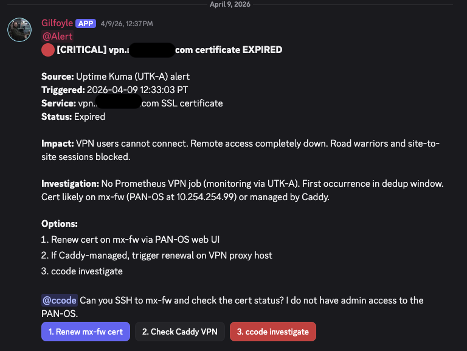

## The Wake-Up Call

On April 9, Gilfoyle -- my AI network admin -- posted this at midnight:



The cert flap resolved itself within hours -- Gilfoyle posted the recovery notice, and ccode closed the escalation. No lasting impact.

But the question stuck with me: **why was I relying on luck?**

If that flap had lasted longer -- during a weekend, during travel, during an incident that *needed* VPN access -- I'd have been locked out of my own infrastructure. The AI caught it. But catching a fire isn't the same as preventing one.

## The Problem I Was Actually Solving

My homelab's certificate management was a patchwork:

→ **Caddy** auto-renews `*.<YOUR_DOMAIN>` via Let's Encrypt (Cloudflare DNS-01 challenge)
→ **PAN-OS** needs that same wildcard cert for the GlobalProtect VPN portal
→ **SSL decryption** on the firewall needs an up-to-date root CA store
→ A **dedicated LXC** (30122) was running acme.sh separately -- doing the same job Caddy already does

Three separate cert lifecycles. Two ACME clients. One VM that existed solely to shuffle certificates. And no monitoring to tell me when any of it breaks -- until Gilfoyle started watching.

## The Architecture: Three Layers of Cert Automation

I didn't build this all at once. Each piece was a response to a real problem. The AI incident just connected them into a coherent system.

### Layer 1: Consolidate Certificate Renewal

**Problem:** Why run two separate ACME clients for the same wildcard cert?

**Solution:** Kill LXC 30122. Reuse Caddy's cert.

Caddy already auto-renews `*.<YOUR_DOMAIN>` and stores the cert/key on an NFS share (HA NFS pair). Proxmox mounts that share. A Semaphore Ansible playbook runs weekly, compares the Caddy cert fingerprint against what's on the firewall, and only deploys when they differ.

```yaml
# Simplified -- the playbook compares SHA-256 fingerprints
- name: Get live cert fingerprint from firewall
  shell: |
    echo | openssl s_client -connect vpn.<YOUR_DOMAIN>:443 2>/dev/null \
    | openssl x509 -fingerprint -sha256 -noout

- name: Get Caddy cert fingerprint from NFS
  shell: |
    openssl x509 -in /mnt/nfs-caddy-data/certificates/acme/cert.pem \
    -fingerprint -sha256 -noout

- name: Deploy only if fingerprints differ
  when: live_fingerprint != caddy_fingerprint
```

One ACME client. One renewal schedule. One less VM to maintain.

### Layer 2: Keep the Root Store Fresh

**Problem:** PAN-OS only updates its trusted root CA store on major software releases. Between upgrades, new CAs appear in browser trust stores but the firewall doesn't know about them. Users hit TLS errors on sites signed by newer CAs.

**Solution:** [pan-chainguard](https://github.com/PaloAltoNetworks/pan-chainguard) -- a Palo Alto Networks tool that pulls current root and intermediate certificates from CCADB (the Common CA Database used by Mozilla, Apple, Chrome, and Microsoft) and imports them to the firewall via the XML API.

Another Semaphore playbook. Same 5-phase pattern as the cert deploy: pre-flight, compare, deploy, validate, report. Runs monthly.

The Discord notification tells me exactly what changed:

> **✅ Root Store Update Complete**
>
> Added: 12 new certificates
> Previous count: 347 → New count: 359
> Source: CCADB (Mozilla, Apple, Chrome, Microsoft)

### Layer 3: The AI Monitoring Loop

**Problem:** The automation runs, but who watches the watcher?

**Solution:** Gilfoyle.

This is where the [MCP server]() and the [AI sysadmin]() tie together. Every 6 hours, Gilfoyle's infrastructure patrol checks:

- **Firewall posture** via `fw_status()` -- includes interface health, HA state, session count
- **Certificate expiry** -- caught by email-monitor (UTK-A sends alerts when certs approach expiry)
- **Semaphore failures** -- flags if the weekly cert deploy or monthly root store update failed

When Gilfoyle sees a cert-related alert, the alert-correlator kicks in:

1. Classify severity (Warning: expiring soon. Critical: expired.)
2. Cross-reference: Is Semaphore's cert deploy schedule running? When did it last succeed?
3. Check: Is the firewall serving the right cert? (via the MCP's `fw_status` tool)
4. Report with options and wait for approval

The AI doesn't renew certs. It watches the automation that renews certs and tells me when something breaks.

## PAN-OS XML API: What Nobody Tells You

A few gotchas I hit that aren't in the documentation:

**Private key import requires `passphrase=none`** even for unencrypted PEM keys. Without this parameter, the API silently accepts the import but the key isn't usable. The error only surfaces when you try to use the certificate.

**Certificate chain import splits silently.** Upload a PEM with server cert + intermediate, and PAN-OS imports only the leaf. You need to separately extract and import the intermediate CA:

```bash
# Extract intermediate from Caddy's combined PEM
awk '/BEGIN CERTIFICATE/{n++} n==2' cert.pem > intermediate-ca.pem
```

**No `show certificate` in the XML API.** I expected to verify imports by querying cert details. `<show><certificate>` returns "unexpected command." Instead, poll the live endpoint with `openssl s_client` and compare fingerprints.

**Partial commits scope by admin user.** Using a dedicated `certbot` admin user with only certificate management permissions means cert deploys never interfere with other admin sessions.

## What the Full Picture Looks Like

```
Caddy (auto-renews wildcard cert via Let's Encrypt)
  └── NFS share (HA pair)
       └── Semaphore (weekly Ansible playbook)
            ├── Compare fingerprints
            ├── Deploy to PAN-OS via XML API (if changed)
            └── Discord notification

pan-chainguard (monthly root store update)
  └── Semaphore (monthly Ansible playbook)
       ├── Download CCADB archive
       ├── Import to PAN-OS via guard.py
       └── Discord notification

Gilfoyle (24/7 AI monitoring)
  └── Infrastructure patrol (every 6h)
       ├── Check firewall posture
       ├── Monitor Semaphore task success/failure
       ├── Email-monitor catches cert expiry alerts
       └── Alert-correlator triages with cross-source data
```

<!-- SCREENSHOT: Semaphore showing the cert deploy and root store update templates -->

## Why I Used AI For This

I want to be clear about what the AI actually did here:

1. **Gilfoyle caught the expired cert** -- the monitoring that surfaced the problem
2. **Claude Code (ccode) investigated** -- SSH'd into the firewall, checked cert state, confirmed the flap
3. **I designed the automation** -- the Ansible playbooks, the Semaphore schedules, the NFS consolidation
4. **Claude Code helped me build it** -- wrote the playbook, debugged the XML API quirks, tested the deployment
5. **Gilfoyle now watches it** -- monitors that the automation keeps running

The AI didn't replace my thinking. It accelerated it. The expired cert was the signal. The AI helped me trace it to the root cause (fragmented cert management) and build the fix (consolidated automation with monitoring).

That's the pattern I keep coming back to: **AI surfaces the problem, AI helps you build the solution, AI watches the solution run.** You make the decisions.

## Lessons Learned

### 1. Catching a fire isn't preventing one

Gilfoyle flagged the expired cert. Great. But if I'd stopped there, I'd just have a better alarm system. The real value was using the incident to build automation that eliminates the failure mode entirely.

### 2. Consolidate before you automate

I could have automated LXC 30122's acme.sh setup. Instead, I killed the VM and reused Caddy's cert. One less moving part. The best automation is the kind you don't need to build because you eliminated the complexity.

### 3. The AI monitoring loop closes the gap

Automation handles the happy path. Monitoring handles the exceptions. Gilfoyle watching Semaphore's cert deploy schedule means I know within 6 hours if the automation breaks -- not when the cert expires 90 days later.

### 4. PAN-OS XML API demands patience

The silent failures (key import without passphrase, chain splitting, missing show commands) would have cost me days without AI assistance. Claude Code's ability to iterate rapidly on API quirks -- try, fail, read error, adjust -- compressed what would have been a weekend of documentation-hunting into an afternoon.

### 5. Document the gotchas for your future AI

The PAN-OS API quirks are now in a CLAUDE.md file in the project directory. When I (or an AI) touch this automation next year, the context is there. The AI that helped me build it is also the system that will help me maintain it.
