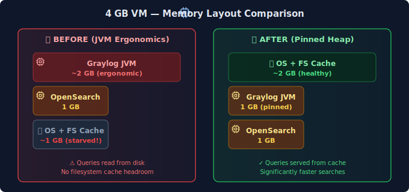

## The Problem

I noticed my Graylog VM was consuming more memory than expected. The VM has 4GB RAM allocated, but both Graylog and OpenSearch were competing for memory, leaving little headroom for the operating system's filesystem cache.

## What I Tried

First, I checked memory usage on the Graylog VM:

```bash
ssh -i ~/.ssh/<YOUR_KEY> <USER>@<GRAYLOG_IP>
free -h
docker stats --no-stream
```

The output showed the Graylog container was using significantly more memory than I'd anticipated. I had explicitly configured OpenSearch's heap (1GB), but I'd left Graylog's JVM to its default "ergonomic" settings.

## The Solution

I pinned Graylog's JVM heap explicitly in the Docker Compose environment:

```yaml
services:
  graylog:
    environment:
      # Pin JVM heap to 1g (prevents ergonomic over-allocation)
      GRAYLOG_SERVER_JAVA_OPTS: "-Xms1g -Xmx1g -XX:NewRatio=1 -server -XX:+UseG1GC"
```

The key flags:
- `-Xms1g -Xmx1g`: Fixed heap size (no dynamic growth)
- `-XX:NewRatio=1`: Equal old/young generation split (good for Graylog's allocation patterns)
- `-XX:+UseG1GC`: G1 garbage collector (better for larger heaps)

After redeploying:

```bash
cd /opt/graylog
docker compose down && docker compose up -d
```

Memory usage stabilized, and I recovered ~1GB for the OS.

## Root Cause

**JVM ergonomics** is the culprit. When you don't specify heap size, the JVM calculates a "reasonable" default based on available system memory—typically 25% of RAM for the max heap. On a 4GB VM, that's ~1GB... but the JVM may allocate additional memory for:

- Metaspace (class metadata)
- Code cache (JIT compilation)
- Native memory (direct buffers, threads)

The result: a JVM configured for 1GB heap can easily consume 1.5-2GB total.

**Why this matters for log servers:** OpenSearch (which stores the actual logs) benefits enormously from filesystem cache. Linux uses free RAM to cache frequently-accessed files, making queries faster. When the JVM hogs all available memory, OpenSearch has to read from disk for every query.

### Memory Layout Comparison



**The key insight:** OpenSearch benefits enormously from filesystem cache. When the JVM hogs all available memory, OpenSearch has to read from disk for every query. Leaving ~2 GB free for OS cache makes queries significantly faster.

## Key Takeaways

1. **Always pin JVM heap for containerized apps**: Don't trust JVM ergonomics in resource-constrained environments. Explicit is better than implicit.

2. **Monitor memory before deploying**: Run `docker stats` and `free -h` after deploying any Java-based service to verify actual consumption matches expectations.

3. **Read the vendor sizing guides**: Both [Graylog](https://go2docs.graylog.org/current/setting_up_graylog/server_configuration.html) and [OpenSearch](https://opensearch.org/docs/latest/install-and-configure/install-opensearch/index/) have memory tuning documentation. The general rule: give OpenSearch 50% of available RAM, but never more than 32GB (pointer compression limit).

4. **Leave headroom for OS filesystem cache**: This is the hidden performance multiplier for any disk-intensive workload. A log server with 4GB RAM and proper tuning will outperform one with 8GB RAM where the JVM consumes everything.

## Verification

After the change, I confirmed the improvement:

```bash
# Check container memory usage
docker stats --no-stream graylog opensearch

# Check system memory (look for buff/cache)
free -h

# Test query performance in Graylog UI
# Search → Last 24 hours → "source:*" → Note response time
```

The filesystem cache (`buff/cache` in `free -h` output) should now show 1-2GB, indicating the OS has memory available for caching OpenSearch index files.
