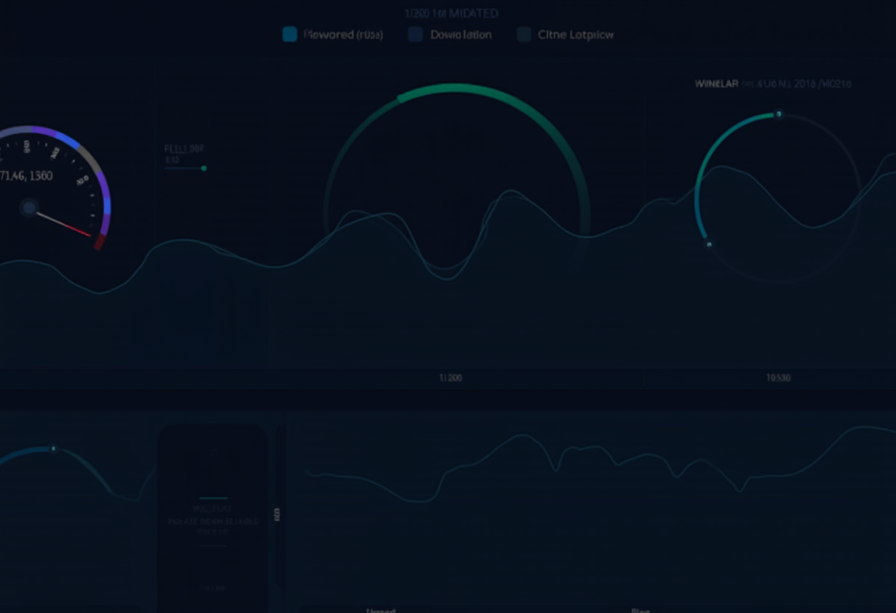

## Overview

I migrated my internet speed monitoring from Speedtest Tracker to MySpeed after learning that Speedtest Tracker was deprecating native Discord notifications. Rather than adding an Apprise sidecar container for notifications, I opted for MySpeed which has built-in Discord support.

## Why Migrate?

| Factor | Speedtest Tracker | MySpeed |
|--------|-------------------|---------|
| Stack | Laravel/PHP | Node.js |
| Discord | Deprecated (needs Apprise) | Native support |
| Complexity | nginx + php-fpm + SQLite | Single Docker container |
| Updates | Manual | Watchtower auto-update |

### Architecture Comparison


flowchart TB
    subgraph OLD["❌ OLD: Speedtest Tracker"]
        direction TB
        O_NGINX["nginx"]
        O_PHP["php-fpm"]
        O_APP["Speedtest Tracker<br/>(Laravel)"]
        O_DB["SQLite"]
        O_APPRISE["Apprise<br/>(sidecar)"]
        O_DISCORD["Discord"]

        O_NGINX --> O_PHP --> O_APP --> O_DB
        O_APP -.->|"deprecated"| O_APPRISE --> O_DISCORD
    end

    subgraph NEW["✅ NEW: MySpeed"]
        direction TB
        N_APP["MySpeed<br/>(Node.js)"]
        N_WT["Watchtower<br/>(auto-updates)"]
        N_DISCORD["Discord"]

        N_APP -->|"native"| N_DISCORD
        N_WT -.->|"watches"| N_APP
    end

    classDef old fill:#ffebee,stroke:#c62828
    classDef new fill:#e8f5e9,stroke:#2e7d32
    classDef deprecated fill:#fafafa,stroke:#9e9e9e,stroke-dasharray: 5 5

    class OLD old
    class NEW new
    class O_APPRISE deprecated


## Prerequisites

- Existing LXC or VM with network connectivity
- Docker and docker-compose installed
- Reverse proxy configuration (Caddy/nginx)
- DNS records configured

## Migration Steps

### Step 1: Backup Existing Data

Before removing Speedtest Tracker, I preserved the historical data:

```bash
# SSH to the server
ssh -i ~/.ssh/<YOUR_KEY> <USER>@<SPEED_MONITOR_IP>

# Create backup directory
sudo mkdir -p /opt/speedtest-tracker-backup

# Backup the SQLite database
sudo cp /opt/speedtest-tracker/database/database.sqlite \
  /opt/speedtest-tracker-backup/speedtest-final-backup.sqlite
```

### Step 2: Stop Old Services

```bash
# Stop and disable the old PHP services
sudo systemctl stop nginx php*-fpm
sudo systemctl disable nginx php*-fpm

# Remove old installation (optional, after verifying backup)
sudo rm -rf /opt/speedtest-tracker
```

### Step 3: Install Docker (if not present)

```bash
sudo apt-get update
sudo apt-get install -y docker.io docker-compose
sudo systemctl enable docker
sudo systemctl start docker
```

### Step 4: Deploy MySpeed

Create the deployment directory and compose file:

```bash
sudo mkdir -p /opt/myspeed
sudo tee /opt/myspeed/docker-compose.yml << 'EOF'
version: '3.8'

services:
  myspeed:
    image: germannewsmaker/myspeed:latest
    container_name: myspeed
    restart: unless-stopped
    ports:
      - '5216:5216'
    volumes:
      - myspeed-data:/myspeed/data
    environment:
      - TZ=<YOUR_TIMEZONE>

  watchtower:
    image: containrrr/watchtower:latest
    container_name: watchtower
    restart: unless-stopped
    volumes:
      - /var/run/docker.sock:/var/run/docker.sock
    environment:
      - WATCHTOWER_CLEANUP=true
      - WATCHTOWER_TIMEOUT=300s
      - WATCHTOWER_ROLLING_RESTART=true
      - WATCHTOWER_SCHEDULE=0 0 4 */14 * *
      - DOCKER_API_VERSION=1.44
      - TZ=<YOUR_TIMEZONE>

volumes:
  myspeed-data:
EOF
```

Start the containers:

```bash
cd /opt/myspeed
sudo docker compose up -d
```

### Step 5: Update Reverse Proxy

For Caddy, update your site configuration:

```caddyfile
myspeed.<YOUR_DOMAIN> {
    reverse_proxy http://<SPEED_MONITOR_IP>:5216 {
        health_uri /
        health_interval 30s
        health_timeout 5s
    }
    header {
        Strict-Transport-Security "max-age=31536000; includeSubDomains; preload"
    }
}
```

Validate and reload:

```bash
docker exec caddy caddy validate --config /etc/caddy/Caddyfile
docker compose restart caddy
```

### Step 6: Update DNS

Add an A record pointing your hostname to the server IP:

```
<YOUR_HOSTNAME>.local  →  <SPEED_MONITOR_IP>
```



## Verification

```bash
# Check container is running
sudo docker ps | grep myspeed

# Test HTTP response
curl -s -o /dev/null -w '%{http_code}' http://localhost:5216
# Expected: 200

# Test DNS resolution
dig @<DNS_SERVER_IP> myspeed.<YOUR_DOMAIN> +short
```

## Configuring Discord Notifications

This was the whole point of the migration! MySpeed makes it simple:

1. Access the MySpeed web UI
2. Navigate to **Settings** → **Notifications**
3. Add your Discord webhook URL
4. Configure triggers (test failures, speed drops, etc.)
5. Send a test notification to verify

## What I Learned

1. **Built-in integrations matter**: Choosing apps with native features saves complexity
2. **Docker simplifies migrations**: Swapping container-based services is trivial
3. **Always backup first**: Even if data isn't directly importable, it's good to have
4. **HA deployments need attention**: Remember to update ALL reverse proxy nodes

## Troubleshooting

### Container won't start
Check logs: `sudo docker logs myspeed --tail 50`

### Can't access web UI
Verify the port isn't blocked and container is healthy:
```bash
sudo docker ps
curl http://localhost:5216
```

### Discord notifications not working
- Verify webhook URL is correct
- Check MySpeed logs for API errors
- Test webhook directly with curl

## Resources

- [MySpeed GitHub](https://github.com/gnmyt/MySpeed)
- [Speedtest Tracker Archive](https://github.com/alexjustesen/speedtest-tracker) (for reference)
