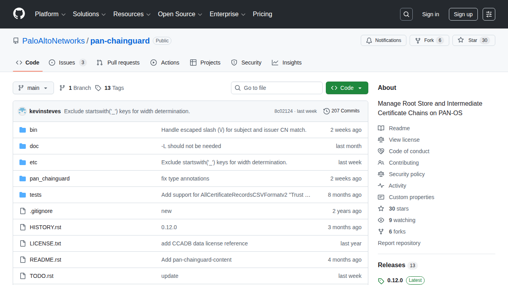

## Overview

If you're running SSL decryption on a Palo Alto firewall, you've probably hit this: a user reports they can't access a website, and it turns out the site's CA certificate isn't in your firewall's trusted root store. PAN-OS only updates its built-in root store on major software releases, which means between upgrades your firewall's trust anchors slowly go stale.

[pan-chainguard](https://github.com/PaloAltoNetworks/pan-chainguard) by Palo Alto Networks solves this. It pulls current root and intermediate CA certificates from CCADB (the Common CA Database used by Mozilla, Apple, Chrome, and Microsoft) and imports them into your firewall's device certificate store via the XML API.

I already had a Semaphore playbook that deploys my wildcard TLS certificate to the firewall weekly. This new automation follows the exact same pattern — just with a different certificate payload.

## The Problem

PAN-OS maintains a "Default Trusted CA" store that ships with each major release. Between releases, new Certificate Authorities get added to browser trust stores (Mozilla NSS, Apple, Chrome Root Program, Microsoft) but your firewall doesn't know about them. When the firewall performs SSL decryption and encounters a certificate chain signed by a CA it doesn't trust, users see TLS errors.

The manual fix is to periodically download new CA certificates and import them one by one through the web UI. That doesn't scale.

## The Solution

### Architecture


flowchart TD
    A[pan-chainguard-content GitHub Action] -->|Download archive| B[Python Host utility LXC]
    B -->|guard.py| C[PAN-OS Firewall XML API]
    C -->|Import + commit| D[Trusted CA Store Updated]
    D --> E[Discord Notification]

    style A fill:#2d333b,stroke:#58a6ff,color:#c9d1d9
    style B fill:#2d333b,stroke:#3fb950,color:#c9d1d9
    style C fill:#2d333b,stroke:#f0883e,color:#c9d1d9
    style D fill:#2d333b,stroke:#3fb950,color:#c9d1d9
    style E fill:#2d333b,stroke:#bc8cff,color:#c9d1d9


The `pan-chainguard-content` repository runs a GitHub Action daily that builds a certificate archive (`certificates-new.tgz`) from all four major vendor root programs. My Semaphore playbook downloads this archive monthly and uses `guard.py` to import everything to the firewall.

### How It Works

The Ansible playbook follows a 5-phase structure (identical to my existing cert deploy playbook):

**Phase 1 — Pre-flight:** Install `pan-chainguard` via pip, download the latest certificate archive from GitHub releases, verify the archive is valid.

**Phase 2 — Compare:** Generate a PAN-OS API key, query the firewall's current device certificate count as a baseline.

**Phase 3 — Deploy:** Create a temporary `.panrc` file for `guard.py` authentication, run `guard.py` to import all root and intermediate certificates, clean up the `.panrc` immediately after.

**Phase 4 — Validate:** Wait for the commit to settle, query the certificate count again, calculate the delta.

**Phase 5 — Report:** Send a Discord notification with the results — green if certificates were added, gray if already current, red with an @mention if something failed.

### Key Design Decisions

**Reuse existing API credentials.** I already had a `certbot` admin account on the firewall with import/commit permissions for the TLS cert automation. Rather than creating a separate service account, I reused it — both automations push certificates through the same API, and partial commits are scoped per admin session so they don't interfere with each other.

**Pre-built archive (simple path).** pan-chainguard supports a custom pipeline where you choose specific vendor root programs, but for a homelab the "all vendors" archive from pan-chainguard-content is perfect. One download, one import.

**Monthly schedule.** Root CA changes are infrequent — monthly catches everything meaningful without unnecessary API calls. You can always trigger it manually from the Semaphore UI if needed.

**Temporary credentials file.** `guard.py` uses a `.panrc` file for authentication. The playbook creates it with a unique epoch-based filename, uses it, and deletes it in an Ansible `always` block — so even on failure, the API key doesn't persist on disk.

## Prerequisites

- A Palo Alto firewall with API access enabled
- An API admin account with import, commit, and export permissions
- A host with Python 3 and pip (I used a dedicated utility LXC)
- Network connectivity from the Python host to the firewall management interface
- Semaphore (or any Ansible runner) for scheduling

## Verification

After the first run, check:

1. **Semaphore output** — The playbook logs certificate count before and after
2. **Discord** — A notification embed shows the delta
3. **Firewall UI** — Device > Certificate Management shows the new trusted CAs

## What I Learned

The `PANRC` environment variable is key for automation. Rather than placing `.panrc` in the user's home directory (which could conflict with other tools), you can point `guard.py` to any file path. Combined with Ansible's `always` block for cleanup, this makes the credentials lifecycle completely ephemeral.

Also worth noting: `guard.py` is idempotent. Running it twice with the same archive doesn't create duplicate certificates — it updates existing ones if they've changed and skips those that haven't. This makes the monthly schedule safe with no special "check if already ran" logic needed.
