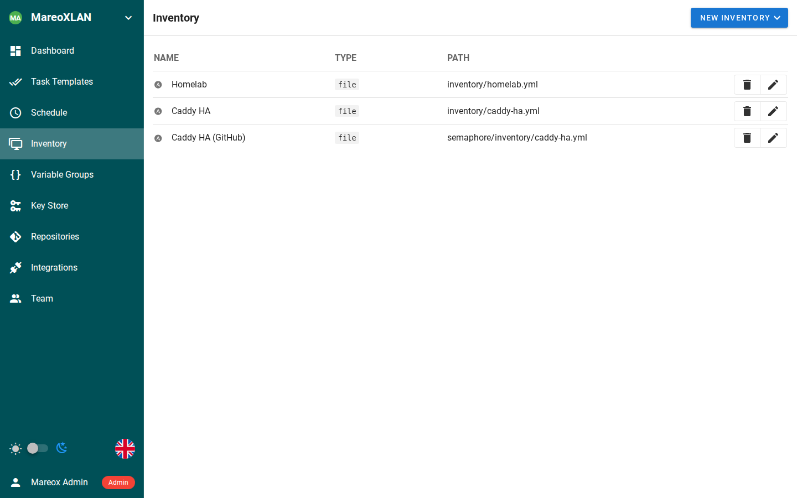
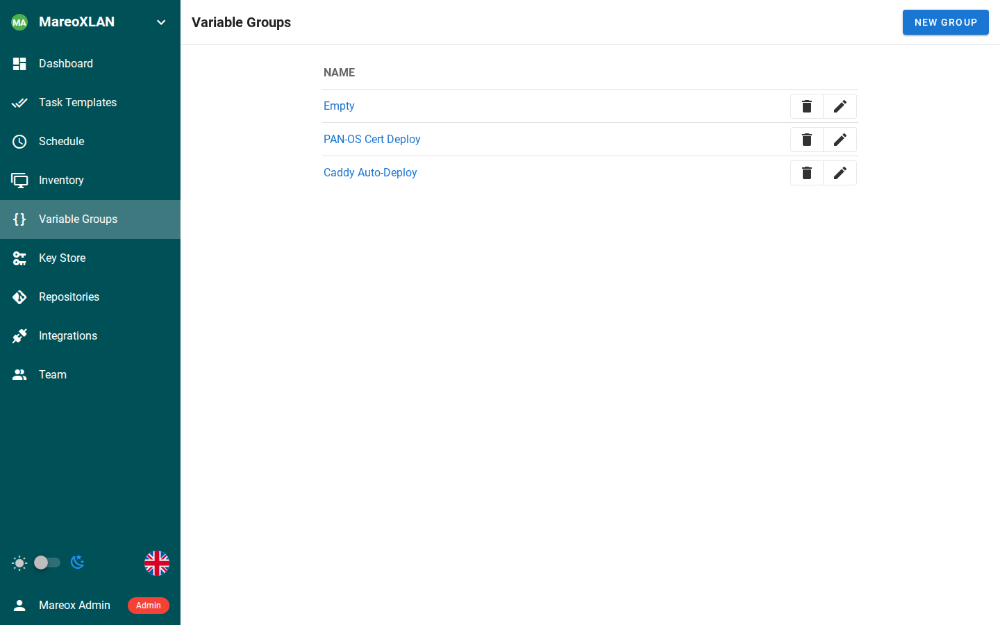
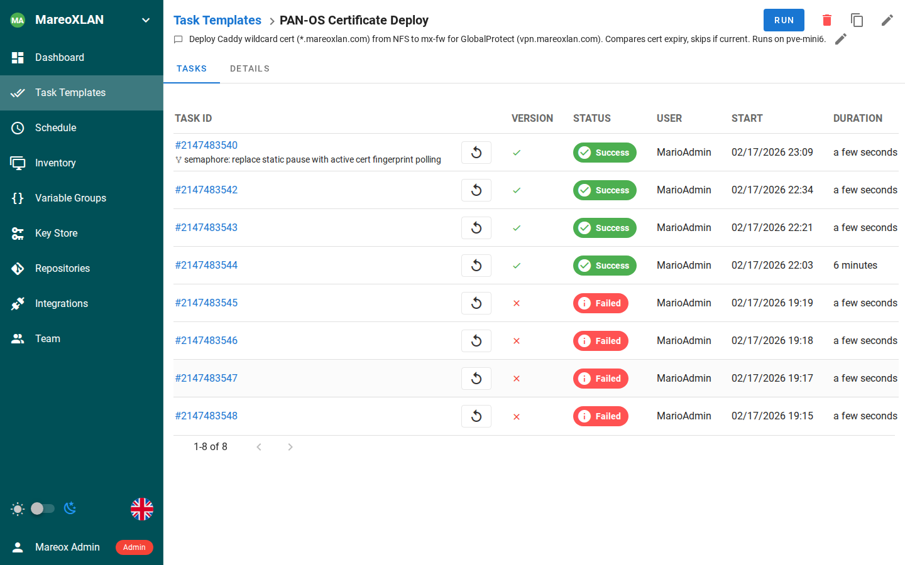
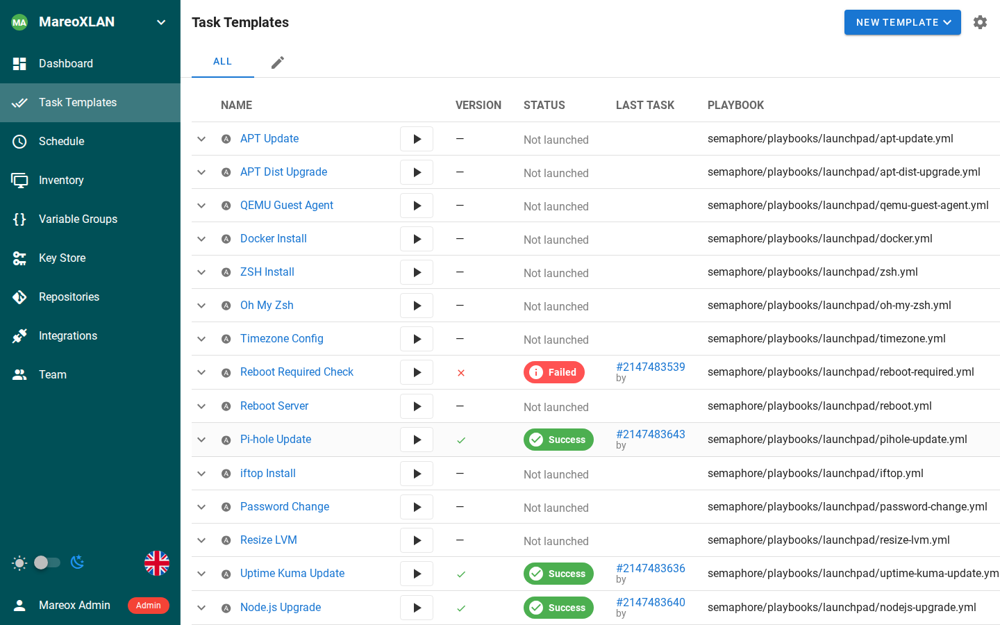

## Overview

If you're running SSL decryption on a Palo Alto firewall, you've probably hit this: a user reports they can't access a website, and it turns out the site's CA certificate isn't in your firewall's trusted root store. PAN-OS only updates its built-in root store on major software releases, which means between upgrades your firewall's trust anchors slowly go stale.

[pan-chainguard](https://github.com/PaloAltoNetworks/pan-chainguard) by Palo Alto Networks solves this. It pulls current root and intermediate CA certificates from CCADB (the Common CA Database used by Mozilla, Apple, Chrome, and Microsoft) and imports them into your firewall's device certificate store via the XML API.

I already had a Semaphore playbook that deploys my wildcard TLS certificate to the firewall weekly. This new automation follows the exact same pattern — just with a different certificate payload.

## The Problem

PAN-OS maintains a "Default Trusted CA" store that ships with each major release. Between releases, new Certificate Authorities get added to browser trust stores (Mozilla NSS, Apple, Chrome Root Program, Microsoft) but your firewall doesn't know about them. When the firewall performs SSL decryption and encounters a certificate chain signed by a CA it doesn't trust, users see TLS errors.

The manual fix is to periodically download new CA certificates and import them one by one through the web UI. That doesn't scale.

## The Solution

### Architecture

```text
pan-chainguard-content          Python Host            PAN-OS Firewall
  (GitHub Action)              (utility LXC)            (XML API)
       │                            │                       │
       │   Download archive         │                       │
       ├───────────────────────────►│                       │
       │                            │     guard.py          │
       │                            ├──────────────────────►│
       │                            │                       │
       │                            │   Import + commit     │
       │                            │                       ├──► Trusted CA Store
       │                            │                       │       Updated
       │                            │                       │
       │                            │                       ├──► Discord
       │                            │                       │    Notification
```

The `pan-chainguard-content` repository runs a GitHub Action daily that builds a certificate archive (`certificates-new.tgz`) from all four major vendor root programs. My Semaphore playbook downloads this archive monthly and uses `guard.py` to import everything to the firewall.

### How It Works

The Ansible playbook follows a 5-phase structure (identical to my existing cert deploy playbook):

**Phase 1 — Pre-flight:** Install `pan-chainguard` via pip, download the latest certificate archive from GitHub releases, verify the archive is valid.

**Phase 2 — Compare:** Generate a PAN-OS API key, query the firewall's current device certificate count as a baseline.

**Phase 3 — Deploy:** Create a temporary `.panrc` file for `guard.py` authentication, run `guard.py` to import all root and intermediate certificates, clean up the `.panrc` immediately after.

**Phase 4 — Validate:** Wait for the commit to settle, query the certificate count again, calculate the delta.

**Phase 5 — Report:** Send a Discord notification with the results — green if certificates were added, gray if already current, red with an @mention if something failed.

### Key Design Decisions

**Reuse existing API credentials.** I already had a `certbot` admin account on the firewall with import/commit permissions for the TLS cert automation. Rather than creating a separate service account, I reused it — both automations push certificates through the same API, and partial commits are scoped per admin session so they don't interfere with each other.

**Pre-built archive (simple path).** pan-chainguard supports a custom pipeline where you choose specific vendor root programs, but for a homelab the "all vendors" archive from pan-chainguard-content is perfect. One download, one import.

**Monthly schedule.** Root CA changes are infrequent — monthly catches everything meaningful without unnecessary API calls. You can always trigger it manually from the Semaphore UI if needed.

**Temporary credentials file.** `guard.py` uses a `.panrc` file for authentication. The playbook creates it with a unique epoch-based filename, uses it, and deletes it in an Ansible `always` block — so even on failure, the API key doesn't persist on disk.

## Setting It Up in Semaphore

Here's how I configured this in Semaphore. If you're using a different Ansible runner, the playbook itself is the same — you just need to wire up the environment variables and scheduling differently.

### Step 1: Inventory

The playbook targets `python-lxc` — a dedicated utility host with Python 3 and pip. Your inventory needs this host defined, plus network access from it to the firewall's management interface.



I use a single `homelab.yml` inventory file that groups hosts by function. The `python-lxc` host lives in the `utility` group. The firewall (`mx-fw`) is in the `palo_alto` group — the playbook reaches it via API calls, not SSH.

### Step 2: Variable Group (Environment Variables)

Create a Variable Group with the credentials the playbook needs. I named mine "PAN-OS Cert Deploy" and reused it from my existing TLS certificate playbook since both automations talk to the same firewall with the same API user.



The required variables:

```json
{
  "PANOS_USER": "certbot",
  "PANOS_PASS": "<your-api-admin-password>",
  "DISCORD_WEBHOOK": "https://discord.com/api/webhooks/<your-webhook>"
}
```

`PANOS_HOST` defaults to `mx-fw.mareoxlan.local` in the playbook, so I don't set it here. Adjust if your firewall hostname is different.

### Step 3: Task Template

Create a new Task Template. The key settings:

- **Name**: PAN-OS Root Store Update (chainguard)
- **Playbook**: `playbooks/homelab/panos-chainguard-update.yml`
- **Inventory**: Homelab
- **Variable Group**: PAN-OS Cert Deploy
- **Repository**: Your Git repo containing the playbook

For reference, here's my existing PAN-OS Certificate Deploy template (#22) which this new one mirrors. You can see the task history — green for successful runs, red for the early failures while I was testing.



### Step 4: Schedule

Set up a cron schedule for the 1st of each month. I chose 4 AM Pacific to avoid peak hours:

```json
"0 4 1 * *"
```

Root CA changes are infrequent — monthly is plenty. You can always hit "Run" manually if you know a new CA was just added to a vendor root program.

### Step 5: All Templates at a Glance

Once configured, the template appears alongside your other automation tasks. Here's my MareoXLAN project with 23 templates covering everything from apt updates to certificate management.



## Prerequisites

- A Palo Alto firewall with API access enabled
- An API admin account with import, commit, and export permissions
- A host with Python 3 and pip (I used a dedicated utility LXC)
- Network connectivity from the Python host to the firewall management interface
- Semaphore (or any Ansible runner) for scheduling

## Verification

After the first run, check:

1. **Semaphore output** — The playbook logs certificate count before and after
2. **Discord** — A notification embed shows the delta (green = new certs added, gray = already current)
3. **Firewall UI** — Device > Certificate Management shows the new trusted CAs

## What I Learned

The `PANRC` environment variable is key for automation. Rather than placing `.panrc` in the user's home directory (which could conflict with other tools), you can point `guard.py` to any file path. Combined with Ansible's `always` block for cleanup, this makes the credentials lifecycle completely ephemeral.

Also worth noting: `guard.py` is idempotent. Running it twice with the same archive doesn't create duplicate certificates — it updates existing ones if they've changed and skips those that haven't. This makes the monthly schedule safe with no special "check if already ran" logic needed.
