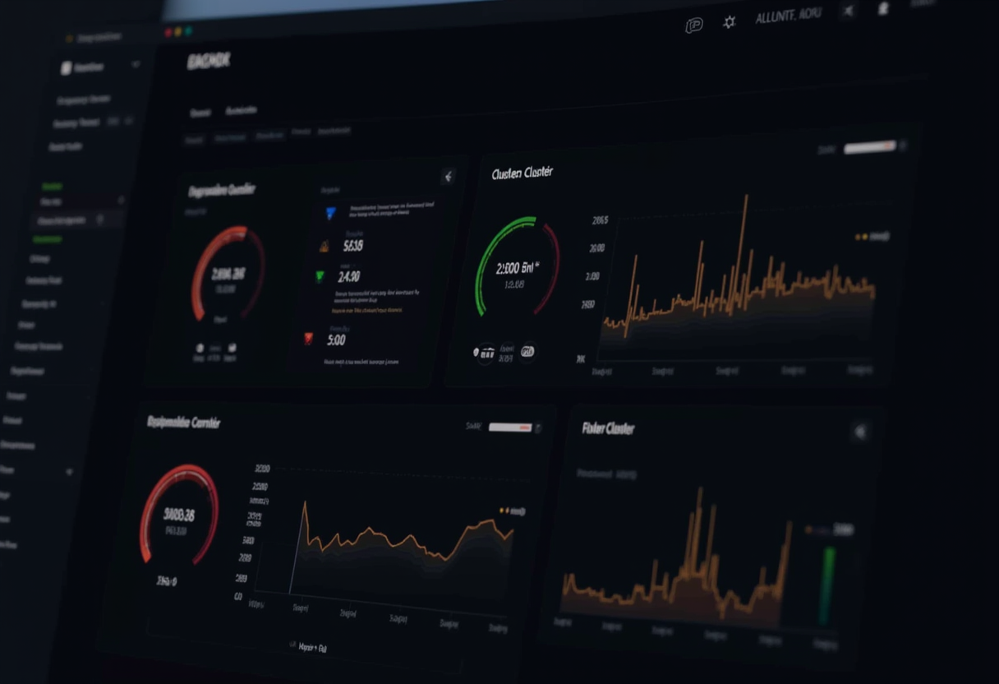

## The Goal

Add all 4 Proxmox VE cluster nodes (pve-mini2, pve-mini3, pve-mini5, pve-mini6) to the existing Prometheus/Grafana stack on LXC 30194. The monitoring stack already covered Graylog, Windows desktop, and PAN-OS firewall metrics -- Proxmox was the last major gap.

## Approach: pve-exporter vs node_exporter

I evaluated two options:

1. **node_exporter on each Proxmox host** -- gives OS-level metrics (CPU, RAM, disk, network) but misses Proxmox-specific data like VM/CT status, storage pools, and cluster quorum.
2. **pve-exporter (API-based)** -- a single relay container that queries the Proxmox VE REST API and exposes all cluster, node, storage, and guest metrics. One container monitors the entire cluster.

I chose **pve-exporter** because it provides Proxmox-native metrics (guest status, storage pool usage, cluster health) without installing anything on the Proxmox hosts themselves. The trade-off is slightly less OS-level detail, but for cluster oversight this is the better fit.

## Implementation

### PVE API Token

Created a dedicated API user and token on the Proxmox cluster:

```bash
# On any Proxmox node
pveum user add prometheus@pve
pveum aclmod / -user prometheus@pve -role PVEAuditor
pveum user token add prometheus@pve exporter --privsep 0
```

Key lesson: the token was initially created with `--privsep 1` (default), which caused 403 Forbidden errors on `/api2/json/cluster/status` despite the correct role assignment. Switching to `--privsep 0` (token inherits user permissions) resolved it. The `PVEAuditor` built-in role provides read-only access to all cluster data.

### Docker Compose

Added pve-exporter to the existing stack:

```yaml
pve-exporter:
  image: prompve/prometheus-pve-exporter:3
  container_name: pve-exporter
  restart: unless-stopped
  environment:
    - TZ=America/Los_Angeles
    - PVE_USER=${PVE_USER}
    - PVE_TOKEN_NAME=${PVE_TOKEN_NAME}
    - PVE_TOKEN_VALUE=${PVE_TOKEN_VALUE}
    - PVE_VERIFY_SSL=${PVE_VERIFY_SSL}
  ports:
    - "9221:9221"
```

### Prometheus Scrape Jobs

Two scrape jobs using the same multi-target relay pattern as snmp-exporter:

- **`pve-cluster`**: Scrapes one node (192.168.30.202) with `cluster=1, node=0` for cluster-wide metrics
- **`pve-nodes`**: Scrapes all 4 nodes individually with `cluster=0, node=1` for per-node metrics

The per-node job uses relabel rules to assign friendly instance names (`pve-mini2`, `pve-mini3`, etc.) -- the same 4th-rule pattern established for the SNMP firewall job.

### Grafana Dashboard

Created a 21-panel dashboard across 5 sections:

| Section | Panels | Purpose |
|---------|--------|---------|
| Cluster Overview | 5 stat panels | Nodes online, VMs/CTs running, stopped guests, PVE version |
| Node Status | 3 time series | Per-node CPU, memory %, memory absolute |
| Storage | 2 panels | Storage usage bar gauge + trend over time |
| Guest Overview | 2 bar gauges | Top 10 guests by CPU and memory |
| Guest Details | 4 time series | Per-guest CPU, memory, network I/O, disk I/O |

Template variables for `node` (multi-select) and `guest_type` (All/VMs/CTs) enable filtering.

### Alert Rules

Added 5 Proxmox-specific alerts:

| Alert | Condition | Severity |
|-------|-----------|----------|
| Proxmox Node Down | `pve_up < 1` | Critical |
| PVE Node CPU > 85% | Sustained CPU > 85% | Warning |
| PVE Node Memory > 90% | Sustained memory > 90% | Warning |
| PVE Storage > 85% | Any storage pool > 85% | Warning |
| Critical Guest Down | Guest with `onboot=1` is stopped | Critical |

The "Critical Guest Down" alert uses an `and on(id)` join between `pve_up` and `pve_onboot_status` to only fire for guests configured to auto-start.

## Challenges and Fixes

### PVE Token Authentication (privsep)
The biggest debugging effort was the 403 errors with `--privsep 1`. Even after assigning PVEAuditor to both the user AND the token, API calls failed. Recreating the token with `--privsep 0` fixed it immediately. This seems to be either a PVE bug or an undocumented behavior where privilege separation doesn't fully propagate token ACLs.

### Grafana Folder Caching
The Proxmox dashboard initially landed in the "Graylog Monitoring" folder instead of the "Proxmox" folder. The root cause was that the server still had the old `dashboards.yml` with a single catch-all provider. Even after a Grafana volume reset, the old config was still being used. The fix required **both** deploying the correct per-folder `dashboards.yml` **and** resetting the Grafana data volume.

### Deployment File Sync
The `scp -r` of the provisioning directory didn't fully sync all files -- the `rules.yml` on the server was missing the Proxmox alert group, and the dashboard JSON didn't copy into the `Proxmox/` subdirectory. Had to SCP individual files and verify on the server. Lesson: always verify deployed files match local copies after bulk SCP operations.

## Final Verification

After deployment, all systems verified healthy:




- **12/12 Prometheus targets UP** (including `pve-cluster` + 4 `pve-nodes`)
- **6/6 containers running** (prometheus, grafana, opensearch-exporter, snmp-exporter, node-exporter, pve-exporter)
- **Dashboard in Proxmox folder** with 21 panels rendering correctly
- **13 alert rules active** (4 Graylog + 4 mx-fw + 5 Proxmox)
- All 4 Proxmox nodes reporting metrics with friendly instance names

## Files Changed

| File | Change |
|------|--------|
| `prometheus/docker-compose.yml` | Added pve-exporter service |
| `prometheus/prometheus.yml` | Added pve-cluster and pve-nodes scrape jobs |
| `prometheus/.env` / `.env.example` | Added PVE_USER, PVE_TOKEN_NAME, PVE_TOKEN_VALUE, PVE_VERIFY_SSL |
| `prometheus/grafana/provisioning/dashboards/Proxmox/proxmox-cluster-overview.json` | New 21-panel dashboard |
| `prometheus/grafana/provisioning/dashboards/dashboards.yml` | Added Proxmox folder provider |
| `prometheus/grafana/provisioning/alerting/rules.yml` | Added proxmox-cluster alert group (5 rules) |
| `prometheus/CLAUDE.md` | Updated with pve-exporter, dashboard, alerts documentation |

## Key Takeaways

1. **pve-exporter is excellent for cluster-level monitoring** -- one container covers all nodes, VMs, CTs, and storage with no agent installation on Proxmox hosts
2. **Always use `--privsep 0`** for pve-exporter API tokens unless you have a specific reason for privilege separation
3. **Grafana folder assignments are cached in SQLite** -- changing `dashboards.yml` folder config requires a volume reset (`docker volume rm`), not just a restart
4. **Verify deployed files on the server** -- bulk SCP can silently skip files, especially in subdirectories
5. **The multi-target relay pattern** (same as snmp-exporter) works seamlessly for pve-exporter with the standard 3-rule relabel + 4th rule for friendly names
