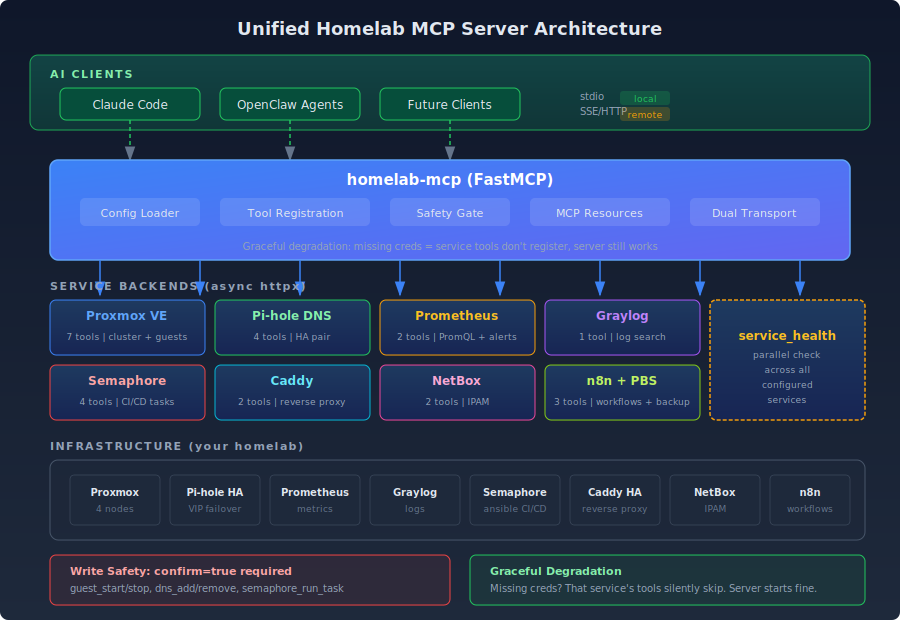
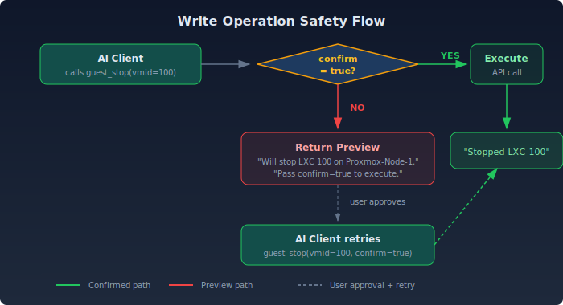

## The Problem: Six Interfaces for One Question

"Is anything broken in my homelab?"

Answering that question used to mean: SSH into Proxmox to check guest status. Curl the Pi-hole API for DNS health. Open Grafana to scan Prometheus alerts. Check Graylog for error spikes. Look at Semaphore for failed automation runs. Glance at Caddy logs for 502s.

Six interfaces. Six authentication contexts. Six mental models. And that's just the read side. Want to restart a misbehaving container? That's another SSH session, another set of commands, another chance to fat-finger a VMID.

I had two MCP servers already: one for Semaphore (CI/CD automation) and one for PAN-OS (firewall management). Each worked fine in isolation. But every new MCP server meant another process, another `.mcp.json` entry, and no way to do cross-service operations like "check the health of everything."

## The Decision

Build a single [FastMCP](https://github.com/jlowin/fastmcp) server that wraps all 9 homelab services behind one unified interface. One process. One config. 26 tools covering daily infrastructure operations.

The Semaphore MCP gets absorbed. The PAN-OS MCP stays separate (it's an upstream fork with a different domain). Everything else is new.

### Why MCP?

MCP (Model Context Protocol) is the native protocol for AI clients like Claude Code. Building a REST API would require an adapter layer. MCP tools map directly to what an AI assistant can call, with structured input schemas, descriptions, and return types. The AI doesn't need to parse HTML or guess at curl flags. It calls `list_guests(status="running")` and gets structured data back.

## Architecture

The server follows a modular pattern: one Python module per service, each with its own async HTTP client, all registered conditionally at startup.



### Graceful Degradation

This was the most important design choice. The server loads each service config independently with try/except. Missing Graylog credentials? Graylog tools don't register, but everything else works. The server starts successfully with just Proxmox configured.

```python
# Each service loads independently
try:
    config.proxmox = ProxmoxSettings()
except ValidationError:
    config.proxmox = None  # Tools won't register

try:
    config.graylog = GraylogSettings()
except ValidationError:
    config.graylog = None  # Graylog tools silently absent
```

This means you can start using the MCP immediately with just one service configured, then add credentials for others as needed. No "all or nothing" startup failures.

### The Safety Gate

Every write operation (starting/stopping containers, adding DNS records, running Semaphore tasks) goes through a confirmation gate. Without `confirm=true`, the tool returns a preview of what it would do.



This maps perfectly to Claude Code's permission model. The AI calls the tool, gets the preview, shows it to the user, and only executes when approved. No accidental `guest_stop` on a production database.

```python
def require_confirmation(action: str, details: str, confirm: bool) -> str | None:
    if confirm:
        return None  # Proceed with execution
    return f"Will {action}. {details}\nPass confirm=true to execute."
```

Simple, but it means every destructive operation has a human approval step baked into the protocol.

## Service Backends

### Proxmox (the core)

The Proxmox service was ported from an existing infrastructure drift scanner. The key reuse was the IP extraction logic, which handles Proxmox's inconsistent IP reporting across LXC configs, cloud-init, and QEMU agent data:

```python
def _extract_ip_from_config(config: dict) -> str | None:
    # Try cloud-init first
    if ipconfig := config.get("ipconfig0", ""):
        if match := re.search(r"ip=(\d+\.\d+\.\d+\.\d+)", ipconfig):
            return match.group(1)
    # Fall back to net0 static IP
    if net0 := config.get("net0", ""):
        if match := re.search(r"ip=(\d+\.\d+\.\d+\.\d+)", net0):
            return match.group(1)
    return None
```

The original used synchronous `requests`. The port to async `httpx` was mechanical but important: MCP servers handle concurrent tool calls, so blocking I/O would serialize everything.

**Tools**: `infra_overview`, `list_guests`, `get_guest`, `node_status`, `guest_start`, `guest_stop`, `guest_restart`

### Pi-hole HA

The homelab runs Pi-hole in a high-availability pair with keepalived failover. The MCP service manages both instances, authenticating to each independently using Pi-hole v6's session-based auth (SID + CSRF tokens):

```python
class PiholeService:
    def __init__(self, settings):
        self.dns1 = PiholeClient(settings.dns1_url, settings.dns1_password)
        self.dns2 = PiholeClient(settings.dns2_url, settings.dns2_password)

    async def add_record(self, domain: str, ip: str, confirm: bool):
        # Write to BOTH servers for HA consistency
        await self.dns1.add_record(domain, ip)
        await self.dns2.add_record(domain, ip)
```

**Tools**: `dns_list_records`, `dns_lookup`, `dns_add_record`, `dns_remove_record`

### Prometheus

No auth needed (internal network), so this service always loads when the server starts. Exposes raw PromQL queries and a structured alerts endpoint:

**Tools**: `prom_query`, `prom_alerts`, `prom_targets`

### Graylog

Basic auth over the Graylog REST API. The search tool accepts a query string and timerange, returning structured log entries:

**Tools**: `search_logs`, `graylog_streams`, `graylog_overview`

### Semaphore (absorbed)

The standalone Semaphore MCP server (376 lines, raw `Server` class) was ported into the unified server. Same httpx async pattern, but with cleaner FastMCP decorators and the shared safety gate for `run_task`:

**Tools**: `semaphore_list_projects`, `semaphore_list_templates`, `semaphore_run_task`, `semaphore_task_status`

### Caddy, NetBox, n8n, PBS

Read-only tools for the remaining services. Caddy manages both HA instances (like Pi-hole). NetBox provides IPAM lookups. n8n exposes workflow and execution data. PBS (Proxmox Backup Server) shows backup status and datastore health.

## The Tool Inventory

| Category | Tools | Safety |
|----------|-------|--------|
| Proxmox | 7 (overview, guests, nodes, power ops) | 3 write |
| Pi-hole DNS | 4 (list, lookup, add, remove) | 2 write |
| Prometheus | 3 (query, alerts, targets) | read-only |
| Graylog | 3 (search, streams, overview) | read-only |
| Semaphore | 4 (projects, templates, run, status) | 1 write |
| Caddy | 2 (sites, config) | read-only |
| NetBox | 3 (search, IPs, devices) | read-only |
| n8n | 2 (workflows, executions) | read-only |
| PBS | 3 (datastores, backups, tasks) | read-only |
| **Cross-service** | **1 (health check)** | **read-only** |
| **Total** | **32** | **6 write** |

The `service_health` tool runs parallel health checks across all configured services using `asyncio.gather()`, returning a unified status in one call.

## Configuration

The entire server is configured through environment variables, one prefix per service:

```bash
# Required (minimum viable server)
PROXMOX_API_URL=https://<PROXMOX_HOST>:8006
PROXMOX_TOKEN_ID=<USER>@pam!<TOKEN_NAME>
PROXMOX_TOKEN_SECRET=<SECRET>

# Optional (tools register only when present)
PIHOLE_DNS1_URL=http://<DNS_PRIMARY>/api
PIHOLE_DNS1_PASSWORD=<PASSWORD>
PROMETHEUS_URL=http://<PROMETHEUS_HOST>:9090
GRAYLOG_URL=http://<GRAYLOG_HOST>:9000
SEMAPHORE_URL=http://<SEMAPHORE_HOST>:3000
# ... etc
```

Claude Code connects via a single `.mcp.json` entry:

```json
{
  "mcpServers": {
    "homelab": {
      "command": "uv",
      "args": ["--directory", "homelab-mcp", "run", "homelab-mcp-stdio"]
    }
  }
}
```

## What It Looks Like in Practice

With the MCP running, a conversation with Claude Code goes from "let me SSH into three boxes" to:

> **Me**: "Is anything broken?"
>
> **Claude**: *calls `service_health`* "All 7 configured services healthy. Proxmox cluster: 4 nodes, 47 guests (38 running). No Prometheus alerts firing. Graylog ingestion rate normal."

> **Me**: "Restart the n8n container, it's acting up"
>
> **Claude**: *calls `guest_restart(vmid=30062)`* "Will restart LXC 30062 (n8n) on pve-mini5. Pass confirm=true to execute."
>
> **Me**: "Do it"
>
> **Claude**: *calls `guest_restart(vmid=30062, confirm=true)`* "Restarted LXC 30062."

> **Me**: "Add a DNS record for the new service"
>
> **Claude**: *calls `dns_add_record(domain="newservice.homelab.local", ip="<IP>", confirm=true)`* "Added A record to both Pi-hole servers."

No SSH. No curl. No context switching. The AI handles the API calls, the user handles the decisions.

## Code Reuse

One of the satisfying parts of this project was how much existing code got reused:

| Source | Destination | What was ported |
|--------|------------|-----------------|
| Infrastructure drift scanner | Proxmox service | Guest dataclass, IP extraction, node iteration |
| PAN-OS MCP config | Config module | pydantic-settings pattern with env_prefix |
| PAN-OS MCP entry points | Transport modules | Dual stdio/SSE pattern |
| Standalone Semaphore MCP | Semaphore service | All 8 tools, API paths |
| Pi-hole DNS deploy script | Pi-hole service | v6 session auth, record CRUD |

The main transformation across all ports was `requests` (sync) to `httpx` (async). The business logic stayed the same.

## What's Next

**Phase 1 (done)**: Daily operations. 26 tools covering the services I touch every day.

**Phase 2 (planned)**: MCP Resources. Serve infrastructure documentation (IP inventory, known pitfalls, service CLAUDE.md files) directly through the MCP protocol so AI clients have context without reading files.

**Phase 3 (future)**: SSE transport for remote clients. The server already has the entry point; it just needs to be deployed behind Caddy on a dedicated LXC. This opens the door for autonomous agents running on separate hosts to query infrastructure state.

## Lessons Learned

1. **Graceful degradation beats fail-fast for infrastructure tools.** You don't want your entire MCP server down because one service's API key expired. Independent loading per service means partial outages stay partial.

2. **The confirmation gate is worth the extra round-trip.** It feels slightly slower, but it means you can give an AI full write access to your infrastructure and sleep at night. The preview text also serves as documentation: the AI shows the user exactly what will happen before it happens.

3. **Absorb, don't proliferate.** Having 9 separate MCP servers would be unmaintainable. One server with conditional registration keeps the process count at 1 and makes cross-service tools (like health checks) trivial.

4. **async from the start.** Porting sync code to async later is painful. Starting with `httpx` and `async/await` meant the `service_health` tool could check all services in parallel from day one.
