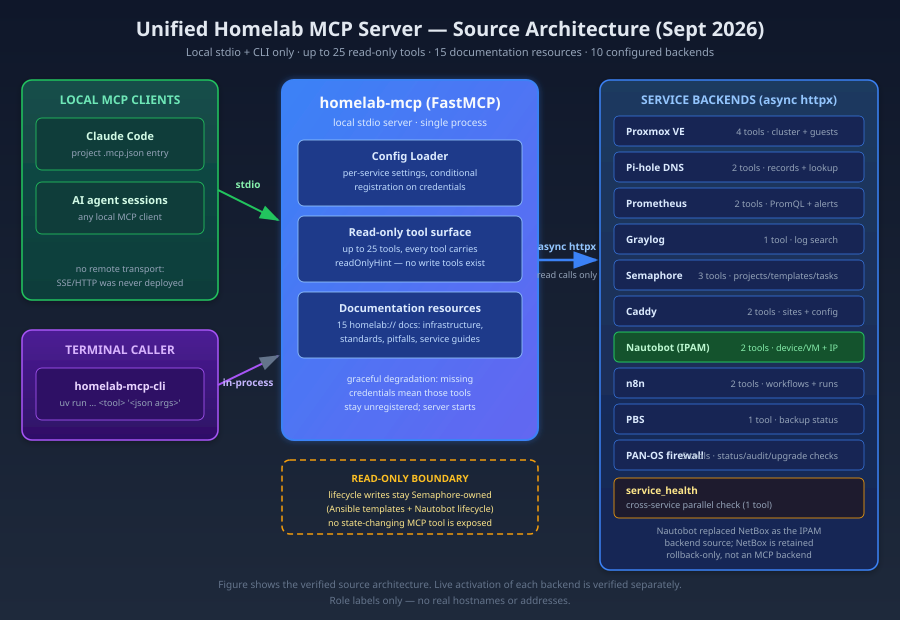

> **Correction, September 2026.** This post originally described the server as
> wrapping 9 services with 32 tools, including a confirmation-gated write
> surface and plans for an SSE transport. The maintained server is simpler and
> stricter than that: **local stdio plus a CLI, up to 25 read-only tools across
> 10 configured backends, and 15 documentation resources**. There are no write
> tools and no remote transport. Lifecycle changes (provisioning, DNS records,
> container updates) are owned by Semaphore automation, and the IPAM backend is
> now Nautobot — NetBox is retained rollback-only. The sections below have been
> rewritten to describe the current architecture; the original narrative is
> preserved where it explains the design decisions that still hold.

## The Problem: Six Interfaces for One Question

"Is anything broken in my homelab?"

Answering that question used to mean: SSH into Proxmox to check guest status. Curl the Pi-hole API for DNS health. Open Grafana to scan Prometheus alerts. Check Graylog for error spikes. Look at Semaphore for failed automation runs. Glance at Caddy logs for 502s.

Six interfaces. Six authentication contexts. Six mental models. Want to *change* something? That's another SSH session, another set of commands, another chance to fat-finger a VMID.

I had two MCP servers already: one for Semaphore (CI/CD automation) and one for PAN-OS (firewall management). Each worked fine in isolation. But every new MCP server meant another process, another `.mcp.json` entry, and no way to do cross-service operations like "check the health of everything."

## The Decision

Build a single [FastMCP](https://github.com/jlowin/fastmcp) server that wraps the homelab services behind one unified interface. One process. One config. Read-only tools covering daily infrastructure questions.

The Semaphore MCP gets absorbed. The PAN-OS MCP stays separate (it's an upstream fork with a different domain). Everything else is new.

### Why MCP?

MCP (Model Context Protocol) is the native protocol for AI clients like Claude Code. Building a REST API would require an adapter layer. MCP tools map directly to what an AI assistant can call, with structured input schemas, descriptions, and return types. The AI doesn't need to parse HTML or guess at curl flags. It calls `list_guests(status="running")` and gets structured data back.

## Architecture

The server follows a modular pattern: one Python module per service, each with its own async HTTP client, all registered conditionally at startup.



Transport is deliberately boring: **local stdio only**, launched by whatever MCP client is sitting on the machine, plus a plain CLI entry point (`homelab-mcp-cli`) that calls the same tools from a terminal or from an agent host. An SSE/HTTP transport was on the original roadmap but never deployed, and the source carries no remote entry point today. Fewer daemons, fewer exposed sockets.

### Graceful Degradation

This was the most important design choice. The server loads each service config independently with try/except. Missing Graylog credentials? Graylog tools don't register, but everything else works. The server starts successfully with just Proxmox configured.

```python
# Each service loads independently
try:
    config.proxmox = ProxmoxSettings()
except ValidationError:
    config.proxmox = None  # Tools won't register

try:
    config.graylog = GraylogSettings()
except ValidationError:
    config.graylog = None  # Graylog tools silently absent
```

This means you can start using the MCP immediately with just one service configured, then add credentials for others as needed. No "all or nothing" startup failures.

### Read-Only by Construction

The original design included a confirmation gate for write operations. The maintained server goes further: **there are no write tools at all.** Every registered tool carries the protocol's read-only annotation, and the tool inventory is asserted in CI against an exact expected set — if a write tool ever appears, the build fails.

State changes belong to automation with its own audit trail: Semaphore runs the Ansible playbooks and lifecycle templates, and Nautobot owns IPAM lifecycle state. The MCP server answers questions; it doesn't mutate the homelab. That boundary is worth more than any `confirm=true` flag, because there is nothing to confirm.

## Service Backends

### Proxmox (the core)

The Proxmox service was ported from an existing infrastructure drift scanner. The key reuse was the IP extraction logic, which handles Proxmox's inconsistent IP reporting across LXC configs, cloud-init, and QEMU agent data:

```python
def _extract_ip_from_config(config: dict) -> str | None:
    # Try cloud-init first
    if ipconfig := config.get("ipconfig0", ""):
        if match := re.search(r"ip=(\d+\.\d+\.\d+\.\d+)", ipconfig):
            return match.group(1)
    # Fall back to net0 static IP
    if net0 := config.get("net0", ""):
        if match := re.search(r"ip=(\d+\.\d+\.\d+\.\d+)", net0):
            return match.group(1)
    return None
```

The original used synchronous `requests`. The port to async `httpx` was mechanical but important: MCP servers handle concurrent tool calls, so blocking I/O would serialize everything.

**Tools**: `infra_overview`, `list_guests`, `get_guest`, `node_status`

### Pi-hole HA

The homelab runs Pi-hole in a high-availability pair with keepalived failover. The MCP service reads both instances, authenticating to each independently using Pi-hole v6's session-based auth (SID + CSRF tokens). DNS *changes* go through the Semaphore-managed deploy pipeline, not through the MCP.

**Tools**: `dns_list_records`, `dns_lookup`

### Prometheus

No auth needed (internal network), so this service always loads when the server starts. Exposes raw PromQL queries and a structured alerts endpoint:

**Tools**: `prom_query`, `prom_alerts`

### Graylog

Basic auth over the Graylog REST API. The search tool accepts a query string and timerange, returning structured log entries:

**Tools**: `search_logs`

### Semaphore (absorbed)

The standalone Semaphore MCP server (376 lines, raw `Server` class) was ported into the unified server. Same httpx async pattern, but with cleaner FastMCP decorators. Read-only: listing projects, templates, and task status. *Running* a task is a deliberate non-feature — that's what the Semaphore UI and its approval flow are for.

**Tools**: `semaphore_list_projects`, `semaphore_list_templates`, `semaphore_task_status`

### Caddy

Read-only access to both HA instances' admin APIs: configured sites and the full config.

**Tools**: `caddy_list_sites`, `caddy_get_config`

### Nautobot (IPAM)

The IPAM backend is [Nautobot](https://docs.nautobot.com/), which replaced NetBox for ordinary IPAM and lifecycle operations. The adapter exposes two tools: a device/VM search and an IP address lookup.

`nautobot_search` is honestly labeled: it queries devices and virtual machines with a bounded search filter (`limit=50`, one page, never follows `next` links) — Nautobot has no global search endpoint, so the adapter doesn't pretend otherwise. `nautobot_get_ip` takes an `address` argument (an IP or CIDR, validated before any HTTP happens) and returns the matching address records with their prefix intact.

*Nautobot adapter status: implemented and verified — live authenticated device/VM search and IP lookup confirmed against production Nautobot on 2026-09-17.*

```bash
uv run homelab-mcp-cli nautobot_search '{"query": "nas"}'
uv run homelab-mcp-cli nautobot_get_ip '{"address": "192.0.2.10/24"}'
```

**Tools**: `nautobot_search`, `nautobot_get_ip`

### n8n and PBS

Read-only visibility into workflow automation and backups: n8n exposes workflow listings and execution history; PBS (Proxmox Backup Server) shows backup status.

**Tools**: `n8n_list_workflows`, `n8n_get_executions`, `pbs_backup_status`

### PAN-OS firewall

Five read-only firewall tools: system info and HA state, policy lookup (would this flow be allowed?), rule config audit, and upgrade readiness/checks.

**Tools**: `fw_status`, `fw_policy_lookup`, `fw_config_audit`, `fw_upgrade_check`, `fw_upgrade_status`

## The Tool Inventory

Verified against the MCP Inspector inventory asserted in CI (exact-set assertion — the build fails on any drift):

| Backend | Tools | Kind |
|---------|-------|------|
| Proxmox | 4 (overview, guests, guest detail, node status) | read-only |
| Pi-hole DNS | 2 (records, lookup) | read-only |
| Prometheus | 2 (query, alerts) | read-only |
| Graylog | 1 (log search) | read-only |
| Semaphore | 3 (projects, templates, task status) | read-only |
| Caddy | 2 (sites, config) | read-only |
| Nautobot | 2 (device/VM search, IP lookup) | read-only |
| n8n | 2 (workflows, executions) | read-only |
| PBS | 1 (backup status) | read-only |
| PAN-OS | 5 (status, policy, audit, upgrade checks) | read-only |
| **Cross-service** | **1 (service_health)** | **read-only** |
| **Total** | **up to 25** | **0 write** |

"Up to" is the graceful-degradation contract in action: each backend's tools register only when its credentials are configured. With every optional credential supplied, the count is exactly 25.

The `service_health` tool runs parallel health checks across all configured services using `asyncio.gather()`, returning a unified status in one call.

## Documentation Resources

The server also serves 15 documentation resources over the MCP protocol (`homelab://` URIs): the infrastructure inventory, standards, known pitfalls, DNS records, and per-service guides. AI clients get context without reading the repository — the original "Phase 2" plan, shipped.

## Configuration

The entire server is configured through environment variables, one prefix per service:

```bash
# Required (minimum viable server)
PROXMOX_API_URL=https://<PROXMOX_HOST>:8006
PROXMOX_TOKEN_ID=<USER>@pam!<TOKEN_NAME>
PROXMOX_TOKEN_SECRET=<SECRET>

# Optional (tools register only when present)
PIHOLE_DNS1_PASSWORD=<PASSWORD>
PIHOLE_DNS2_PASSWORD=<PASSWORD>
PROMETHEUS_URL=http://<PROMETHEUS_HOST>:9090
GRAYLOG_URL=http://<GRAYLOG_HOST>:9000
# Semaphore and Nautobot each take an API token env var
# (SEMAPHORE_API_TOKEN / NAUTOBOT_API_TOKEN — Nautobot powers IPAM lookups)
# ... etc
```

Claude Code connects via a single `.mcp.json` entry:

```json
{
  "mcpServers": {
    "homelab": {
      "command": "uv",
      "args": ["--directory", "homelab-mcp", "run", "homelab-mcp-stdio"]
    }
  }
}
```

## What It Looks Like in Practice

With the MCP running, a conversation with Claude Code goes from "let me SSH into three boxes" to:

> **Me**: "Is anything broken?"
>
> **Claude**: *calls `service_health`* "All configured services healthy. Proxmox cluster: 4 nodes. No Prometheus alerts firing. Graylog ingestion rate normal."

> **Me**: "What's sitting on this IP?"
>
> **Claude**: *calls `nautobot_get_ip` with the address* "That's the NAS primary host — matching interface, DNS name, and assigned status."

> **Me**: "Find every VM with 'nas' in the name"
>
> **Claude**: *calls `nautobot_search`* "Two matches: the NAS primary and its standby, with nodes and status."

No SSH. No curl. No context switching. The AI handles the API calls; questions get answers. And when something needs to *change*, the answer is a Semaphore task with its own log and approval trail — not a chat message with a `confirm=true` flag.

## Code Reuse

One of the satisfying parts of this project was how much existing code got reused:

| Source | Destination | What was ported |
|--------|------------|-----------------|
| Infrastructure drift scanner | Proxmox service | Guest dataclass, IP extraction, node iteration |
| PAN-OS MCP config | Config module | pydantic-settings pattern with env_prefix |
| PAN-OS MCP entry point | stdio entry point | Local stdio launcher pattern |
| Standalone Semaphore MCP | Semaphore service | API paths, project/template handling |
| Pi-hole DNS deploy script | Pi-hole service | v6 session auth |

The main transformation across all ports was `requests` (sync) to `httpx` (async). The business logic stayed the same.

## Lessons Learned

1. **Graceful degradation beats fail-fast for infrastructure tools.** You don't want your entire MCP server down because one service's API key expired. Independent loading per service means partial outages stay partial.

2. **Read-only is a boundary, not a gate.** The original confirmation-gate design put the safety decision inside the tool call. Moving every mutation out of the MCP server entirely — into automation with its own audit trail — turned "trust the AI to ask nicely" into "there is nothing to misuse." I sleep better with the stricter version.

3. **Absorb, don't proliferate.** Having 9 separate MCP servers would be unmaintainable. One server with conditional registration keeps the process count at 1 and makes cross-service tools (like health checks) trivial.

4. **async from the start.** Porting sync code to async later is painful. Starting with `httpx` and `async/await` meant the `service_health` tool could check all services in parallel from day one.

5. **Retire claims with the features.** The biggest documentation bug in this post's history was the article drifting from the code: write tools and SSE that no longer existed, advertised as current. An exact-set CI assertion on the tool inventory keeps the inventory honest — and taught me to date-stamp architecture posts with a correction note instead of silently rewriting them.
