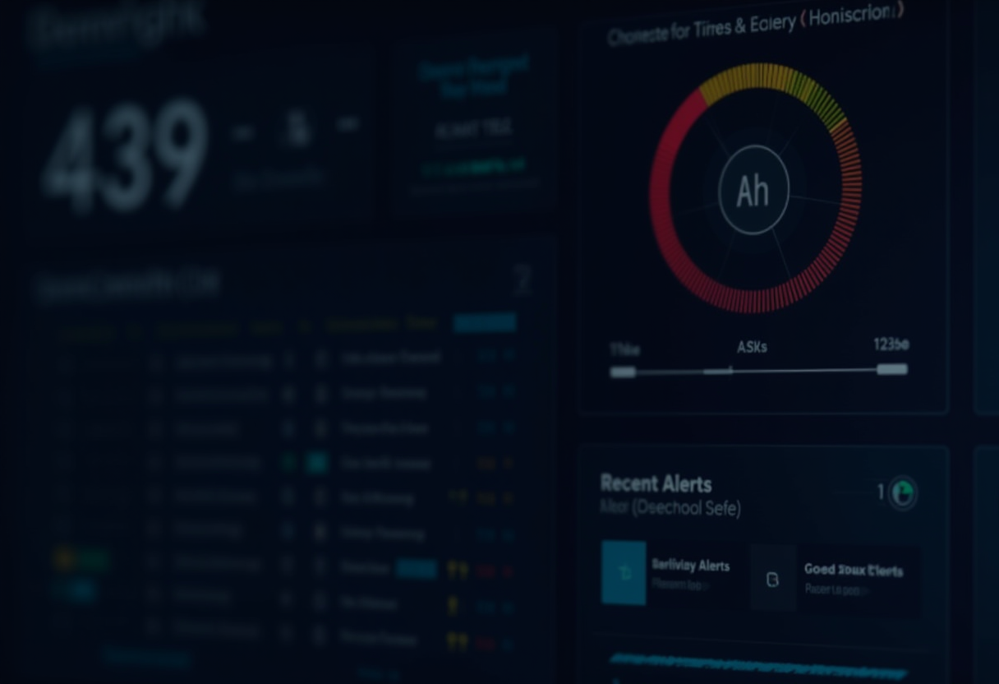

## Why an XDR in a Homelab?

When I first started building out my homelab infrastructure, I fell into the same trap that catches most homelab enthusiasts: I assumed that being behind a firewall made me safe. After all, I wasn't running a Fortune 500 network. I had VLANs, I had a next-generation firewall doing deep packet inspection, and I kept my systems patched. What more did I need?

The wake-up call came when I deployed OpenClaw, a local AI agent framework that gives large language models direct access to my systems. Suddenly, I had a non-deterministic entity with shell access, network access, and the ability to chain commands across my infrastructure. It was essentially a power user that could reason, make decisions, and take actions autonomously. That's when I realized that traditional perimeter security wasn't enough.

The real threats in a modern homelab aren't just external attackers trying to break through your firewall. They're insider threats from compromised containers, lateral movement after a single service gets breached, supply chain attacks in Docker images, and yes, the possibility of an AI agent making poor decisions or being manipulated into malicious behavior. The security research around AI agent frameworks has made this abundantly clear. ClawHavoc, a command-and-control framework specifically designed to target AI agent platforms, demonstrates that these aren't theoretical risks. When you give an LLM the ability to execute code, you need visibility into what it's actually doing.

I needed enterprise-grade security monitoring, but I didn't want enterprise-grade complexity or cost. That's where Wazuh came in. As an open-source XDR platform, it provides the kind of endpoint detection, file integrity monitoring, and threat intelligence correlation that you'd find in commercial solutions, but with the flexibility to integrate it into my existing infrastructure. The goal wasn't to replace everything I'd built—I already had Graylog as my centralized logging platform—but to add a specialized security layer that could give me real-time visibility into system-level events across my entire homelab.

## The Architecture

After evaluating several XDR options, I settled on Wazuh's single-node Docker deployment. The architecture is straightforward: three containers working together to provide comprehensive security monitoring.




The first container is the Wazuh Manager, which serves as the brain of the operation. It handles agent communications from all monitored endpoints, processes security events through its rule engine, and exposes a REST API for configuration and management. The Manager is where all the actual threat detection happens—it's constantly analyzing events, correlating them with threat intelligence, and generating alerts based on pre-configured and custom rules.

The second container is the Wazuh Indexer, which is built on OpenSearch. This is where all security events and alerts are stored for long-term analysis. It provides the backend for the dashboard and enables historical queries, compliance reporting, and forensic investigation. The indexer is memory-intensive but incredibly efficient at handling the time-series data that security monitoring generates.

The third container is the Wazuh Dashboard, a Kibana-based web interface that provides visualization and management capabilities. It's where you go to investigate alerts, review file integrity changes, check compliance status, and manage your agents. The dashboard is intuitive and powerful, with pre-built visualizations for common security use cases.

From a resource perspective, this single-node stack runs comfortably on a dedicated LXC container with 4 vCPUs, 8GB of RAM, and 50GB of storage. That's modest by enterprise standards but perfectly adequate for a homelab environment. The key insight is that for deployments with fewer than 20 agents, the overhead of clustering and high availability actually outweighs the benefits. Single-node Wazuh provides all the security functionality you need without the operational complexity of managing multiple nodes, load balancers, and distributed consensus.

Here's how the components fit together:

```text
┌─────────────────────────────────────────────────────────────┐
│                    Security Monitoring                       │
├─────────────────────────────────────────────────────────────┤
│                                                             │
│  ┌─────────┐    ┌─────────┐    ┌─────────┐                 │
│  │ Agents  │───▶│ Wazuh   │───▶│ Wazuh   │                 │
│  │ (hosts) │    │ Manager │    │ Indexer  │                 │
│  └─────────┘    └────┬────┘    └─────────┘                 │
│                      │                                      │
│                      │ alerts.json                          │
│                      ▼                                      │
│               ┌──────────────┐                              │
│               │   rsyslog    │                              │
│               └──────┬───────┘                              │
│                      │ syslog/udp:1514                      │
│                      ▼                                      │
│               ┌──────────────┐                              │
│               │   Graylog    │◀── Unified Log View          │
│               └──────────────┘                              │
│                                                             │
└─────────────────────────────────────────────────────────────┘
```

The agents installed on each endpoint communicate with the Manager over port 1514 (not shown in the diagram but critical for agent enrollment). The Manager processes events, writes alerts to a JSON file, and stores structured data in the Indexer. Meanwhile, rsyslog running on the LXC host watches that alerts file and forwards everything to Graylog for unified correlation with logs from other infrastructure components.

## Deployment: The Docker Way

The official wazuh-docker repository provides a production-ready single-node deployment that's surprisingly straightforward to set up. I cloned the repository and navigated to the single-node directory, which contains a pre-configured docker-compose.yml file with sensible defaults.

The first critical step is dealing with OpenSearch's requirements. OpenSearch—and by extension, the Wazuh Indexer—requires the kernel parameter `vm.max_map_count` to be set to at least 262144. This isn't just a recommendation; the indexer will fail to start without it. The catch is that this parameter must be set on the Proxmox host, not inside the LXC container. This tripped me up for about 30 minutes when I first deployed.

LXC containers share the host kernel, which means they can't modify sysctl parameters. If you try to set `vm.max_map_count` inside the container, it simply won't work. The fix is to SSH into the Proxmox host and set it there:

```bash
# On the Proxmox host
sysctl vm.max_map_count=262144
echo "vm.max_map_count=262144" >> /etc/sysctl.conf
```

Once that's sorted, the deployment is straightforward. The docker-compose.yml defines three services with appropriate volume mounts for persistence. Before starting the stack, you need to generate TLS certificates for inter-component communication:

```bash
# Generate certificates for the cluster
docker compose -f generate-indexer-certs.yml run --rm generator
```

This creates a `certs` directory with all the necessary certificates and keys. Then you can bring up the stack:

```bash
docker compose up -d
```

The containers take about 60-90 seconds to fully initialize. The Indexer starts first, then the Manager connects to it, and finally the Dashboard becomes available. You can watch the progress with `docker compose logs -f`.

First login uses default credentials that you should immediately change. The Dashboard is accessible on port 443 with a self-signed certificate. Once logged in, the first thing I did was navigate to the agent enrollment section to prepare for deploying agents, and then immediately to the password change interface to secure the installation.

The Docker deployment includes proper health checks, automatic restarts, and volume persistence. It's production-ready out of the box, which is refreshing in the self-hosted security tool space.

## Custom Security Rules: Watching the AI

The standard Wazuh ruleset covers a lot of ground—SSH authentication, file integrity monitoring, rootkit detection, vulnerability scanning, and more. But monitoring an AI agent requires thinking about threats differently than monitoring a traditional server.

An AI agent isn't a user clicking through a GUI or running scheduled scripts. It's a reasoning system that can analyze its environment, make decisions, and execute complex command chains to achieve goals. It has legitimate access to shells, network connections, file systems, and APIs. The challenge is distinguishing between normal AI agent behavior and actual threats.

I created six custom rules specifically for the AI agent host, each mapping to MITRE ATT&CK techniques to provide standardized threat classification. These rules live in a custom XML file that Wazuh loads at startup.

The first rule watches for connections to known ClawHavoc command-and-control infrastructure. ClawHavoc is a proof-of-concept C2 framework designed to exploit AI agent platforms by injecting malicious instructions into agent prompts. The rule triggers on any network connection to the documented C2 server IPs:

```xml
<rule id="100100" level="15">
  <if_sid>100001</if_sid>
  <match>ClawHavoc C2</match>
  <description>OpenClaw agent attempting connection to ClawHavoc C2 infrastructure</description>
  <mitre>
    <id>T1071</id>
    <id>T1041</id>
  </mitre>
</rule>
```

Level 15 is critical severity—this rule generates immediate alerts because it indicates active command-and-control communication. The MITRE mappings are T1071 (Application Layer Protocol) and T1041 (Exfiltration Over C2 Channel).

The second rule monitors modifications to credential files. AI agents often need to authenticate to external services, but changes to SSH keys, API tokens, or password files could indicate credential harvesting or privilege escalation:

```xml
<rule id="100103" level="10">
  <if_sid>550</if_sid>
  <match>.ssh/authorized_keys|.ssh/id_|.env|credentials</match>
  <description>Modification to credential or authentication file</description>
  <mitre>
    <id>T1552</id>
  </mitre>
</rule>
```

This rule builds on Wazuh's file integrity monitoring (rule 550) and specifically looks for changes to SSH key files, environment files with credentials, or any file with "credentials" in the name. It maps to T1552 (Unsecured Credentials).

The third rule detects suspicious network activity on common reverse shell ports. AI agents need network access, but connections to high ports often used for reverse shells warrant investigation:

```xml
<rule id="100104" level="10">
  <if_sid>100002</if_sid>
  <match>:4444|:5555|:6666|:7777|:8888|:9999</match>
  <description>Network connection to common reverse shell port</description>
  <mitre>
    <id>T1571</id>
  </mitre>
</rule>
```

Level 10 is high severity but not critical—these ports have legitimate uses, so this rule flags events for investigation rather than assuming compromise. It maps to T1571 (Non-Standard Port).

The fourth rule watches for data exfiltration to common paste sites and file sharing services. AI agents sometimes need to share data, but uploads to pastebin, file.io, or transfer.sh should be scrutinized:

```xml
<rule id="100108" level="13">
  <if_sid>100002</if_sid>
  <match>pastebin.com|file.io|transfer.sh|0x0.st</match>
  <description>Potential data exfiltration to external service</description>
  <mitre>
    <id>T1567</id>
  </mitre>
</rule>
```

Level 13 is critical because data exfiltration is a primary objective of many attacks. This maps to T1567 (Exfiltration Over Web Service).

The fifth rule detects execution of known attack tools. Even in a homelab, seeing metasploit, nmap in aggressive scan mode, or password cracking tools should trigger alerts:

```xml
<rule id="100109" level="11">
  <if_sid>100003</if_sid>
  <match>msfvenom|msfconsole|nmap -A|nmap -sV|hashcat|john</match>
  <description>Execution of known attack or reconnaissance tool</description>
  <mitre>
    <id>T1059</id>
  </mitre>
</rule>
```

Level 11 because these tools have legitimate security testing uses, but execution should be intentional and documented. Maps to T1059 (Command and Scripting Interpreter).

The final rule detects SSH brute force attempts. While AI agents don't typically brute force SSH, the host itself might be targeted:

```xml
<rule id="100110" level="10">
  <if_sid>5551</if_sid>
  <description>Multiple SSH authentication failures - possible brute force</description>
  <mitre>
    <id>T1110</id>
  </mitre>
</rule>
```

This builds on Wazuh's authentication rules and maps to T1110 (Brute Force).

Together, these rules provide coverage for the unique threats posed by giving an AI agent system access. They're not about preventing the agent from functioning—they're about maintaining visibility into what it's actually doing.

## The Graylog Bridge

I already had Graylog running as my centralized logging platform, aggregating syslog from firewalls, rsyslog from servers, GELF from Docker containers, and application logs from services. Wazuh is powerful, but it's specialized for security events. I didn't want to replace my existing logging infrastructure—I wanted to enhance it by bringing Wazuh's security-focused analysis into the same interface where I correlate everything else.

Wazuh has built-in syslog output support, but it comes with a significant limitation: it sends syslog from inside the Docker container over UDP. This works fine if your syslog server is on the same Docker network or directly routable from the container. In my case, Graylog runs on a different LXC, and Docker's bridge networking meant the UDP packets from inside the Wazuh Manager container weren't reaching Graylog reliably. I spent an embarrassing amount of time troubleshooting this before I realized the routing issue.

The solution was to use rsyslog on the LXC host to tail the Wazuh alerts file and forward it to Graylog. The Wazuh Manager writes all alerts to `/var/lib/docker/volumes/single-node_wazuh_logs/_data/alerts/alerts.json` (the path varies based on your Docker volume configuration). This file is in JSON Lines format—one complete JSON object per line.

I created a dedicated rsyslog configuration file:

```bash
# /etc/rsyslog.d/wazuh-graylog.conf
# Load the file monitoring module
module(load="imfile")

# Monitor the Wazuh alerts file
input(type="imfile"
      File="/var/lib/docker/volumes/single-node_wazuh_logs/_data/alerts/alerts.json"
      Tag="wazuh-alerts"
      Severity="info"
      Facility="local0"
      reopenOnTruncate="on")

# Forward to Graylog via syslog UDP
local0.* @<GRAYLOG_SERVER>:1514
```

The `reopenOnTruncate="on"` parameter is important—when Wazuh rotates its log files, rsyslog needs to reopen the file handle to continue reading. Without this, you'll lose alerts during rotation.

After deploying the config and restarting rsyslog, Wazuh alerts started flowing into Graylog within seconds. Each alert arrives as a syslog message with the full JSON payload in the message field, tagged as "wazuh-alerts". This gives me the best of both worlds: Wazuh's specialized security analytics and rule engine, plus Graylog's powerful correlation, alerting, and unified log view.

I can now build Graylog searches that correlate Wazuh security alerts with firewall denies, DNS queries to suspicious domains, and Docker container events. For example, if Wazuh flags a potential data exfiltration attempt, I can immediately pivot to see what network connections that host made in the preceding minutes, what DNS queries it issued, and whether the firewall allowed or blocked those connections.

## Automating the Graylog Pipeline

Once Wazuh alerts were flowing into Graylog as raw syslog messages, I needed to parse the JSON, extract structured fields, and build dashboards. I could have done this manually through Graylog's web interface, but manual configuration is error-prone and not reproducible. Instead, I wrote Python scripts to automate the entire Graylog configuration.

The first script creates a processing pipeline with extraction rules. Graylog's pipeline language is powerful but has some quirks, especially in version 7. The most important field to extract from Wazuh alerts is `rule.level`, which indicates severity from 0-15. I also extract `rule.id`, `rule.description`, `agent.name`, and relevant fields from the `data` object depending on alert type.

The regex extractor was straightforward to write, but I hit an undocumented gotcha: Graylog 7's `regex()` function uses 0-based capture group indexing. That means `m["0"]` contains the first capture group, not the full match. This is opposite of Java's standard `Matcher.group()` convention and nowhere in Graylog's documentation. I spent 20 minutes debugging why my extracted fields were off by one before I figured this out.

Here's a simplified version of the pipeline rule:

```python
rule "Extract Wazuh Alert Fields"
when
  has_field("application_name") AND
  to_string($message.application_name) == "wazuh-alerts"
then
  let parsed = parse_json(to_string($message.message));
  set_field("wazuh_rule_level", parsed.rule.level);
  set_field("wazuh_rule_id", parsed.rule.id);
  set_field("wazuh_rule_description", parsed.rule.description);
  set_field("wazuh_agent_name", parsed.agent.name);
end
```

The second script creates a dashboard with seven widgets:

1. A count widget showing total alerts in the time range
2. A count widget showing unique agents that generated alerts
3. A count widget showing unique rules that triggered
4. A pie chart breaking down alerts by severity level
5. A bar chart showing which agents generated the most alerts
6. A bar chart showing the top triggered rules
7. A timeline showing alert volume over time

The dashboard creation script uses Graylog's REST API, which requires authenticating with an API token. The most challenging part was getting the widget positioning right—Graylog's grid system is flexible but requires trial and error to get widgets that don't overlap.

The API has one more quirk worth mentioning: when creating dashboards with search types, you must use the correct format for series. Widget format uses `{"function": "count()"}`, but the underlying search type requires `{"type": "count", "id": "count()", "field": null}`. Using the wrong format causes a cryptic "No series handler registered for: null" error that breaks the entire dashboard. The reusable library I built handles this conversion automatically.

After running both scripts, I had a fully functional Graylog pipeline: Wazuh alerts arriving via syslog, getting parsed into structured fields, and displayed in a purpose-built security dashboard. The entire setup is repeatable—if I need to rebuild Graylog or migrate to a new instance, I just run the scripts again.

## The Supporting Security Stack

Wazuh is a critical piece of my security posture, but it's not the only piece. Defense in depth means layering multiple controls so that if one fails, others are still protecting you.

At the network perimeter, I have a next-generation firewall doing application-aware deep packet inspection. This isn't just port-based filtering—it's identifying specific applications by signature and applying policies based on user, zone, and application. Traffic between VLANs is strictly controlled, and anything trying to move laterally gets blocked unless explicitly allowed.

DNS filtering happens at Pi-hole, running in high availability with keepalived for automatic failover. Malicious domains get blocked before they can resolve, stopping command-and-control callbacks, phishing attempts, and malware downloads. Pi-hole logs every DNS query, and those logs flow into Graylog for correlation with other security events.

External access to internal services goes through Cloudflare Tunnel, which provides zero-trust external access without opening firewall ports. The tunnel maintains an outbound connection to Cloudflare's edge, and external requests are proxied through that tunnel. Even if an attacker compromises a public-facing service, they can't use it as a jumping-off point to scan my internal network.

For secrets management, I run Vaultwarden for password management and Infisical for infrastructure secrets like API keys and certificates. Nothing is stored in plaintext in configuration files or environment variables that could be accidentally committed to Git or exposed in logs.

The AI agent host has additional controls. LuLu, an application-level firewall for macOS, intercepts every network connection request and logs it before allowing or denying. Those logs get shipped to Graylog where I can see exactly which processes are making network requests. The agent host is also isolated on its own VLAN with strict firewall rules limiting what it can reach.

Pi.Alert scans the network every five minutes, maintaining an inventory of every device and alerting on new or unexpected devices. If something joins the network that shouldn't be there, I know within minutes.

Finally, Uptime Kuma monitors the availability of over 50 services. It's not security-focused per se, but availability is part of the CIA triad. If a service goes down unexpectedly, that's worth investigating—it might be a denial of service, a misconfiguration, or a sign of compromise.

No single tool provides complete security. It's the combination of network segmentation, application-aware firewalling, DNS filtering, endpoint monitoring, secrets management, and availability monitoring that creates real defense in depth.

## What I Learned

The deployment wasn't without its challenges. Here are the key lessons that might save you time if you're implementing something similar.

First, `vm.max_map_count` must be set on the Proxmox host, not the LXC container. I spent 30 minutes confused about why the Wazuh Indexer kept crashing with out-of-memory errors before I realized the kernel parameter wasn't actually being set. LXC containers share the host kernel, so kernel parameters have to be configured at the host level. This applies to any OpenSearch or Elasticsearch deployment in LXC.

Second, Docker bridge networking breaks Wazuh's built-in syslog output. The UDP packets from inside the Wazuh Manager container don't reliably route to external syslog servers. Using rsyslog on the LXC host to tail the alerts file and forward it is the reliable approach. As a bonus, this gives you flexibility—you can forward to multiple destinations, filter alerts before forwarding, or transform the format.

Third, Graylog 7's regex function uses 0-based capture group indexing where `m["0"]` is the first capture group, not the full match. This is undocumented and opposite of Java's convention. If your extracted fields seem off by one, check your capture group indexing.

Fourth, single-node Wazuh is plenty for a homelab. The three-container stack with 4 vCPUs and 8GB of RAM easily handles 20+ agents with thousands of events per day. Don't over-architect your deployment—start with single-node and only move to clustering if you actually need the scale or availability.

Fifth, AI agents need security monitoring more than anything else in your homelab. They have shell access, network access, and the ability to make autonomous decisions. They're non-deterministic by design, which means you can't predict their behavior just by reading code. Frameworks like ClawHavoc demonstrate that the attack surface is real. If you're running AI agents, you need visibility into what they're doing at the system level.

Finally, defense in depth isn't optional. Every layer I deployed—firewall, XDR, SIEM, DNS filtering, network segmentation—has caught issues that other layers missed. Wazuh alerts on suspicious file modifications, but it's Graylog correlation that shows the context around those modifications. The firewall blocks command-and-control traffic, but it's Wazuh that identifies the process that tried to make the connection. No single tool covers everything.

## Next Steps

The current deployment is functional and providing valuable security visibility, but there's more work to do.

First, I need to deploy Wazuh agents to all LXC containers across the Proxmox cluster. Right now I'm only monitoring a handful of hosts including the AI agent. Full coverage means deploying to every Docker host, every database server, and every publicly accessible service.

Second, I want to create Graylog alerting rules for critical Wazuh events—specifically anything at level 12 or higher. These should trigger immediate notifications rather than requiring me to check dashboards.

Third, I need to integrate Discord notifications for real-time security alerts. I already have Discord webhooks set up for infrastructure events; extending them to cover Wazuh is straightforward.

Fourth, Wazuh has a vulnerability detection module that can scan installed packages and flag known CVEs. Enabling this would give me automated vulnerability awareness across the entire infrastructure.

Fifth, I want to explore Wazuh's active response capabilities. These allow Wazuh to take automated actions when certain rules trigger—things like blocking IP addresses, killing processes, or disabling accounts. Used carefully, active response could automatically contain threats before they spread.

## Files Created

This implementation produced five key configuration files that enable the entire security monitoring pipeline:

| File | Purpose |
|------|---------|
| `docker-compose.yml` | Wazuh single-node stack definition with Manager, Indexer, and Dashboard services |
| `rsyslog-graylog-wazuh.conf` | rsyslog configuration for tailing Wazuh alerts and forwarding to Graylog via syslog UDP |
| `openclaw_rules.xml` | Custom Wazuh rules for monitoring AI agent behavior with MITRE ATT&CK mappings |
| `create-wazuh-graylog-pipeline.py` | Python script to automate Graylog stream, pipeline, and extraction rule creation via REST API |
| `create-wazuh-dashboard.py` | Python script to generate Graylog dashboard with seven security-focused widgets |

Each of these files is version-controlled and reproducible. If I need to rebuild any part of the security stack, I can deploy from these artifacts without manual configuration through web interfaces.

## Closing Thoughts

Building security monitoring for a homelab feels different from doing it professionally. In an enterprise, you have budgets, dedicated security teams, and compliance requirements driving decisions. In a homelab, you're balancing security with the practical reality that you're one person managing dozens of services.

The goal isn't to achieve perfect security—that's impossible regardless of budget. The goal is to have visibility and control appropriate to your risk profile. For me, that risk profile changed significantly when I started running AI agents. These aren't static services that do the same thing every time. They're reasoning systems that make decisions and take actions based on those decisions.

Giving an AI agent shell access means accepting a level of uncertainty. The agent might make mistakes. It might misinterpret instructions. And if someone figures out how to inject malicious prompts, it could potentially do things I never intended. That uncertainty demands monitoring.

Wazuh gives me that monitoring without requiring me to become a full-time security analyst. The rule engine handles the grunt work of analyzing events and identifying suspicious patterns. The integration with Graylog means I don't have to learn a new interface or maintain separate logging infrastructure. And the MITRE ATT&CK mappings give me standardized language for understanding and communicating threats.

The lesson I keep coming back to is that enabling powerful tools—AI agents, internet-facing services, automated deployments—requires balancing capability with accountability. Wazuh is the accountability layer. It doesn't prevent me from running powerful tools. It just makes sure I know what those tools are actually doing.
