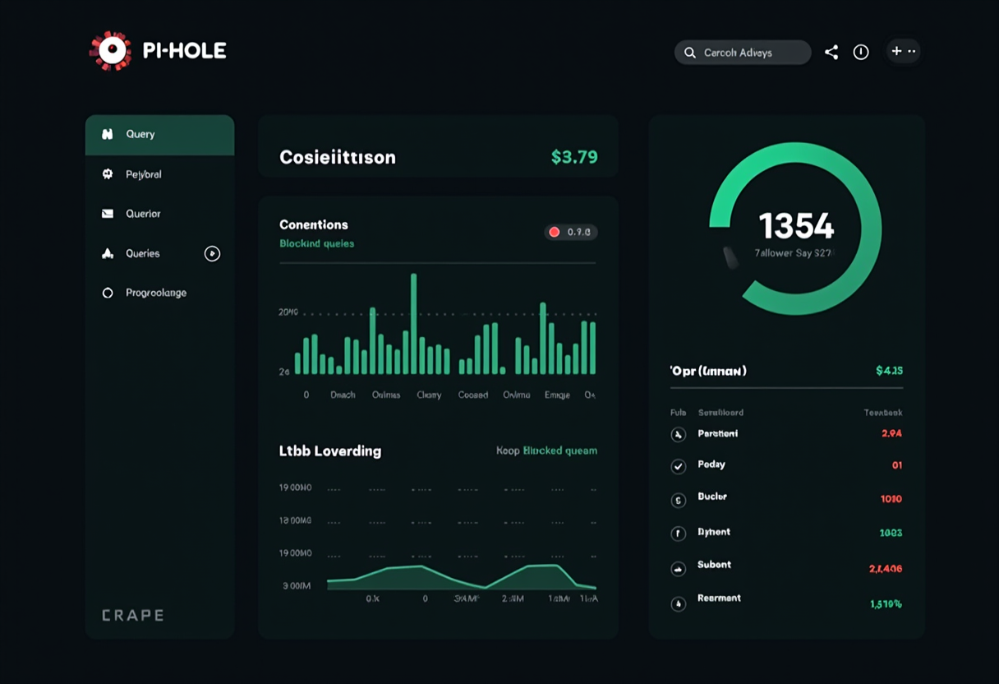

## Overview

DNS is the backbone of your network. When your Pi-hole goes down, every device in your home loses internet access. Websites won't load. Apps stop working. Smart home devices go offline. It's a single point of failure that brings everything to a halt.

This tutorial shows you how to build a resilient DNS infrastructure using two Pi-hole servers with automatic failover. If one server dies, the other seamlessly takes over in under 15 seconds — without any manual intervention.

**What you'll build:**

```text
                    Client Devices
                          ↓
                 Firewall DNS Proxy
                          ↓
              Pi-hole VIP (<DNS_VIP>)
                  ↙          ↘
         DNS-Primary         DNS-Secondary
      <DNS_PRIMARY_IP>    <DNS_SECONDARY_IP>
       Priority: 200       Priority: 100
            ↓                    ↓
      Health Check          Health Check
      (every 5 sec)         (every 5 sec)
            ↓                    ↓
    VIP ACTIVE when       Takes VIP when
    healthy (MASTER)      Primary fails
```

**Key features:**
- **Automatic failover** - VIP moves to backup server when primary fails
- **Health monitoring** - Checks FTL service, port 53, DNS resolution
- **Discord notifications** - Real-time alerts on state changes
- **Staggered updates** - Never update both servers simultaneously
- **Zero client configuration** - Clients always use the same VIP address

## Prerequisites

Before starting, you need:

- **Two Linux servers** - LXC containers work great (1GB RAM minimum each)
- **Pi-hole v6** - Already installed and configured on both servers
- **SSH access** - Ability to deploy files and restart services
- **Discord webhook** (optional) - For failover notifications
- **Static IPs** - Both servers need fixed IP addresses on the same subnet
- **VIP address** - Available IP on the same subnet for the floating virtual IP

**Network requirements:**
- All three IPs (primary, secondary, VIP) must be on the same subnet
- VIP should not conflict with DHCP ranges or other static assignments
- Firewall/router must allow VRRP multicast traffic (protocol 112)

## Architecture Diagram

The high-availability setup uses **VRRP (Virtual Router Redundancy Protocol)** to manage a floating IP address that automatically moves between servers based on health status.

```text
┌─────────────────────────────────────────────────────────────┐
│                    Your Network Devices                      │
│  (phones, laptops, servers, IoT devices)                     │
└────────────────────┬────────────────────────────────────────┘
                     │ DNS queries to <DNS_VIP>
                     ↓
         ┌───────────────────────┐
         │  Firewall DNS Proxy   │
         │  (Optional Layer)     │
         └───────────┬───────────┘
                     │
                     ↓
         ┌───────────────────────┐
         │  Virtual IP (VIP)     │
         │  <DNS_VIP>            │
         │  (Floating Address)   │
         └───────────┬───────────┘
                     │
        ┌────────────┴────────────┐
        │  keepalived VRRP        │
        │  Manages VIP Location   │
        └────────────┬────────────┘
                     │
         ┌───────────┴───────────┐
         │                       │
    MASTER State           BACKUP State
         ↓                       ↓
┌─────────────────┐     ┌─────────────────┐
│  DNS-Primary    │     │  DNS-Secondary  │
│ <DNS_PRIMARY_IP>│     │<DNS_SECONDARY_IP>│
│  Priority: 200  │     │  Priority: 100  │
├─────────────────┤     ├─────────────────┤
│ Pi-hole v6      │     │ Pi-hole v6      │
│ pihole-FTL      │     │ pihole-FTL      │
├─────────────────┤     ├─────────────────┤
│ Health Check    │     │ Health Check    │
│ Every 5 sec     │     │ Every 5 sec     │
│ 3 fails = -150  │     │ Watching for    │
│ priority        │     │ Primary failure │
└─────────────────┘     └─────────────────┘
         │                       │
         └───────┬───────────────┘
                 ↓
         Discord Webhook
         (State Change Alerts)
```

**How failover works:**

1. Both servers run keepalived with VIP configured
2. DNS-Primary has priority 200, DNS-Secondary has priority 100
3. Health check runs every 5 seconds on both servers
4. If DNS-Primary health check passes: VIP stays on DNS-Primary (MASTER)
5. If DNS-Primary fails 3 consecutive checks (15 seconds): Priority drops from 200 → 50
6. DNS-Secondary sees DNS-Primary priority < 100, claims VIP (becomes MASTER)
7. Discord notification sent on state change
8. When DNS-Primary recovers: Priority returns to 200, reclaims VIP

## Step 1: Install Keepalived

Install keepalived on **both** Pi-hole servers:

```bash
# SSH to primary
ssh user@<DNS_PRIMARY_IP>
sudo apt update && sudo apt install -y keepalived

# SSH to secondary
ssh user@<DNS_SECONDARY_IP>
sudo apt update && sudo apt install -y keepalived
```

Verify installation:
```bash
keepalived --version
# Should show version 2.2.x or newer
```

## Step 2: Create Health Check Script

The health check script verifies Pi-hole is actually working, not just running. Create this script on **both servers**.

**File:** `/etc/keepalived/check_pihole.sh`

```bash
#!/bin/bash
set -euo pipefail
#
# Pi-hole Health Check Script for Keepalived
# Verifies that Pi-hole FTL service is running and responding to DNS queries
#
# Exit codes:
#   0 = Pi-hole is healthy (keepalived continues as MASTER/BACKUP)
#   1 = Pi-hole is unhealthy (keepalived reduces priority)
#

# Check if pihole-FTL service is active
if ! systemctl is-active --quiet pihole-FTL; then
    logger -t keepalived-healthcheck "FAILED: pihole-FTL service is not running"
    exit 1
fi

# Check if FTL is listening on port 53 (DNS)
if ! ss -tulpn | grep -q ':53.*pihole-FTL'; then
    logger -t keepalived-healthcheck "FAILED: pihole-FTL not listening on port 53"
    exit 1
fi

# Perform actual DNS query test using dig
# Query DNS infrastructure domains to verify DNS resolution is working
# Uses redundant targets to avoid false positives from single-site outages
if command -v dig &> /dev/null; then
    # Try Google's DNS infrastructure first (dns.google = 8.8.8.8)
    if ! timeout 1.0 dig @127.0.0.1 +short +tries=1 +time=1 dns.google &> /dev/null; then
        # First query failed, try Cloudflare as fallback (one.one.one.one = 1.1.1.1)
        if ! timeout 1.0 dig @127.0.0.1 +short +tries=1 +time=1 one.one.one.one &> /dev/null; then
            logger -t keepalived-healthcheck "FAILED: DNS query test failed (both targets unreachable)"
            exit 1
        fi
    fi
else
    # Fallback to nc if dig is not available
    if ! echo -e "q\n" | timeout 1.0 nc -u 127.0.0.1 53 &> /dev/null; then
        logger -t keepalived-healthcheck "FAILED: Port 53 connectivity test failed"
        exit 1
    fi
fi

# All checks passed
exit 0
```

**Deploy and set permissions:**

```bash
# Copy to both servers
scp check_pihole.sh user@<DNS_PRIMARY_IP>:/tmp/
scp check_pihole.sh user@<DNS_SECONDARY_IP>:/tmp/

# On each server, move to final location
ssh user@<DNS_PRIMARY_IP> "sudo mv /tmp/check_pihole.sh /etc/keepalived/ && \
                            sudo chmod 750 /etc/keepalived/check_pihole.sh && \
                            sudo chown root:root /etc/keepalived/check_pihole.sh"

ssh user@<DNS_SECONDARY_IP> "sudo mv /tmp/check_pihole.sh /etc/keepalived/ && \
                              sudo chmod 750 /etc/keepalived/check_pihole.sh && \
                              sudo chown root:root /etc/keepalived/check_pihole.sh"
```

**Why redundant DNS queries?**

Using multiple targets (dns.google + one.one.one.one) prevents false positives. If Google's DNS is briefly unreachable, Cloudflare provides a fallback. Both have 99.99%+ uptime SLAs. The health check only fails if **both** queries fail, indicating a real Pi-hole problem.

## Step 3: Configure Keepalived (Primary)

Create keepalived configuration on DNS-Primary.

**File:** `/etc/keepalived/keepalived.conf` (on <DNS_PRIMARY_IP>)

```bash
global_defs {
    router_id DNS_PRIMARY
    enable_script_security
    script_user root
}

vrrp_script check_pihole {
    script "/etc/keepalived/check_pihole.sh"
    interval 5        # Run every 5 seconds
    timeout 2         # Script must complete within 2 seconds
    fall 3            # Require 3 consecutive failures before declaring unhealthy
    rise 2            # Require 2 consecutive successes before declaring healthy
    weight -150       # Reduce priority by 150 when unhealthy
}

vrrp_instance DNS_HA {
    state MASTER                    # Initial state
    interface eth0                  # Network interface
    virtual_router_id 55            # Must match on both servers
    priority 200                    # Higher = preferred MASTER
    advert_int 1                    # Advertise every 1 second

    authentication {
        auth_type PASS
        auth_pass YourSecretPassword  # Change this! Must match on both servers
    }

    unicast_src_ip <DNS_PRIMARY_IP>   # This server's IP
    unicast_peer {
        <DNS_SECONDARY_IP>             # Peer server's IP
    }

    virtual_ipaddress {
        <DNS_VIP>/24                   # Virtual IP with subnet mask
    }

    track_script {
        check_pihole
    }

    notify "/etc/keepalived/keepalived-discord-notify.sh"
}
```

**Key parameters explained:**

| Parameter | Value | Why |
|-----------|-------|-----|
| `priority` | 200 | Primary's base priority (higher than secondary's 100) |
| `weight` | -150 | Drops priority to 50 when unhealthy (below secondary's 100) |
| `fall` | 3 | Requires 15 seconds of failures (3 × 5 sec) before failover |
| `rise` | 2 | Requires 10 seconds of health (2 × 5 sec) before recovery |
| `virtual_router_id` | 55 | Arbitrary number, must match on both servers |

**Critical:** The `weight` value must drop primary's priority **below** secondary's priority to trigger failover. If weight is too small (e.g., -50), the calculation becomes 200 - 50 = 150, which is still higher than secondary's 100, preventing failover.

## Step 4: Configure Keepalived (Secondary)

Create keepalived configuration on DNS-Secondary. **Only 4 values change** from primary config.

**File:** `/etc/keepalived/keepalived.conf` (on <DNS_SECONDARY_IP>)

```bash
global_defs {
    router_id DNS_SECONDARY           # Changed: Different router ID
    enable_script_security
    script_user root
}

vrrp_script check_pihole {
    script "/etc/keepalived/check_pihole.sh"
    interval 5
    timeout 2
    fall 3
    rise 2
    weight -150
}

vrrp_instance DNS_HA {
    state BACKUP                      # Changed: Initial state BACKUP
    interface eth0
    virtual_router_id 55
    priority 100                      # Changed: Lower priority
    advert_int 1

    authentication {
        auth_type PASS
        auth_pass YourSecretPassword  # Same as primary
    }

    unicast_src_ip <DNS_SECONDARY_IP> # Changed: This server's IP
    unicast_peer {
        <DNS_PRIMARY_IP>              # Changed: Primary's IP
    }

    virtual_ipaddress {
        <DNS_VIP>/24
    }

    track_script {
        check_pihole
    }

    notify "/etc/keepalived/keepalived-discord-notify.sh"
}
```

**Deploy configurations:**

```bash
# Copy configs to servers
scp keepalived-primary.conf user@<DNS_PRIMARY_IP>:/tmp/keepalived.conf
scp keepalived-secondary.conf user@<DNS_SECONDARY_IP>:/tmp/keepalived.conf

# Move to final location on each server
ssh user@<DNS_PRIMARY_IP> "sudo mv /tmp/keepalived.conf /etc/keepalived/keepalived.conf && \
                            sudo chmod 644 /etc/keepalived/keepalived.conf"

ssh user@<DNS_SECONDARY_IP> "sudo mv /tmp/keepalived.conf /etc/keepalived/keepalived.conf && \
                              sudo chmod 644 /etc/keepalived/keepalived.conf"
```

**Validate syntax before starting:**

```bash
# On primary
ssh user@<DNS_PRIMARY_IP> "sudo keepalived -t -f /etc/keepalived/keepalived.conf"

# On secondary
ssh user@<DNS_SECONDARY_IP> "sudo keepalived -t -f /etc/keepalived/keepalived.conf"

# Both should output: "Configuration is using : 0 Bytes"
```

## Step 5: Discord Notifications (Optional)

Get instant alerts when failover occurs. This script sends color-coded Discord embeds on state changes.

**Setup Discord webhook:**

1. Go to your Discord server → Server Settings → Integrations
2. Create a new webhook, copy the URL
3. Replace `<YOUR_WEBHOOK_ID>/<YOUR_WEBHOOK_TOKEN>` in the script below

**File:** `/etc/keepalived/keepalived-discord-notify.sh` (deploy to both servers)

```bash
#!/bin/bash
set -euo pipefail
#
# Keepalived Discord Notification Script
# Sends formatted alerts to Discord webhook when VRRP state changes
#
# Usage: /etc/keepalived/keepalived-discord-notify.sh <STATE> <INSTANCE>
#

STATE=$1
INSTANCE=$2
WEBHOOK_URL="https://discord.com/api/webhooks/<YOUR_WEBHOOK_ID>/<YOUR_WEBHOOK_TOKEN>"

# Get system information
HOSTNAME=$(hostname)
FQDN=$(hostname -f)
IP_ADDRESS=$(ip -4 addr show eth0 | grep -oP '(?<=inet\s)\d+(\.\d+){3}' | head -1)
VIP_STATUS=$(ip addr show eth0 | grep -q "<DNS_VIP>" && echo "Active" || echo "Inactive")
TIMESTAMP=$(date -u +"%Y-%m-%dT%H:%M:%S.000Z")
READABLE_TIME=$(date "+%Y-%m-%d %H:%M:%S %Z")

# Determine color and emoji based on state
# Colors in decimal: Green=5763719, Yellow=16705372, Red=15548997
case "$STATE" in
    MASTER)
        COLOR=5763719
        EMOJI="🟢"
        TITLE="Pi-hole DNS - MASTER State"
        DESCRIPTION="**$HOSTNAME** has transitioned to **MASTER** state and is now serving DNS requests."
        ;;
    BACKUP)
        COLOR=16705372
        EMOJI="🟡"
        TITLE="Pi-hole DNS - BACKUP State"
        DESCRIPTION="**$HOSTNAME** has transitioned to **BACKUP** state and is on standby."
        ;;
    FAULT)
        COLOR=15548997
        EMOJI="🔴"
        TITLE="Pi-hole DNS - FAULT State"
        DESCRIPTION="**$HOSTNAME** has encountered a FAULT condition. Immediate attention required!"
        ;;
    *)
        COLOR=5793266
        EMOJI="ℹ️"
        TITLE="Pi-hole DNS - State Change"
        DESCRIPTION="**$HOSTNAME** state changed to: **$STATE**"
        ;;
esac

# Build Discord embed JSON payload
PAYLOAD=$(cat <<EOF
{
  "username": "Keepalived Monitor",
  "embeds": [{
    "title": "$EMOJI $TITLE",
    "description": "$DESCRIPTION",
    "color": $COLOR,
    "timestamp": "$TIMESTAMP",
    "fields": [
      {
        "name": "Hostname",
        "value": "\`$FQDN\`",
        "inline": true
      },
      {
        "name": "Server IP",
        "value": "\`$IP_ADDRESS\`",
        "inline": true
      },
      {
        "name": "VIP Status",
        "value": "\`$VIP_STATUS\`",
        "inline": true
      },
      {
        "name": "New State",
        "value": "\`$STATE\`",
        "inline": true
      },
      {
        "name": "VRRP Instance",
        "value": "\`$INSTANCE\`",
        "inline": true
      },
      {
        "name": "Time",
        "value": "\`$READABLE_TIME\`",
        "inline": true
      }
    ],
    "footer": {
      "text": "Keepalived VRRP Monitor | <YOUR_DOMAIN>"
    }
  }]
}
EOF
)

# Send to Discord webhook
curl -H "Content-Type: application/json" \
     -X POST \
     -d "$PAYLOAD" \
     "$WEBHOOK_URL" \
     --silent --output /dev/null

# Log to syslog
logger -t keepalived-notify "[$HOSTNAME] VRRP Instance $INSTANCE transitioned to $STATE state"

exit 0
```

**Deploy:**

```bash
# Copy to both servers
scp keepalived-discord-notify.sh user@<DNS_PRIMARY_IP>:/tmp/
scp keepalived-discord-notify.sh user@<DNS_SECONDARY_IP>:/tmp/

# Set permissions
ssh user@<DNS_PRIMARY_IP> "sudo mv /tmp/keepalived-discord-notify.sh /etc/keepalived/ && \
                            sudo chmod 750 /etc/keepalived/keepalived-discord-notify.sh && \
                            sudo chown root:root /etc/keepalived/keepalived-discord-notify.sh"

ssh user@<DNS_SECONDARY_IP> "sudo mv /tmp/keepalived-discord-notify.sh /etc/keepalived/ && \
                              sudo chmod 750 /etc/keepalived/keepalived-discord-notify.sh && \
                              sudo chown root:root /etc/keepalived/keepalived-discord-notify.sh"
```

## Step 6: Start Keepalived

Start keepalived on **secondary first**, then primary. This ensures clean startup without flapping.


```bash
# Start on secondary (BACKUP)
ssh user@<DNS_SECONDARY_IP> "sudo systemctl enable keepalived && sudo systemctl start keepalived"

# Wait 5 seconds
sleep 5

# Start on primary (MASTER)
ssh user@<DNS_PRIMARY_IP> "sudo systemctl enable keepalived && sudo systemctl start keepalived"
```

**Check status:**

```bash
# On primary - should show VIP active
ssh user@<DNS_PRIMARY_IP> "ip addr show eth0 | grep <DNS_VIP>"

# On secondary - should NOT show VIP
ssh user@<DNS_SECONDARY_IP> "ip addr show eth0 | grep <DNS_VIP>"

# Check keepalived logs
ssh user@<DNS_PRIMARY_IP> "sudo journalctl -u keepalived --since '5 minutes ago' --no-pager"
```

You should see Discord notifications for both servers: DNS-Secondary entering BACKUP state, DNS-Primary entering MASTER state.

## Step 7: Stagger Automated Updates

**Critical:** Never update both Pi-hole servers simultaneously. If an update breaks DNS, you'll have zero redundancy. Stagger updates by at least 3 days.

**File:** `/etc/crontab` (add to each server)

```bash
# On DNS-Primary - 1st of each month at 3:00 AM
0 3 1 * * root /usr/local/bin/pihole-auto-update.sh

# On DNS-Secondary - 4th of each month at 3:00 AM
0 3 4 * * root /usr/local/bin/pihole-auto-update.sh
```

**Create update script:**

**File:** `/usr/local/bin/pihole-auto-update.sh` (deploy to both servers)

```bash
#!/bin/bash
set -euo pipefail
#
# Pi-hole Automatic Update Script
# Runs monthly updates and logs the results
#

LOGFILE="/var/log/pihole-auto-update.log"
HOSTNAME=$(hostname)
TIMESTAMP=$(date "+%Y-%m-%d %H:%M:%S")

echo "========================================" | tee -a "$LOGFILE"
echo "Pi-hole Auto-Update Started" | tee -a "$LOGFILE"
echo "Server: $HOSTNAME" | tee -a "$LOGFILE"
echo "Time: $TIMESTAMP" | tee -a "$LOGFILE"
echo "========================================" | tee -a "$LOGFILE"
echo "" | tee -a "$LOGFILE"

# Run Pi-hole update
echo "Running: pihole -up" | tee -a "$LOGFILE"
pihole -up 2>&1 | tee -a "$LOGFILE"

UPDATE_EXIT_CODE=${PIPESTATUS[0]}
TIMESTAMP_END=$(date "+%Y-%m-%d %H:%M:%S")

echo "" | tee -a "$LOGFILE"
echo "========================================" | tee -a "$LOGFILE"
echo "Pi-hole Auto-Update Completed" | tee -a "$LOGFILE"
echo "End Time: $TIMESTAMP_END" | tee -a "$LOGFILE"
echo "Exit Code: $UPDATE_EXIT_CODE" | tee -a "$LOGFILE"
echo "========================================" | tee -a "$LOGFILE"

# Log to syslog
if [ $UPDATE_EXIT_CODE -eq 0 ]; then
    logger -t pihole-auto-update "[$HOSTNAME] Pi-hole update completed successfully"
else
    logger -t pihole-auto-update "[$HOSTNAME] Pi-hole update failed with exit code $UPDATE_EXIT_CODE"
fi

exit $UPDATE_EXIT_CODE
```

**Deploy:**

```bash
# Copy to both servers
scp pihole-auto-update.sh user@<DNS_PRIMARY_IP>:/tmp/
scp pihole-auto-update.sh user@<DNS_SECONDARY_IP>:/tmp/

# Set permissions
ssh user@<DNS_PRIMARY_IP> "sudo mv /tmp/pihole-auto-update.sh /usr/local/bin/ && \
                            sudo chmod 755 /usr/local/bin/pihole-auto-update.sh"

ssh user@<DNS_SECONDARY_IP> "sudo mv /tmp/pihole-auto-update.sh /usr/local/bin/ && \
                              sudo chmod 755 /usr/local/bin/pihole-auto-update.sh"
```

**Why 3 days apart?**

If the update on DNS-Primary causes issues, you have 3 days to detect and fix the problem before DNS-Secondary updates to the same broken version. This window gives you time to monitor logs, check for regressions, and roll back if needed.

## Step 8: FTL Health Monitoring (Optional)

Monitor Pi-hole FTL for exhaustion, rate-limiting, and upstream failures. Sends Discord alerts with 30-minute cooldown.

**File:** `/usr/local/bin/pihole-ftl-monitor.sh` (deploy to both servers)

```bash
#!/usr/bin/env bash
set -euo pipefail
#
# Pi-hole FTL Log Monitor
# Detects DNS query exhaustion, rate-limiting, and upstream failures
# Sends Discord webhook alerts with cooldown to avoid alert fatigue
#

# --- Configuration ---
WEBHOOK_URL="https://discord.com/api/webhooks/<YOUR_WEBHOOK_ID>/<YOUR_WEBHOOK_TOKEN>"
FTL_LOG="/var/log/pihole/FTL.log"
STATE_FILE="/var/run/pihole-ftl-monitor.state"
CHECK_WINDOW_MINUTES=5
ALERT_COOLDOWN_SECONDS=1800  # 30 minutes between repeated alerts

# --- Thresholds (within check window) ---
MAX_QUERY_THRESHOLD=1        # Any concurrent query exhaustion = alert
RATE_LIMIT_THRESHOLD=5       # 5+ rate-limit events
UPSTREAM_FAIL_THRESHOLD=10   # 10+ upstream connection failures

HOSTNAME=$(hostname)

count_recent_matches() {
    local pattern="$1"
    local cutoff
    cutoff=$(date -u -d "${CHECK_WINDOW_MINUTES} minutes ago" '+%Y-%m-%d %H:%M')

    if [[ ! -f "$FTL_LOG" ]]; then
        echo 0
        return
    fi

    # FTL.log timestamps: "2026-01-26 21:55:08.414 UTC"
    awk -v cutoff="$cutoff" -v pat="$pattern" '
        substr($0, 1, 16) >= cutoff && index($0, pat) > 0 { count++ }
        END { print count+0 }
    ' "$FTL_LOG"
}

# Count issues in the check window
max_query_count=$(count_recent_matches "Maximum number of concurrent DNS queries reached")
rate_limit_count=$(count_recent_matches "Rate-limiting")
upstream_fail_count=$(count_recent_matches "Connection error")

# Alert if thresholds breached (Discord webhook implementation omitted for brevity)
if [[ "$max_query_count" -ge "$MAX_QUERY_THRESHOLD" ]] || \
   [[ "$rate_limit_count" -ge "$RATE_LIMIT_THRESHOLD" ]] || \
   [[ "$upstream_fail_count" -ge "$UPSTREAM_FAIL_THRESHOLD" ]]; then
    logger -t pihole-ftl-monitor "[$HOSTNAME] DNS health issues detected"
    # Send Discord alert (full implementation in actual script)
fi

exit 0
```

**Add to crontab:**

```bash
# /etc/crontab (on both servers)
*/5 * * * * root /usr/local/bin/pihole-ftl-monitor.sh
```

This monitors for signs of DNS overload or upstream connectivity issues and alerts before they cause failover.

## Step 9: Centralized Logging (Optional)

If you run Graylog, rsyslog, or another centralized logging system, ship Pi-hole FTL logs for long-term analysis.

**File:** `/etc/rsyslog.d/60-graylog-ftl.conf`

```bash
# Pi-hole FTL Log Forwarding
# Forward FTL WARNING and ERROR logs to centralized logging

module(load="imfile" PollingInterval="10")

# FTL application logs
input(type="imfile"
      File="/var/log/pihole/FTL.log"
      Tag="pihole-ftl"
      Severity="info"
      Facility="local6")

# Forward to Graylog (or your syslog server)
if $syslogtag == 'pihole-ftl' and ($msg contains 'WARN' or $msg contains 'ERROR') then {
    action(type="omfwd" target="<GRAYLOG_IP>" port="1514" protocol="udp")
}
```

This captures warnings and errors for historical analysis without bloating local disk.

## Verification

### Test 1: Check Which Server is MASTER




```bash
# Should show VIP on primary
ssh user@<DNS_PRIMARY_IP> "ip addr show eth0 | grep <DNS_VIP>"

# Should show nothing on secondary
ssh user@<DNS_SECONDARY_IP> "ip addr show eth0 | grep <DNS_VIP>"
```

### Test 2: Manual Failover Test

```bash
# Stop Pi-hole on primary
ssh user@<DNS_PRIMARY_IP> "sudo systemctl stop pihole-FTL"

# Wait 15 seconds (3 × 5 second health checks)
sleep 15

# Check VIP moved to secondary
ssh user@<DNS_SECONDARY_IP> "ip addr show eth0 | grep <DNS_VIP>"

# Check Discord - should show:
# - Primary: FAULT state
# - Secondary: MASTER state

# Test DNS still works
dig @<DNS_VIP> google.com

# Restore primary
ssh user@<DNS_PRIMARY_IP> "sudo systemctl start pihole-FTL"

# Wait 10 seconds (2 × 5 second rise checks)
sleep 10

# Check VIP returned to primary
ssh user@<DNS_PRIMARY_IP> "ip addr show eth0 | grep <DNS_VIP>"
```

### Test 3: DNS Query Works via VIP

```bash
# From your workstation
dig @<DNS_VIP> example.com

# Should return DNS resolution without errors
```

### Test 4: Keepalived Logs

```bash
# Check state transitions
ssh user@<DNS_PRIMARY_IP> "sudo journalctl -u keepalived --since '1 hour ago' | grep -i transition"

# Expected output shows MASTER/BACKUP transitions
```

## Troubleshooting

| Symptom | Cause | Fix |
|---------|-------|-----|
| VIP not appearing on primary | `virtual_router_id` mismatch | Verify both configs use same VRID (e.g., 55) |
| VIP appears on both servers | Firewall blocking VRRP | Allow protocol 112 (VRRP) on firewall |
| Frequent failover (flapping) | Health check timeout too aggressive | Increase `timeout` from 2→5 seconds |
| No failover when primary stops | Weight calculation wrong | Verify weight -150 drops priority below secondary's 100 |
| Discord notifications not working | Webhook URL incorrect | Test webhook with curl manually |
| Health check always failing | DNS resolution broken on Pi-hole itself | Check `/etc/resolv.conf` points to gateway, not 127.0.0.1 |
| VIP appears but DNS doesn't work | Firewall blocking VIP traffic | Ensure firewall allows traffic to VIP address |
| keepalived won't start | Syntax error in config | Run `keepalived -t -f /etc/keepalived/keepalived.conf` |

**Common keepalived issues:**

- **"Configuration is using : 0 Bytes"** - This is GOOD. Config is valid.
- **"VRRP_Instance(DNS_HA) Entering FAULT STATE"** - Health check failed. Check `/var/log/syslog` for keepalived-healthcheck messages.
- **Both servers show MASTER** - VRRP multicast blocked. Use `unicast_peer` (as shown in configs above) to avoid multicast dependency.

## Lessons from Production

I've been running this HA DNS setup for months in production. Here are the hard-learned lessons:

### Memory Matters

**Mistake:** Started with 512MB RAM per container.

**Problem:** Pi-hole's FTL database grew to 700MB+ with 61-day retention, causing I/O stalls and health check timeouts.

**Fix:**
- Upgraded containers to 1GB RAM minimum
- Reduced database retention to 3 days (ship long-term logs to Graylog)
- Monitor available memory, alert if < 200MB

**Lesson:** Pi-hole FTL database size grows with query volume × retention days. Budget RAM accordingly.

### Health Check Timeout Tuning

**Mistake:** Initial health check timeout was 500ms.

**Problem:** Spurious failovers every 15-20 minutes when Pi-hole briefly lagged under load.

**Fix:**
- Increased timeout from 0.5s → 1.0s
- Increased interval from 2s → 5s
- Changed fall from 2 → 3 (now requires 15 seconds of consecutive failures)

**Lesson:** Health checks must tolerate brief performance hiccups. Use conservative timeouts and multiple failure threshold.

### DNS Resolution Circular Dependency

**Mistake:** DNS-Primary used DNS-Secondary for DNS, DNS-Secondary used DNS-Primary for DNS (circular dependency).

**Problem:** When one server rebooted, the other couldn't resolve DNS during gravity updates → 12+ minute failures → cascading outage.

**Fix:** Both servers now use gateway/firewall (which has static DNS entries) as primary DNS, Cloudflare 1.1.1.2 as fallback. Neither depends on the other.

**Lesson:** HA pairs should never depend on each other for critical services. Use external/upstream dependencies.

### Never Use Multiline Output in Health Checks

**Mistake:** Health check used `grep` without `-q` flag.

**Problem:** Multiline output broke keepalived's state machine → constant FAULT state.

**Fix:** Changed all `grep` to `grep -q` (quiet mode, returns only exit code).

**Lesson:** Health check scripts must return **only** exit code 0 or 1. Any stdout/stderr output can break keepalived.

### FTL Database Retention vs. Centralized Logging

**Mistake:** Kept 30-day local database retention "just in case."

**Problem:** 1GB+ database files caused slow queries, high I/O, health check timeouts.

**Fix:**
- Reduced retention to 3 days (enough for Pi-hole web dashboard)
- Ship DNS query logs to Graylog (30-90 day retention, indexed, searchable)
- Freed up 800MB disk space and eliminated I/O pressure

**Lesson:** Use centralized logging for long-term DNS analytics. Keep local retention minimal.

### Gravity Updates Can Cause Circular DNS Dependency

**Mistake:** Pi-hole servers using 127.0.0.1 for DNS resolution during gravity updates.

**Problem:** Gravity update downloads blocklists → requires DNS → queries itself → deadlock.

**Fix:** Configure Proxmox LXC containers to set `/etc/resolv.conf` to gateway IP, not localhost.

**Lesson:** Pi-hole cannot be its own upstream DNS. Always use external resolver for the Pi-hole server itself.

### 512MB RAM is Insufficient

**Mistake:** Assumed Pi-hole is "lightweight" and allocated 512MB.

**Problem:** OOM killer terminated processes when FTL database grew beyond 500MB.

**Fix:** 1GB RAM minimum. More if you have high query volume (>100K queries/day).

**Lesson:** Memory usage = FTL database + buffers + OS overhead. Monitor with `free -h` and alert if available < 200MB.

### Duplicate CNAME Files Break Pi-hole v6

**Mistake:** Created CNAME records in `/etc/dnsmasq.d/*.conf` files AND in `pihole.toml`.

**Problem:** Pi-hole v6 loads CNAMEs from both locations → duplicate CNAME errors → dnsmasq fails to start → DNS outage.

**Fix:** Use **only** `pihole-FTL --config` to manage CNAMEs. Delete all `dnsmasq.d/*.conf` CNAME files.

**Lesson:** Pi-hole v6 changed CNAME management. Never manually create dnsmasq.d config files for CNAMEs.

## What I Learned

### High Availability Doesn't Mean Zero Downtime

Failover takes 15 seconds (3 consecutive health check failures). During that window, DNS queries time out. Design for **resilience**, not perfection. 15 seconds of DNS unavailability is acceptable when it prevents hours of manual recovery.

### Monitoring is as Important as Redundancy

Without Discord notifications, I wouldn't know failover occurred until I checked logs. Real-time alerts turn HA from "set and forget" to "observe and optimize."

### Start Conservative, Tune Based on Reality

Initial health check settings (0.5s timeout, 2-failure threshold) caused flapping. Production data showed that 1.0s timeout with 3-failure threshold eliminated false positives. Trust your metrics, not your assumptions.

### Stagger Everything

Updates, backups, maintenance windows — never do both servers simultaneously. The 3-day update stagger saved me when a Pi-hole update introduced a regression that broke DNSSEC. Primary got the broken version, I caught it in logs, held back secondary's update.

### Simplicity Wins

I considered adding Consul for health checks, Prometheus for metrics, Ansible for config management. Instead: keepalived (simple, battle-tested, built-in health checks), bash scripts (readable, auditable), rsyslog (ubiquitous). Fewer dependencies = fewer failure modes.

### Test Failover Regularly

I manually trigger failover monthly to verify it works. You don't want to discover your HA setup is broken during an actual outage.

### Documentation is for Future You

Six months from now, you won't remember why you set `weight -150` instead of `-100`. Document the math. Explain the rationale. Your future self will thank you.

## Conclusion

You've built a production-grade high-availability DNS infrastructure with:

- **Automatic failover** in under 15 seconds
- **Health monitoring** that detects actual failures, not noise
- **Discord notifications** for real-time visibility
- **Staggered updates** to prevent simultaneous outages
- **Centralized logging** (optional) for long-term analytics

DNS is now resilient to server failures, LXC host reboots, power outages, and failed updates. Your homelab gained a critical reliability layer.

**Next steps:**

1. Monitor Discord for the first week — verify no spurious failovers
2. Manually trigger failover monthly to ensure it works
3. Check FTL database size weekly (`du -sh /etc/pihole/pihole-FTL.db`)
4. Review health check logs for false positives
5. Consider adding Uptime Kuma or similar external DNS monitoring

**Resources:**

- Keepalived documentation: https://www.keepalived.org/manpage.html
- Pi-hole FTL docs: https://docs.pi-hole.net/ftldns/
- VRRP RFC 3768: https://datatracker.ietf.org/doc/html/rfc3768

Your homelab DNS just became bulletproof. Go break something — your Pi-hole will survive it.
