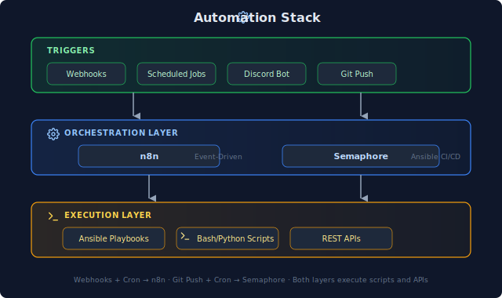
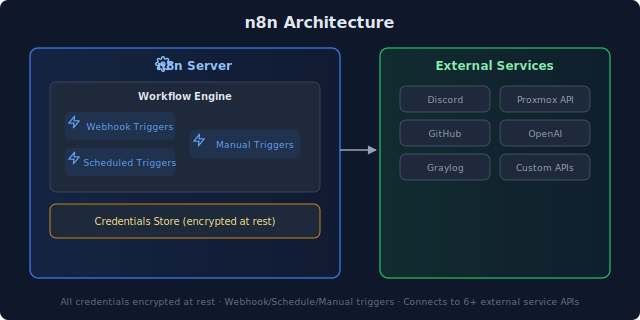
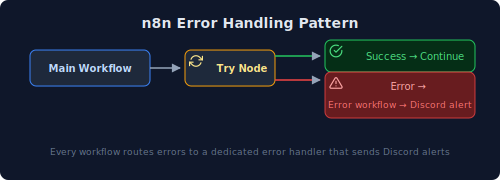
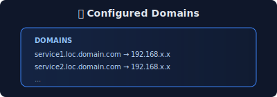
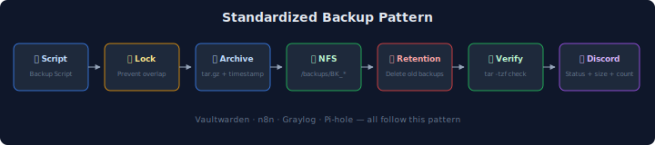
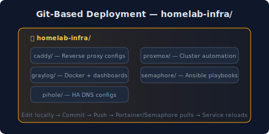
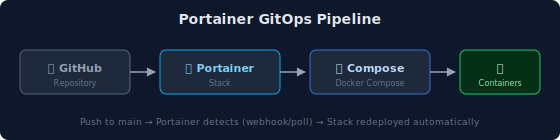
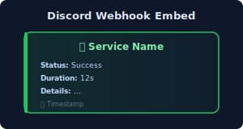

Automation is the backbone of my homelab. This wiki covers the tools, patterns, and workflows that keep 50+ services running with minimal manual intervention.

## Automation Stack



## n8n Workflow Automation

[n8n](https://n8n.io) is my primary workflow automation platform—think Zapier/Make but self-hosted with full code access.

### Active Workflows

| Workflow | Trigger | Purpose |
|----------|---------|---------|
| **Proxmox Monitor** | Webhook (Discord bot) | AI-assisted cluster management |
| **UniFi Reports** | Schedule (weekly) | Network device inventory reports |
| **Meeting Notes** | Webhook | Transcription and summarization |
| **Service Alerts** | Webhook | Route alerts to appropriate channels |

### n8n Architecture



### Workflow Patterns

**1. Event → Process → Notify**
```text
Trigger (webhook/schedule)
         ↓
Process data (HTTP requests, code nodes)
         ↓
Notify (Discord, email, webhook)
```

**2. Fan-Out/Fan-In**
```text
    Single trigger
         ↓
Split to parallel branches
         ↓
 Process independently
         ↓
     Merge results
         ↓
     Final action
```

**3. Error Handling**



### Discord Bot Integration

A Discord bot forwards DMs and @mentions to n8n webhooks, enabling conversational automation:

```text
   Discord @mention
          ↓
Discord Bot (LXC container)
          ↓
      n8n Webhook
          ↓
AI Processing (Claude API)
          ↓
  Response → Discord
```

**Use cases:**
- "Check Proxmox cluster status"
- "List running VMs on node 3"
- "Show recent Graylog alerts"

## Semaphore CI/CD

[Semaphore](https://github.com/semaphoreui/semaphore) is my Ansible automation platform—a web UI for running playbooks with scheduling and audit logging.

### Active Playbooks

| Category | Playbooks | Purpose |
|----------|-----------|---------|
| **Caddy Management** | add-domain, remove-domain, list-domains | Reverse proxy automation |
| **Power Management** | night-sleep, day-on | Proxmox cluster power scheduling |
| **Maintenance** | update-containers, backup-verify | Routine maintenance tasks |

### Caddy Domain Automation

Instead of SSH'ing to both Caddy nodes manually, Semaphore playbooks handle domain management:

**Add Domain:**
1. Input: domain name, backend IP, port
2. Playbook generates Caddy config snippet
3. Deploys to BOTH nodes (prevents config drift)
4. Validates with `caddy validate`
5. Reloads Caddy

**Remove Domain:**
1. Input: domain name
2. Playbook removes from both nodes
3. Validates and reloads

**List Domains:**



### Power Management Automation

Scheduled playbooks manage Proxmox cluster power:

| Schedule | Playbook | Action |
|----------|----------|--------|
| 11 PM | night-sleep | Shutdown non-essential VMs/LXCs |
| 7 AM | day-on | Wake up daytime services |

**Why automate power?**
- Reduce electricity costs
- Extend hardware lifespan
- Lower heat output
- Essential services (DNS, proxy, backups) stay running 24/7

**Important gotcha:** Semaphore's cron scheduler ignores the container's `TZ` variable. Must set `SEMAPHORE_SCHEDULE_TIMEZONE` explicitly.

## Scripting Standards

### Bash Scripts

All bash scripts follow these conventions:

```bash
#!/usr/bin/env bash
set -euo pipefail  # Exit on error, undefined vars, pipe failures

# Trap for cleanup
trap 'echo "Error on line $LINENO"; exit 1' ERR
```

**Validation:**
- `shellcheck` for linting
- `shfmt` for formatting
- Tested on both Ubuntu and Debian

### Python Scripts

For complex automation, Python with type hints:

```python
#!/usr/bin/env python3
"""Script description."""

from pathlib import Path
import argparse
import logging

def main() -> int:
    """Entry point."""
    ...
    return 0

if __name__ == "__main__":
    raise SystemExit(main())
```

**Tooling:**
- `ruff` for linting
- `mypy` for type checking
- `uv` for fast package management

## Backup Automation

Standardized backup pattern across services:



**Services with automated backups:**
- Vaultwarden (password manager)
- n8n workflows
- Graylog configuration
- Pi-hole settings

## Infrastructure as Code

### Git-Based Deployment

All configurations live in Git repositories:



**Deployment flow:**
1. Edit config locally
2. Commit and push
3. Portainer/Semaphore pulls changes
4. Service reloads

### Portainer GitOps

Docker Compose stacks deploy via Portainer's Git integration:



**Update process:**
1. Push to main branch
2. Portainer detects change (webhook or poll)
3. Stack redeployed automatically

## WUD (What's Up Docker) Update Monitoring

All Docker services include WUD for opt-in update monitoring (replaced Watchtower):

```yaml
wud:
  image: getwud/wud:latest
  environment:
    - WUD_WATCHER_LOCAL_WATCHBYDEFAULT=false
    - WUD_TRIGGER_DISCORD_URL=discord://<WEBHOOK_ID>/<WEBHOOK_TOKEN>
  volumes:
    - /var/run/docker.sock:/var/run/docker.sock
  labels:
    - wud.watch=true
```

**Key difference from Watchtower:** WUD uses an **opt-in model** — only containers with `wud.watch=true` are monitored. WUD notifies about available updates but does not auto-update, giving you control over when to apply changes.

**Key settings:**
- `WATCHBYDEFAULT=false`: Only watch labeled containers (opt-in)
- Discord notifications when new versions are available
- Web UI dashboard showing update status across all services

## Notification Patterns

### Discord Webhook Embeds

All automation sends Discord notifications with consistent formatting:



**Color coding:**
- 🟢 Green: Success
- 🟡 Yellow: Warning
- 🔴 Red: Error/Fault

### Shoutrrr Integration

WUD and other services use Shoutrrr for notifications:

```text
discord://<webhook_id>/<webhook_token>?color=5793266&title=ServiceName
```

## Lessons Learned

### 1. Idempotency is Non-Negotiable

Every script must be safe to run multiple times:
- Check before creating (`id -u user` before `useradd`)
- Use `--ignore-existing` flags where available
- Test with `set -e` to catch hidden failures

### 2. Timezone Chaos

Different tools handle timezones differently:
- Docker: Uses host timezone or `TZ` env var
- Cron: Uses container timezone
- Semaphore: Has its OWN `SEMAPHORE_SCHEDULE_TIMEZONE`

Always set timezone explicitly. Default: `America/Los_Angeles`.

### 3. Lock Files Prevent Disasters

Long-running scripts need lock files:

```bash
LOCK_FILE="/var/lock/backup.lock"
exec 9>"$LOCK_FILE"
flock -n 9 || { echo "Already running"; exit 1; }
```

Without this, cron overlap caused corrupted backups.

### 4. Validate Before Deploy

Every deployment includes validation:
- `docker compose config --quiet` before deploy
- `caddy validate` before reload
- `bash -n script.sh` before execution

## Related Pages

- [Infrastructure](../infrastructure/) - Where automation runs
- [Observability](../observability/) - Automation observability
- [Networking](../networking/) - Caddy and DNS automation
