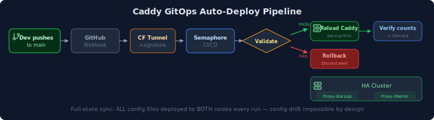

## Overview

After multiple outages caused by configuration drift between two HA Caddy reverse proxy nodes, I built a GitOps pipeline that automatically deploys configs to both nodes whenever changes are pushed to the main branch. Config drift is now impossible by design.

**The problem:** Two Caddy nodes in a keepalived HA pair need identical configs. Forgetting to deploy to the second node after editing a site config caused service outages — twice in the same week.

**The solution:** Push config changes to Git, and a webhook pipeline handles the rest — deploying to both nodes, validating, rolling back on failure, and notifying Discord.

## Diagram

## Components

### GitHub Webhook
- Fires on every push to `main`
- Sends payload with commit SHA and ref
- Uses HMAC-SHA256 signature for authentication
- Delivers through Cloudflare Tunnel (no port forwarding needed)

### Semaphore Integration
- Validates webhook signature (prevents unauthorized triggers)
- Matches only `refs/heads/main` (ignores other branches)
- Extracts `commit_sha` from payload for audit trail
- Triggers the Ansible template automatically

### Ansible Playbook (`sync-caddy-sites.yml`)
An 8-phase playbook that handles the full deployment lifecycle:

1. **Pre-flight**: Verify SSH access to both nodes, check file integrity (truncation guard rejects files < 100 bytes)
2. **Backup**: Timestamped backup of current configs on each node
3. **Deploy**: SCP all site files, snippets, and main Caddyfile to both nodes
4. **Validate**: Run `caddy validate` inside the container on both nodes
5. **Rollback** (on failure): Restore from backup, notify Discord, fail the task
6. **Reload**: Graceful reload — backup node first, then master (minimizes HA disruption)
7. **Verify**: Count deployed domains vs Git repo — detects drift immediately
8. **Cleanup**: Prune old backups (keep last 5 per node)

### Discord Notifications
- **Success**: Green embed with commit hash, domain count, files synced
- **Failure**: Red embed with failed nodes and rollback confirmation
- **Dry Run**: Yellow embed (validation only, no reload)

## Design Decisions

### Why Semaphore (not GitHub Actions)?
Semaphore runs inside the homelab network, with direct SSH access to both Caddy nodes. GitHub Actions would need a self-hosted runner or VPN tunnel to reach internal servers. Semaphore also manages all other homelab automation (power management, maintenance, updates), keeping everything in one place.

### Why sync ALL files every run (not just changed files)?
Simpler and more reliable. Parsing GitHub's changed-files list adds complexity and edge cases (renamed files, moved content). Syncing everything guarantees both nodes match Git — the whole point of eliminating drift. The full sync takes ~25 seconds for 4 site files + 1 snippet + Caddyfile.

### Why reload backup node first?
If the reload somehow breaks a node (despite validation passing), the backup node fails first while the master continues serving traffic. The keepalived VIP stays on the healthy master throughout.

### Why Cloudflare Tunnel for the webhook?
The Semaphore instance is behind NAT with no public IP. Cloudflare Tunnel provides a stable external endpoint (`sema.<YOUR_DOMAIN>`) that GitHub can reach, without opening firewall ports. The same tunnel already serves other homelab services.

### Why a truncation guard?
A previous outage was caused by deploying a truncated config file (incomplete SCP transfer). The playbook now rejects any site file smaller than 100 bytes — a legitimate Caddy config is never that small.

## Trade-offs

| Decision | Benefit | Cost |
|----------|---------|------|
| Full sync (not diff-based) | Zero drift guarantee | ~25s per run even for tiny changes |
| Webhook on all pushes to main | Simple setup | Triggers on non-Caddy changes too (playbook handles gracefully) |
| Rollback on ANY validation failure | Protects both nodes | Could rollback one node unnecessarily if only the other has issues |
| No approval gate | Instant deploys | Bad config deploys immediately (mitigated by validation + rollback) |

## What I Learned

**Ansible self-referencing variables are a trap.** Defining `dry_run: "{{ dry_run | default(false) }}"` in a `vars:` block causes an infinite template recursion when the variable isn't passed. The fix: remove the definition entirely and inline `| default(false)` at every usage point. I hit this twice in the same playbook (first `commit_sha`, then `dry_run`).

**Semaphore webhook endpoints use random aliases, not numeric IDs.** The integration API creates an integration with a numeric ID, but the webhook receiver endpoint requires a separate alias object (`/api/integrations/<random_string>`). Without creating the alias, webhook deliveries return "no rows in result set."

**Cloudflare Tunnel public hostnames vs DNS records are different things.** Adding a regular DNS A record for a service behind a tunnel doesn't work — it resolves to your WAN IP, which has no port forwarding. The service must be added as a "Public Hostname" in the Cloudflare Zero Trust tunnel configuration, which routes through the tunnel's encrypted connection.

## Results

- **Before**: Manual SCP to two nodes, prone to forgetting one. Multiple outages from config drift.
- **After**: Push to Git, both nodes update in ~25 seconds with validation and rollback safety.
- **Pipeline verified**: Two consecutive successful runs deploying real config changes through the full webhook chain.
