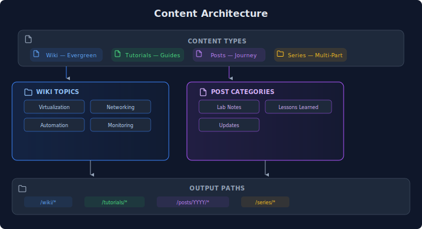
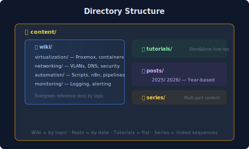
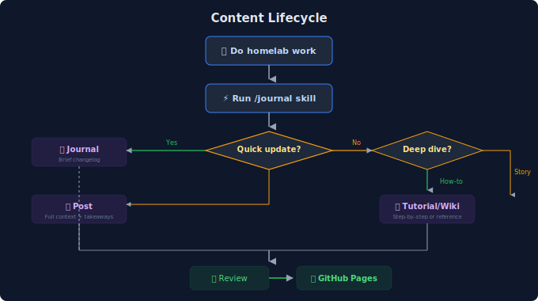

## Overview

This site uses a **hybrid content structure** that combines the best of wikis and blogs. Instead of choosing between "everything chronological" or "everything by topic," we get both:

- **Wiki sections** for evergreen reference content (organized by topic)
- **Blog posts** for journey updates and lessons learned (organized by date)
- **Tutorials** for step-by-step guides (standalone, searchable)
- **Series** for multi-part deep dives (linked learning paths)

## Content Architecture

## Directory Structure

## Why This Structure?

### Problem: Wiki vs Blog Dilemma

Most homelab documentation falls into two camps:

1. **Pure Blog** - Great for following someone's journey, but hard to find specific info later
2. **Pure Wiki** - Great for reference, but loses the narrative and lessons learned

### Solution: Hybrid Approach

| Content Type | Organization | Purpose | Example |
|-------------|--------------|---------|---------|
| Wiki | By topic | Quick reference, "how does X work?" | "Keepalived VRRP basics" |
| Tutorial | Standalone | "How do I set up X?" | "HA Pi-hole with Keepalived" |
| Post | By date | "What happened? What did I learn?" | "The day DNS failed" |
| Series | Linked sequence | Deep dives that build on each other | "Building a Proxmox Cluster" |

## Content Lifecycle

## Design Decisions

### 1. Topic-First for Wiki

Wiki content is organized by **what it's about**, not when it was written. This makes it easy to find related content:

- All DNS stuff → `/wiki/networking/`
- All container stuff → `/wiki/infrastructure/`

### 2. Year-Based for Posts

Posts are organized by year to:
- Keep URLs stable and predictable
- Allow browsing by time period
- Avoid overly deep nesting

### 3. Flat Tutorials

Tutorials live in a single `/tutorials/` directory because:
- They're meant to be found via search/tags
- Nesting would add friction to publishing
- Tags provide the categorization

### 4. Tags + Topics Taxonomy

Two separate taxonomies serve different purposes:

- **Tags**: Content type (`tutorial`, `lesson-learned`, `lab-note`)
- **Topics**: Technology (`proxmox`, `docker`, `networking`, `dns`)

This allows queries like "all lessons learned about DNS" or "all tutorials about Proxmox."

## Trade-offs

| Decision | Gain | Cost |
|----------|------|------|
| Hybrid structure | Best of both worlds | More complex to maintain |
| Flat tutorials | Easy publishing | Less topic grouping |
| Year-based posts | Stable URLs | Manual year folders |
| Dual taxonomy | Flexible queries | More tags to manage |

## What's Next

- Add more wiki reference content
- Create first tutorial (HA Pi-hole)
- Build out series for cluster setup
- Integrate with homelab automation for auto-posting
