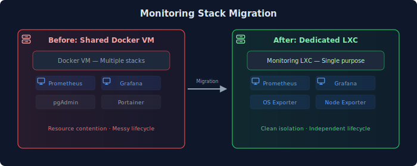
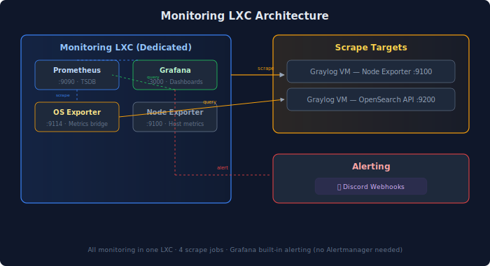

## Overview

Migrated the Prometheus + Grafana monitoring stack from a shared Docker VM to a dedicated LXC container. The shared VM hosted multiple stacks (pgAdmin, Portainer, monitoring) which created resource contention and made lifecycle management messy. Moving monitoring to its own LXC follows the homelab pattern of **one service per container** for cleaner isolation, backups, and management.

## Before vs After

## Architecture

The monitoring LXC runs four containers in a single Docker Compose stack:

## Components

| Container | Purpose | Port |
|-----------|---------|------|
| **Prometheus** | Time-series database and scrape engine | 9090 |
| **Grafana** | Dashboards, visualization, and alerting | 3000 |
| **OpenSearch Exporter** | Translates OpenSearch metrics into Prometheus format | 9114 |
| **Node Exporter** | Exposes host-level CPU, memory, disk, and network metrics | 9100 |

### Scrape Targets

| Job | What It Monitors | Why |
|-----|------------------|-----|
| `prometheus` | Self-monitoring | Detect Prometheus issues |
| `opensearch` | Graylog's OpenSearch backend | JVM heap, GC pauses, index sizes |
| `node-graylog` | Graylog VM system resources | CPU, memory, disk (prevent full disk) |
| `node-prom` | Monitoring LXC itself | Ensure the monitor is healthy |

### Grafana Alerts

| Alert | Condition | Severity |
|-------|-----------|----------|
| OpenSearch Old GC | GC collection count increases | Warning |
| OpenSearch Heap High | JVM heap > 85% | Critical |
| Index Too Large | Single index > 20 GB | Warning |
| Graylog Disk Full | Filesystem usage > 80% | Critical |

Alerts fire to Discord via Grafana's built-in contact point — no separate Alertmanager needed for homelab scale.

## Design Decisions

### 1. Dedicated LXC Per Stack

**Decision**: Give monitoring its own LXC instead of sharing a Docker VM with other services.

**Why**:
- **Resource isolation** — Prometheus and Grafana can't starve other services (or vice versa). On the shared VM, a Prometheus scrape spike could impact pgAdmin queries.
- **Simplified lifecycle** — Snapshot, backup, or migrate monitoring independently. No worrying about side effects on unrelated services.
- **Cleaner management** — `docker compose down` doesn't accidentally affect other stacks. Each LXC has a single `docker-compose.yml`.

**LXC specs**: 2 GB RAM, 16 GB disk, 2 CPU cores on Debian 12. Lightweight enough that the overhead of a separate container is negligible.

### 2. Short Hostnames

**Decision**: Use `graf` and `prom` instead of `grafana` and `prometheus`.

**Why**: Follows the homelab's 4-character naming convention (`sema`, `nbox`, `utka`, `hass`). Shorter hostnames are faster to type in URLs and SSH commands. The full name is obvious from context.

### 3. Grafana Built-in Alerting (No Alertmanager)

**Decision**: Use Grafana's native alerting with Discord webhooks instead of deploying Alertmanager.

**Why**: At homelab scale (4 scrape targets, ~5 alert rules), Alertmanager's grouping, silencing, and routing features are overkill. Grafana's built-in contact points handle Discord webhooks directly. One fewer container to manage.

### 4. OpenSearch Exporter in Same Stack

**Decision**: Run the OpenSearch exporter alongside Prometheus rather than on the Graylog VM.

**Why**: Keeps all monitoring logic in one place. The exporter only makes lightweight HTTP calls to the OpenSearch API — network overhead is negligible on the same VLAN. If monitoring goes down, all monitoring goes down together (easier to reason about).

## Migration Process

The migration followed a **blue-green pattern**:

1. **Deploy new** — Stand up the full stack on the dedicated LXC, verify all targets are UP
2. **Update routing** — Switch DNS records and reverse proxy to point to the new LXC
3. **Tear down old** — Remove the stack from the shared VM only after verifying the new one works
4. **Verify end-to-end** — Test DNS resolution, TLS access, and dashboard loading

### DNS Records Required

Every service in this homelab needs three DNS record types:

| Record Type | Pattern | Purpose |
|-------------|---------|---------|
| **A record** | `graf.<DOMAIN>.local` → LXC IP | Direct access (no TLS) |
| **CNAME** | `graf.loc.<DOMAIN>.com` → Proxy VIP | Internal TLS via reverse proxy |
| **CNAME** | `graf.<DOMAIN>.com` → Proxy VIP | External access via tunnel |

**Gotcha discovered during migration**: Forgetting the CNAME records means `.loc.<DOMAIN>.com` queries escape to upstream DNS (Cloudflare) instead of resolving locally. The symptom is the domain resolving to a public IP instead of the reverse proxy VIP. Always add all three record types when deploying a new service.

## Trade-offs

| Trade-off | Impact | Mitigation |
|-----------|--------|------------|
| **More LXCs to manage** | Another container in the cluster (+1 to ~25 existing) | Single-purpose LXCs are actually easier to manage — predictable resource usage, simple backups |
| **Network overhead** | Prometheus scrapes cross the network instead of localhost | Same VLAN, sub-millisecond latency, negligible bandwidth |
| **Fresh Grafana instance** | Dashboard configuration starts from zero | Dashboards are defined in provisioning files (version controlled). Alert rules recreated quickly |

## Data Retention

| Component | Retention | Limit |
|-----------|-----------|-------|
| Prometheus TSDB | 30 days | 5 GB max |
| Grafana | Persistent volume | Dashboards, alerts, preferences |

30 days of metrics covers most troubleshooting scenarios. For longer historical analysis, Graylog retains the underlying log data for 30-90 days.

## Lessons Learned

### 1. DNS Record Completeness

The biggest snag in this migration was forgetting CNAME records. A records alone only enable direct access via `.local` hostnames. For TLS access through the reverse proxy, CNAME records must point the `.loc.<DOMAIN>.com` and `.<DOMAIN>.com` hostnames to the proxy VIP. Without them, DNS queries leak to upstream resolvers and return public IPs — causing confusing "it works locally but not via hostname" issues.

**Takeaway**: When deploying any new service, always create all three DNS record types: A record, internal CNAME, and external CNAME.

### 2. Single-Purpose Containers Pay Off

The shared Docker VM accumulated multiple unrelated stacks over time. Each "just add one more stack" decision made the VM harder to reason about. Dedicated LXCs have minimal overhead (a few hundred MB RAM) and dramatically simplify operations — you can snapshot, migrate, or destroy a service without thinking about neighbors.

### 3. Hostname Consistency Matters

Renaming from `grafana`/`prometheus` to `graf`/`prom` required updating DNS records, reverse proxy configs, documentation, and infrastructure inventory — six files across the repo. Establishing a naming convention early (short, consistent) reduces this friction for future services.

## Related Pages

- [Monitoring Overview](../../monitoring/) — Full observability stack including Graylog, Uptime Kuma, and Pulse
- [Networking](../../networking/) — DNS architecture and reverse proxy setup
- [Virtualization](../../virtualization/) — Proxmox LXC management patterns
