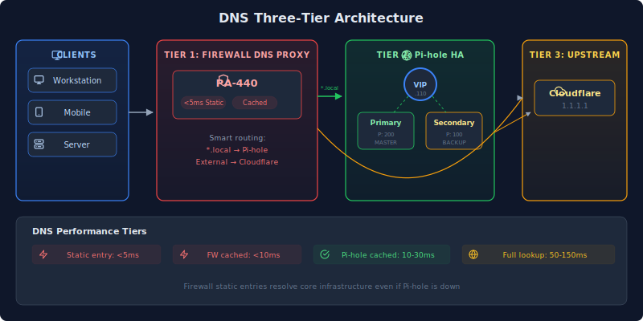
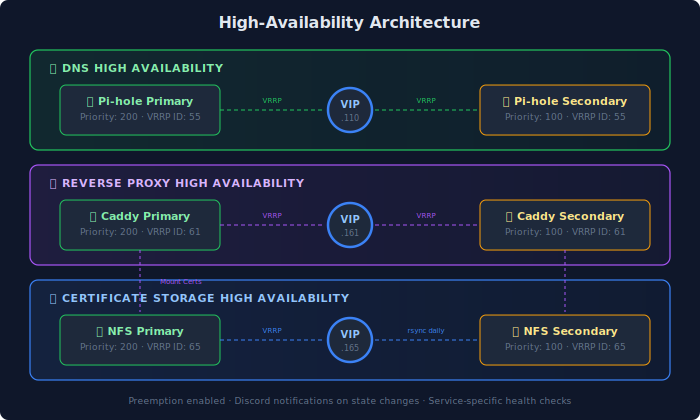
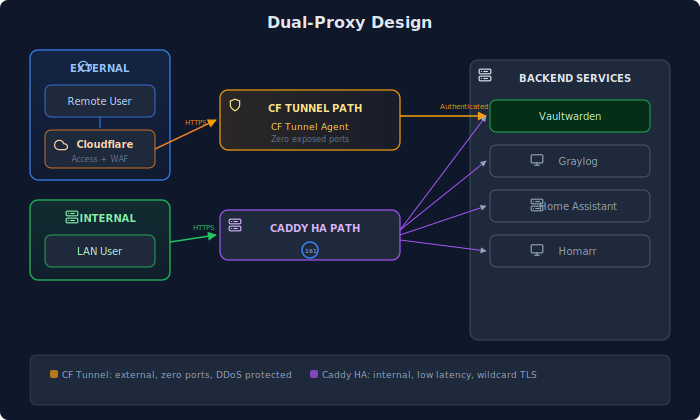
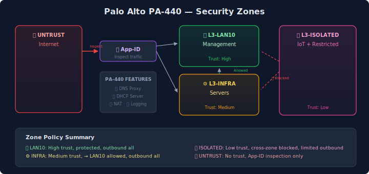

My homelab network is segmented into **5 VLANs** with a multi-tier DNS architecture and high-availability reverse proxy. This wiki covers the design decisions and implementation details.

## Complete Network Topology



## VLAN Design

| VLAN | Subnet | Purpose | Key Services | Security Level |
|------|--------|---------|--------------|----------------|
| **10** | 192.168.10.0/24 | Management & Core | NAS, DNS HA, KVM devices | 🔒 High |
| **30** | 192.168.30.0/24 | Server Network | Proxmox, Docker, Apps | ⚙️ Medium |
| **40** | 172.30.40.0/24 | Isolated Services | Restricted access | 🔸 Low |
| **50** | 172.30.50.0/24 | IoT Devices | Smart home | 📱 Minimal |
| **254** | 10.254.254.0/24 | Firewall Management | Out-of-band mgmt | 🔐 Critical |

**Design principle:** Servers (VLAN 30) can reach management (VLAN 10), but management devices are protected from server-initiated connections. IoT devices are fully isolated—they cannot initiate connections to any other VLAN.

## DNS Architecture

### Multi-Tier Design

The DNS stack uses a **three-tier architecture** for performance, redundancy, and ad-blocking:

### DNS Performance Tiers

| Query Type | Response Time | Path |
|------------|---------------|------|
| 🚀 Firewall static entry | **<5ms** | Direct from PA-440 cache |
| ⚡ Firewall cached | **<10ms** | PA-440 → cached response |
| 💨 Pi-hole cached | **10-30ms** | PA-440 → Pi-hole → cached |
| 🌐 Uncached (full lookup) | **50-150ms** | Full DNS resolution chain |

### Layer 1: Firewall DNS Proxy

The Palo Alto firewall provides the first DNS layer:

| Feature | Benefit |
|---------|---------|
| **Caching** | Sub-10ms response for repeated queries |
| **Static Entries** | Core infrastructure resolves instantly (<5ms) |
| **Domain Routing** | Local domains → Pi-hole, external → Cloudflare |
| **DHCP Integration** | All VLANs receive firewall as DNS server |

**Static entries** include Proxmox nodes, NAS devices, and firewall interfaces—services that must resolve even if Pi-hole is down.

### Layer 2: Pi-hole HA

Two Pi-hole instances with automatic failover:

| Component | Description |
|-----------|-------------|
| **Primary** | Priority 200, handles all queries normally |
| **Secondary** | Priority 100, takes over on primary failure |
| **Virtual IP** | Floating IP that firewall DNS proxy targets |
| **Technology** | keepalived (VRRP) |

**Failover timing:**
- Health check interval: 5 seconds
- Failures before failover: 3 consecutive
- Recovery Time Objective: ~15 seconds

**Health checks verify:**
1. FTL service is running
2. Port 53 is listening
3. DNS queries resolve (tests dns.google, cloudflare)

### Layer 3: Upstream DNS

Pi-hole forwards to Cloudflare for external resolution:
- Primary: Firewall (which uses Cloudflare)
- Fallback: Direct to Cloudflare 1.1.1.2

## High-Availability Architecture

Three critical services run as HA pairs using keepalived VRRP:

| Service | Primary | Secondary | VIP | VRRP ID | Failover Time |
|---------|---------|-----------|-----|---------|---------------|
| **DNS** | Pi-hole 1 | Pi-hole 2 | .110 | 55 | ~15 seconds |
| **Reverse Proxy** | Caddy 1 | Caddy 2 | .161 | 61 | ~10 seconds |
| **Cert Storage** | NFS 1 | NFS 2 | .165 | 65 | ~10 seconds |

**Key settings:**
- Preemption: Enabled (primary reclaims VIP on recovery)
- Notifications: Discord webhooks on state changes
- Health checks: Service-specific validation before accepting traffic

## Reverse Proxy Architecture

### Dual-Proxy Design

| Proxy | Purpose | Auth | Use Case |
|-------|---------|------|----------|
| **Cloudflare Tunnel** | External access | Cloudflare Access | Public-facing services |
| **Caddy HA** | Internal + direct external | None (service-level) | Internal services, high-throughput |

### Cloudflare Tunnel Path

**Benefits:**
- Zero exposed firewall ports (outbound-only)
- DDoS protection included
- User identity via Cloudflare Access
- Automatic TLS termination

**Protected services:** Password manager, VPN management, media server.

### Caddy HA Path

**Benefits:**
- No external dependency
- Lower latency for internal traffic
- Full control over TLS certificates
- Wildcard cert via DNS-01 challenge

### Domain Tiers

| Pattern | Example | Purpose | TLS |
|---------|---------|---------|-----|
| `*.local` | `service.homelab.local` | Direct backend access | None |
| `*.loc.domain.com` | `service.loc.domain.com` | Internal TLS | Wildcard cert |
| `*.domain.com` | `service.domain.com` | External via Cloudflare | Cloudflare |

## Firewall Architecture

### Palo Alto Networks PA-440

| Feature | Usage |
|---------|-------|
| **App-ID** | Application-aware traffic inspection |
| **DNS Proxy** | Intelligent caching and routing |
| **DHCP Server** | Centralized IP assignment for all VLANs |
| **NAT** | Destination/source translation for services |
| **Zone Security** | VLAN-based access policies |
| **Logging** | All traffic to Graylog via Syslog TCP |

### Security Zones

| Zone | VLANs | Trust Level | Outbound | Cross-Zone |
|------|-------|-------------|----------|------------|
| L3-LAN10 | 10 | 🔒 High | ✅ All | Protected |
| L3-INFRA | 30 | ⚙️ Medium | ✅ All | → LAN10 only |
| L3-ISOLATED | 40, 50 | 🔸 Low | ✅ Limited | ❌ Blocked |
| L3-UNTRUST | - | ❌ None | N/A | Inspect only |

## Network Monitoring

### UniFi Controller

Manages all network hardware:
- UniFi Gateway (inter-VLAN routing)
- 24-port managed switch (USW-24-G2)
- 2 WiFi 6 access points (U6-LR, U6-Pro)

**Monitoring features:**
- Real-time client list
- Bandwidth per device
- DPI (Deep Packet Inspection) stats
- Anomaly detection

### Pi.Alert Network Scanner

Scans subnets every 5 minutes for:
- New device detection
- MAC address tracking
- Port scanning
- Vendor lookup

## Lessons Learned

### 1. Multi-Tier DNS Saves the Day

When Pi-hole crashed due to database pressure, the firewall's static entries kept core infrastructure resolving. Without this layer, Proxmox nodes couldn't reach each other.

### 2. Config Drift Kills HA

The Caddy HA pair once drifted out of sync when I updated only one node. The VIP failed over to the outdated node, breaking several services. **Always deploy to BOTH nodes.**

### 3. VRRP ID Collisions

Each HA pair needs a unique VRRP ID. When I accidentally reused ID 55 for both DNS and NFS, one pair's failover broke the other. Now I track IDs in documentation.

### 4. Health Checks Need Redundancy

Early Pi-hole health checks tested only one upstream. If that upstream was slow, the check failed and triggered unnecessary failover. Now checks test multiple targets with fallback.

## Related Pages

- [Virtualization]() - Where DNS and proxy containers run
- [Monitoring]() - Log shipping and alerting
- [Automation]() - Network automation via Semaphore
