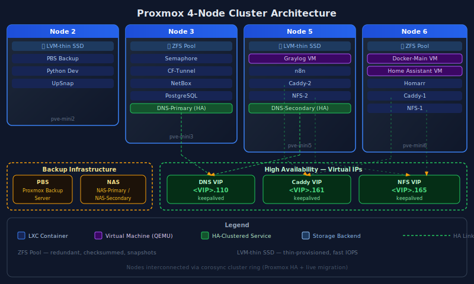
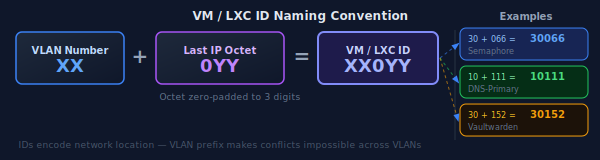
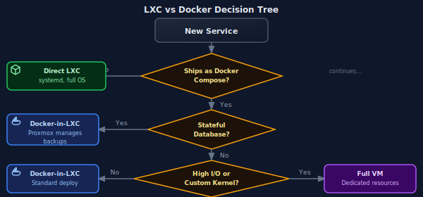
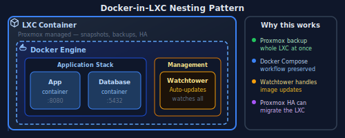
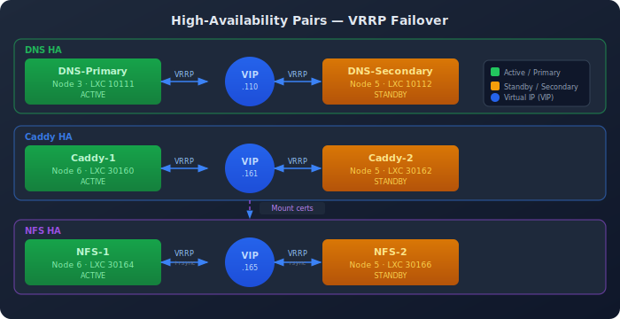
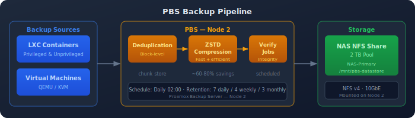
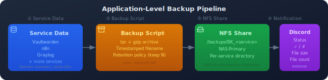
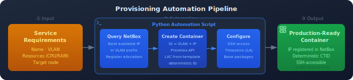

My homelab runs on a **4-node Proxmox VE cluster** hosting 50+ LXC containers and VMs. This wiki documents the architecture, conventions, and lessons learned.

## Proxmox Cluster Architecture

## Cluster Specifications

| Node | Storage | Type | CPU | RAM | Primary Workloads |
|------|---------|------|-----|-----|-------------------|
| **Node 2** | ssd-data | LVM-thin | 4 cores | 16 GB | PBS, Development |
| **Node 3** | zdata | ZFS | 4 cores | 32 GB | Databases, DNS-Primary |
| **Node 5** | ssd-data | LVM-thin | 4 cores | 16 GB | Graylog VM, DNS-Secondary |
| **Node 6** | zdata | ZFS | 4 cores | 32 GB | Docker-Main, HA services |

**Total Resources:**
- 🖥️ **16 CPU cores** available for VMs/LXCs
- 💾 **96 GB RAM** across cluster
- 📀 **~2 TB** combined storage (SSD + ZFS)
- 📦 **50+ containers** running

### Why Mixed Storage?

| Storage Type | Advantages | Best For |
|--------------|------------|----------|
| **LVM-thin** | Fast snapshots, thin provisioning, SSD optimized | General workloads, development |
| **ZFS** | Checksumming, compression, data integrity | Databases, critical data |

## VM/LXC ID Naming Convention

I use a **deterministic ID scheme** that encodes network location:

**Benefits:**
- 🔍 Instantly know a container's IP from its ID
- ✅ Avoid IP conflicts during provisioning
- 📚 Simplify documentation and troubleshooting
- 🔢 Consistent across all 50+ containers

## Container Strategy

### LXC vs Docker Decision Tree

| Aspect | LXC Containers | Docker-in-LXC | Full VM |
|--------|---------------|---------------|---------|
| **Isolation** | Full OS, systemd | Docker + OS | Complete |
| **Backup** | Proxmox snapshots | Proxmox + volumes | Proxmox snapshots |
| **Use Case** | Native services | Docker Compose apps | High I/O, special kernel |
| **Examples** | Pi-hole, Semaphore | Graylog, Caddy | Docker-Main, KASM |

### Docker-in-LXC Pattern

For services that ship as Docker Compose stacks:

**Why not Docker directly on Proxmox?**
- ✅ Proxmox backups capture entire LXC state
- ✅ Network isolation via Proxmox VLANs
- ✅ Resource limits enforced at LXC level
- ✅ Easier migration between nodes

## High Availability Services

Three service categories run as **HA pairs** with automatic failover:

| Service | Primary Node | Secondary Node | Failover Tech | RTO |
|---------|--------------|----------------|---------------|-----|
| **DNS** | Node 3 | Node 5 | keepalived VRRP | ~15s |
| **Caddy** | Node 6 | Node 5 | keepalived VRRP | ~10s |
| **NFS** | Node 6 | Node 5 | keepalived + rsync | ~10s |

**Node distribution strategy:** Primary services split across nodes 3/6, secondaries on node 5. This ensures a single node failure doesn't take down all primaries.

## Backup Strategy

### Proxmox Backup Server (PBS)

| Setting | Value | Rationale |
|---------|-------|-----------|
| **Storage** | NFS from NAS | Offsite from compute nodes |
| **Retention** | 7 backups | Weekly rotation |
| **Compression** | ZSTD | Good compression/speed balance |
| **Mode** | Snapshot | Live backups, no downtime |

**Schedules:**
- 🗑️ Garbage Collection: Daily at 02:00
- ✅ Verification: Weekly on Sunday at 03:00
- 💾 Backup Jobs: Staggered throughout night

### Application-Level Backups

Critical applications also have their own backup scripts:

## Provisioning Automation

New VMs/LXCs are provisioned via a **Python automation tool**:

**Automation steps:**
1. Query NetBox for next available IP in target VLAN
2. Calculate VM ID using VLAN + IP scheme
3. Create container with correct storage selection
4. Configure SSH key access
5. Set timezone (`America/Los_Angeles`) and locale
6. Install base packages

**Result:** 30 seconds from request to production-ready container.

## Storage Selection Rules

| Node | Storage Pool | Type | When to Use |
|------|--------------|------|-------------|
| Node 2, 5 | `ssd-data` | LVM-thin | General workloads, fast I/O |
| Node 3, 6 | `zdata` | ZFS | Data integrity critical, databases |
| All | **Never use `local`** | - | Reserved for Proxmox system |

## LXC Privilege Levels

| Type | Use Case | Security | Examples |
|------|----------|----------|----------|
| **Unprivileged** | Most containers | ✅ Recommended | Pi-hole, Semaphore, n8n |
| **Privileged** | Special requirements | ⚠️ Use sparingly | PBS, Docker hosts, NFS |

**Privileged container requirements:**
- PBS: Raw device access for backups
- Docker hosts: cgroup access
- NFS servers: Kernel module access

## Resource Management

### Over-Provisioning Strategy

Proxmox allows RAM over-provisioning. My approach:

| Metric | Allocated | Physical | Ratio |
|--------|-----------|----------|-------|
| **RAM** | ~140 GB | 96 GB | 1.5x |
| **CPU** | Variable | 16 cores | Dynamic |

**Why it works:** Containers rarely all peak simultaneously. Monitor with Pulse dashboard to catch issues early.

### Template Library

Golden image templates accelerate deployment:

| Template | Contents | Deploy Time |
|----------|----------|-------------|
| **Base Debian** | SSH keys, timezone, core packages | 30 seconds |
| **Docker-ready** | Base + Docker + Compose | 45 seconds |
| **Python Dev** | Base + pyenv + common libraries | 60 seconds |

## Lessons Learned

### 1. ID Scheme Prevents Chaos

Before the VLAN+IP naming convention, I had random VM IDs and constantly forgot which IP belonged to which container. The deterministic scheme eliminated this entirely.

### 2. Split HA Across Nodes

Initially had both DNS containers on adjacent nodes. A single network issue took down both. Now primaries and secondaries are deliberately split.

### 3. ZFS for Databases

Early database containers ran on LVM-thin. After a corruption incident (power loss during write), moved all databases to ZFS with checksumming.

### 4. Template Everything

Creating a new container manually took 30 minutes of package installation and configuration. Templates reduced this to under a minute.

### 5. Monitor Over-Provisioning

RAM over-provisioning works great—until it doesn't. The Pulse dashboard caught a memory pressure event before it became an outage.

## Related Pages

- [Networking]() - VLAN configuration, DNS architecture
- [Monitoring]() - Cluster monitoring with Pulse
- [Automation]() - Provisioning scripts
